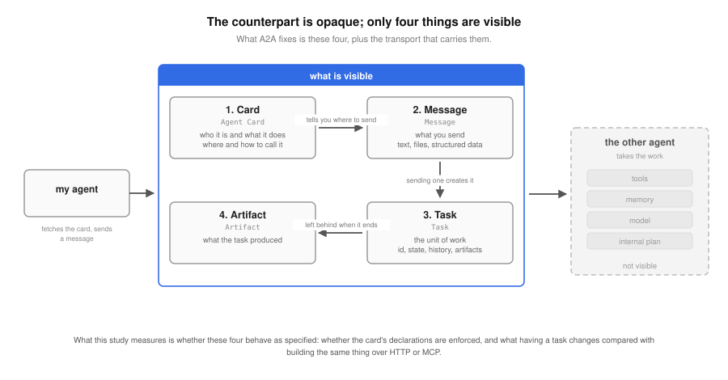
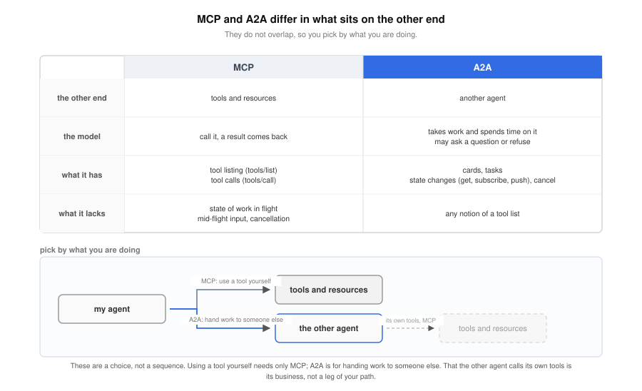
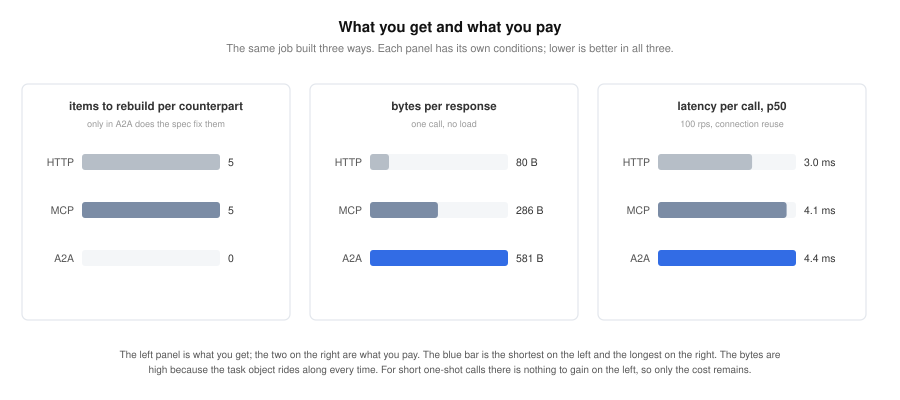

# When and how is A2A useful?

**[한국어로 읽기: README_ko.md](README_ko.md)** (같은 내용의 한국어판)

> Status: stage 1 measured (2026-09-10). Results for all three, declared versus
> actual, against the alternatives, and overhead, are below. The interoperability
> matrix across the two generations and passing through a gateway are left for
> stage 2.

## What A2A is, and where it is used

**Q1. What is A2A?**

A2A (Agent2Agent) is a protocol for one agent to hand work to another and get
the result back. The name is literal: agent to agent. The point is that one side
can find another, hand over work, follow its progress and take the result
without a person brokering it. It starts from the assumption that the other
agent is opaque: its tools, memory, model and internal plan are not visible.

Four things are visible. The Agent Card is JSON saying who the agent is, what it
does, and where and how to call it. The Task is the unit of work, with an id, a
state, a history and artifacts. The Message is a bundle of parts, text or file or
structured data. The Artifact is what a task produced. Everything else is
transport for those four, and the spec defines three bindings: JSON-RPC, HTTP+JSON
and gRPC.



Those four are what this study checks: whether what the card declares is actually
enforced, and what having a task changes. Those are items 1 and 2 in the test
record.

**Q2. Where is it used?**

The typical place is work passed between agents owned by different teams or
companies. If an in-house planning agent hands route calculation to a delivery
agent run by a vendor, the planner fetches the vendor's card, learns where and
how to call it, sends a message, then follows the task by its id until the
result arrives. It does not need to know what framework or model the other side
uses. The foundation's announcement says A2A runs in production in supply chain,
finance and mobile platforms, with more than 150 organizations backing it
(2026-08-17).

**Q3. What happens without it?**

Agents can pass work to each other without A2A, and most do today. The two
common ways both cost something. One is fitting a separate HTTP API per
counterpart: addresses, authentication and request shapes per partner, and
progress and cancellation implemented differently for each. The number of pairs
to fit grows with the number of agents. The other is wrapping the other agent as
an MCP tool. The call convention becomes uniform, but a tool is a "call it and a
result comes back" model, so there is no notion of a running task's state, a
mid-flight request for input, or cancellation. This study confirmed that MCP
2.0.0 has no task lifecycle in its core. That gap is what A2A standardizes: how
to find a counterpart (the card), what the unit of work and its state are (the
task), and how to learn about progress (get, subscribe, push), all independent
of who the counterpart is. That is why the comparison arms here are plain HTTP
and MCP. Putting A2A next to the two things people actually use instead is what
makes the difference visible.

**Q4. It looks like MCP. What is the difference?**

Both call something over JSON-RPC and get a result, so they look alike. The
difference is what sits on the other end. As the spec's own appendix puts it,
MCP standardizes how an agent uses tools and resources; A2A standardizes how an
agent delegates work to another agent. A tool returns a result when called. An
agent takes work, spends time on it, may ask a question partway, and may refuse.
So MCP has tool listing and tool calls, while A2A has cards, tasks and state
changes. The roles differ, so the two do not compete. They are a
choice rather than a sequence: using a tool yourself needs only MCP, and A2A is
for handing work to someone else. The spec's own appendix gives the shape where an
agent that received work over A2A calls tools over MCP, but that is the other
agent's business rather than a leg of your own path. One server can expose both.



## History, how it works, and the versions measured

**Q5. Who made it, and why?**

Google published it in April 2025 (repository created 2025-03-25, public commit
2025-04-14) and donated it to the Linux Foundation with AWS, Cisco, Microsoft,
Salesforce, SAP and ServiceNow among the founding organizations. It was proposed
as an AAIF (Agentic AI Foundation) project on 2026-06-18 (#37), approved by the
technical committee on 07-15 and the governing board on 08-04, and became an
AAIF hosted project at the Growth stage on 2026-08-17. Spec v1.0.0 was fixed on
2026-03-12, and v1.0.1 (2026-05-28), the baseline for this study, is still the
latest as of 2026-09-10. v1.0 renamed methods (`message/send` to `SendMessage`),
part types and task state names, so field-level descriptions written in the 0.x
era mostly no longer hold.

**Q6. How do the spec and the SDKs differ?**

They are different things with separate version numbers. The spec is the
document and the schemas (JSON, protobuf) in the `a2aproject/A2A` repository. An
SDK is a per-language implementation of it; there are six official ones (Python,
JavaScript, Java, Go, .NET, Rust), each released on its own numbering. The
Python SDK used here (a2a-python) is the 1.1.x line implementing spec v1.0.1.
What the spec marks MUST is not necessarily what an SDK does in its default
configuration. Section 7.4, for instance, says the server MUST authenticate
every incoming request against what the card declares, and the default SDK
server checks nothing. That gap is the first thing measured here. What you
actually hold when you "use A2A" is an SDK, so what the spec promises and what
an SDK-built server does have to be read separately.

**Q7. How does it work?**

A client fetches the card from `/.well-known/agent-card.json`, picks an
interface (binding, version, address) and sends a message. The server returns a
task immediately, or waits for completion if the call is blocking, and the
client learns about state changes by polling, by subscribing over SSE, or by
push notification. There are eight task states (SUBMITTED, WORKING, COMPLETED,
FAILED, CANCELED, INPUT_REQUIRED, REJECTED, AUTH_REQUIRED) and cancellation "is
not guaranteed to succeed." Authentication is declared through the card's
`securitySchemes`, and the server MUST authenticate every request against that
declaration (section 7.4). Those two sentences are what the first measurement
checks.

**Q8. Which versions were measured?**

Spec v1.0.1 and the official Python SDK a2a-python 1.1.2. 1.1.2 was released on
2026-07-22, and as of 2026-09-10 the latest is 1.1.4 (09-08). Items where the
two generations diverge were checked by calling the v0.3 names and paths directly. The servers
are the SDK sample (`DefaultRequestHandler` +
`InMemoryTaskStore`, JSON-RPC and REST, v0.3 compatibility on) with minimal
deltas. The MCP comparison arm runs mcp 2.0.0 (the stateless 2026-07-28 spec)
and the HTTP arm is standard-library JSON-RPC. The environment is a three-node
VirtualBox Kubernetes 1.37.0 cluster (`aaif-benchmark`).

The two sections above are cut down to what is needed to read the results. For
the protocol's background and the meaning of each field, see the explainers under
Related.

## What is measured, and how

Three things. All three were measured in September 2026, and the next section is
the answer.

### 1. Declared versus actual

The distance between what the spec document leads you to expect and what a server
built with the SDK actually does.

**Q. What does it check?**

A. Of what the spec promises as MUST and SHOULD, it separates what actually
works in the official SDK's default configuration from what the application has
to build itself.

**Q. How is it checked?**

A. Twelve items checked one at a time with probes that give the same result for
the same input: card discovery, authentication declarations, task state
transitions, cancellation, streaming, push notifications, transport equivalence
and error surfaces. Two servers run side by side, one with v0.3 compatibility on
and one with it off.

### 2. Against the alternatives

The same job put next to the two things people would actually have used instead.

**Q. What does it check?**

A. How what the client goes through differs between building the job over A2A
and building it over MCP or plain HTTP.

**Q. How is it checked?**

A. The same work function is wrapped three ways and runs as three containers in
one pod. Two scenarios, a short job and a 15-second one, compare round trips,
bytes on the wire, what the client has to know (addresses, identifiers, state
values), how progress and cancellation work, and what failure looks like.

### 3. Overhead

What the protocol surface adds in latency and bytes, measured under load.

**Q. What does it check?**

A. How much extra latency and how many extra bytes the protocol itself spends.

**Q. How is it checked?**

A. The same load against the three implementations in a pod of the same shape. Two request
rates and two connection modes make four conditions. One implementation in one
condition for 30 seconds is a cell, so three implementations by four conditions by
five rounds is 60 cells.

The goal is to draw, from measurement, where A2A is useful. Explainers and
migration guides already exist from the foundation and AAIF ambassadors, so this
repository holds measurements only.

### Out of scope this time

None of the three puts a gateway (a proxy) in front of the agent; all call it
directly. What a gateway does and does not do to
the A2A surface is in [the A2A section of the agentgateway
study](../agentgateway-study/a2a/README.md). In short it rewrites and observes but
enforces nothing. The finding that a card advertising both generations keeps the
backend's own address in its v0.3 field, letting older clients bypass the gateway,
is also there.

The interoperability matrix across the two generations and passing through a
gateway are left for stage 2, after stage 1 is published.


## Results: what it buys, and what it costs

If you are weighing adoption, the four questions below are enough. Go to the test
record for numbers and verdicts.

**Q. What does it buy?**

A. A convention for progress and cancellation. When you hand a long job to
someone else, the spec fixes what the client has to know: the task identifier,
the state values, how to query state, how to cancel, streaming and push
notifications.

**Q. When is that convention worth having?**

A. It covers the things you would otherwise rebuild for every counterpart. Four
cases are typical. The first, second and fourth were measured here; the MCP side of
the third comes from the spec and the SDK source.

- **You need to know when the job finishes.** Hand over a 15-second job and you
  have to tell submitted from working from completed while you wait. A2A queries
  it with one task identifier, and you can stream the changes or have the server
  push when it ends. Build the same over HTTP or MCP and the query shape is
  decided per server, so the client is written per server too.
- **You need to stop work in flight.** A user cancels, or a parent job fails and
  its children have to be called back. A2A has cancellation in the spec and the SDK wires
  it to the executor's cancel hook. HTTP and MCP have no such convention, so this
  study left them as a minimal implementation that only flips a flag, and there the
  worker thread kept running. Building real cancellation is possible, and its cost
  is what you pay when there is no convention.
- **The counterpart asks a question partway.** Which environment to deploy to, for
  instance, decided in the middle of the work. A2A has a state for it
  (input-required) and answering on the same task resumes it. The `mcp==2.0.0` core has no such state, so
  unless the application builds one, the call starts over.
- **There are several counterparts, or they change.** Calling one in-house agent
  needs no convention. Calling five, or one run by a vendor, means rewriting the
  client each time. The count in this study is the size of that: five items per
  counterpart for HTTP and MCP, none for A2A.

**Q. What does it cost?**

A. More bytes. For the same single job the response is 80 bytes over HTTP, 286
over MCP and 581 over A2A, with a one-time 858-byte card fetch in front of the
first call. Polling for progress receives 571 bytes per check, over six times
the HTTP application handle (the status query this study built inside the app
because there is no convention for it).

More latency too. Under load, A2A spends 1.2 to 2.1 ms more at p50 (the time half the requests finish within)
per call than the minimal HTTP doing the same work. The gap to MCP is only 0.2 to 0.3 ms, so
most of the cost comes from being a structured protocol rather than from A2A
specifically.

**Q. So when is it worth it?**

A. If any of those four cases applies, it earns its keep. The table below is how
the author reads the numbers above, not a measurement.

| Situation | Worth it? | Why |
|---|---|---|
| Calling a tool on one in-house service | No | MCP covers it. A2A gains nothing while the response grows sevenfold and latency is added |
| Handing a sub-second job to an agent on your own team | No | There is nothing for the convention to do, and matching one counterpart over HTTP is cheaper |
| Handing over a long job whose progress you watch or cancel | Yes | Query, streaming, push and cancel are in the spec, so the client stays the same as counterparts change |
| Calling several agents from other teams or organizations | Yes | Find them by card and treat them the same way. The five per-counterpart items disappear |
| Building a quick prototype | Later | The SDK default enforces no authentication and ships no push sender, so wiring is still ahead of you |

Whatever you pick, keep declaring and enforcing apart. A card can declare security
schemes and push notification capability while the SDK's default configuration
neither enforces nor provides them. The spec puts the duty of authenticating to the
declaration on the server, and the default configuration does not do it, so do not
trust the card alone for how a server behaves.

The same answers in one picture. The left panel is items to rebuild per
counterpart, the middle is bytes per response, the right is p50 latency. A2A (the
blue bar) is the shortest on the left and the longest on the other two. Those are
what trade against each other.



## What an operator should know

| Intent | Works? | Caveat |
|---|---|---|
| Finding a counterpart by card | Yes | The path is `/.well-known/agent-card.json` only. `/.well-known/agent.json` is 404 |
| Putting authentication in the card | Declaration only | Declaring all three of API key, HTTP Bearer and OAuth2 enforces nothing. The spec puts authentication on the server, so the app or a layer in front has to carry it |
| Hiding private information in the extended card | No | The SDK default does not look at identity and hands it to unauthenticated requests |
| Serving clients of both generations | Yes | The `A2A-Version` header decides. Without it the request is treated as v0.3, so a v1.0 client must always send it |
| Trusting the card's interface list | Do not | A server with v0.3 compatibility disabled still lists v0.3 interfaces, and calling them is refused |
| Delegating a long job and following it | Yes | Polling, streaming and push all exist. Polling costs 571 bytes per status check, so prefer streaming or push |
| Using push notifications | Only once wired | The SDK default has neither a config store nor a sender, so the configuration request itself is refused. The card's declaration turns on regardless of the wiring |
| Cancelling a running job | Yes | In-progress and input-required cancel; a completed task returns -32603 |
| Keeping state across a backend restart | No | `InMemoryTaskStore` is pod memory. A durable store has to be added |
| Adopting it for short one-shot calls | Not recommended | Nothing is gained, the response is seven times HTTP's, and 1.2 to 2.1 ms is added |

When push notifications are in use, a failed delivery still leaves the task
completed and the client has no way to know. The server log is what watches the
receiver.

## Test record

What follows is the measurement record, for anyone checking the evidence behind
the conclusions above. If you only need the adoption call, you can stop here.

The per-cell raw data (cell JSON and full probe responses) is not included in this
repository. The tables and numbers below are the whole of what is published, and
the run name in each section says which execution a value came from. The harness
ships with this repository, so the same procedure can be run again.

### 1. Declared versus actual

The spec follows RFC 2119, which grades a rule's strength at three levels: MUST,
SHOULD and MAY, along with their negatives (MUST NOT, SHOULD NOT) and synonyms
(REQUIRED, SHALL, RECOMMENDED, OPTIONAL). The twelve items checked here centre on
the first two levels, the ones where not doing it means departing from the spec.
Run `axis1-0910`.

Here are the twelve.

| # | Item | What the spec says | What the default server does | Verdict |
|---|---|---|---|---|
| 1-1 | Card path | Serve it at `/.well-known/agent-card.json` | It is there, and nowhere else | O |
| 1-2 | Both generations in the card | A new-generation card announces `supportedInterfaces` | Both are announced by default and cannot be turned off. With compatibility off the card still advertises the v0.3 address, which does not answer | X |
| 1-3 | Security schemes in the card | Authenticate every request against the declared schemes (section 7.4, MUST) | Declared only, never enforced. With all three schemes declared, no credentials and wrong credentials both pass | X |
| 1-4 | Identity check on the extended card (the extra card served only to authenticated callers) | Serve it only to authenticated callers | It serves unauthenticated callers too, including skills absent from the public card | X |
| 1-5 | Task state transitions | Move through submitted, working, completed | All five runs reached working within 0.1 s and completed at 15.1 to 15.6 s (the declared-versus-actual server) | O |
| 1-6 | Asking back and resuming | Pause when input is needed, then continue | Answering on the same task resumes it. What is being waited on is the application's to track | O |
| 1-7 | Cancellation | Success is not guaranteed; a task in a non-cancelable state gets `TaskNotCancelableError` (-32002) | In-progress and waiting-for-input tasks cancel. A completed one is refused, but with an internal error (-32603) rather than the spec's -32002 | △ |
| 1-8 | Getting and listing tasks | Fetch one, and list them | Fetching one works in both generations; listing exists only in v1.0. Paging works | O |
| 1-9 | Streaming | Send over SSE, first event is the task | Four events, the first is the task, the last marks completion | O |
| 1-10 | Push notifications | Register a config and the server sends | Needs a config store and a sender wired in. Before that, the configuration request itself is refused. Point it at a host that does not exist and the task still completes, with the failure only in the server log | △ |
| 1-11 | Transport equivalence | The same work through any binding | Identical across JSON-RPC and REST once you send the `A2A-Version` header. Without it the request is treated as v0.3. gRPC was not measured | △ |
| 1-12 | Error surface | Use the standard error codes | It differs by binding: JSON-RPC returns 200 with an error code, REST returns 404 in another format | △ |

O means it behaves as specified, △ that a condition applies, X that it departs
from the spec.

**Of the three Xs, 1-3 and 1-4 share one cause.**

The SDK's default handler has no place where it looks at who the caller is, so
unauthenticated requests pass straight through. The spec puts that duty on the server,
so in practice the application or a layer in front has to carry it. 1-2 is
different: the card advertises an address that does not answer, so it is card
and routing disagreeing rather than an identity problem.

**The three triangles only need a condition met.**

Wire a config store and a sender and 1-10 behaves as specified, though a failed
delivery still leaves the task completed with no way for the client to find out.
1-11 and 1-12 are a matter of matching the header and the binding, but the
documentation does not make that obvious.

**The generation choice in 1-11 is worth setting down separately.**

One server serves both generations, and which one you get is decided by a single
`A2A-Version` header. Without it the request is treated as v0.3, so a v1.0
client that omits the header is served as v0.3 with no error. It goes wrong
quietly, which makes it hard to notice.

How the split works also differs by binding. JSON-RPC splits on the header alone at
one address. REST splits by path as well, and the names read backwards:
`/a2a/rest/` is v1.0 while `/a2a/rest/v1/` is v0.3.

### 2. Against the alternatives

The same work function wrapped over A2A, MCP and plain HTTP, running side by side
in one pod. Run `axis2-0910`.

**For short work the result is identical and only the cost differs.**

The strings the three returned matched character for character. What differed
was round trips, bytes and latency, and the numbers are under the run-by-run
numbers below.

**For long work they diverge.**

Handing over a 15-second job and getting the result back took 15.1 to 15.2 s on
all three. What differs is what the client can do during those 15 seconds.

| | HTTP | MCP | A2A |
|---|---|---|---|
| How progress is checked | polling this study built into the app | a 15-second blocking call, or polling this study built | polling, streaming and push, all in the spec |
| Can you avoid polling? | No, you build it yourself | No, you build it yourself | Yes, streaming and push take round trips to zero |
| Cancellation | no convention; this study's implementation only flips a flag | no convention; this study's implementation only flips a flag | in the spec, wired by the SDK to the executor's cancel hook |
| How lost state is reported after a restart | an error code the server chose | a normal result string (the core has no such error, so this study left it that way) | a protocol error |

On polling alone A2A is the most expensive, because the whole task object
rides along every status check, over six times the bytes of the HTTP side. The
numbers are in the run-by-run numbers below.

A2A does not have to poll. Streaming and push are in the protocol and take
status round trips to zero. Doing the same on the other two means building an SSE
endpoint and a webhook sender, which this measurement did not do.

MCP has the narrowest set of choices to begin with. With no task lifecycle
in the `mcp==2.0.0` core, it is either a blocking call that waits out the 15
seconds or an application-level handle built out of tool names.

**Failure looks different too.**

Restart the backend and all three lose their state, which is expected since
every store is pod memory. What differs is how they say so. The `mcp==2.0.0`
core has no "unknown task" error, so this study's application handle returns the
string
`unknown` as a normal tool result. Telling lost state from live state then becomes
string parsing in the client.

**When the backend disappears entirely, all three are the same.**

Every call is a connection failure and the protocol has no room to act. In this
measurement, protocol differences appeared only while the backend was alive and
the request was the thing that was wrong.

### 3. Overhead

The same load against the three implementations, 60 cells. Run `axis3-0909`.

A2A spends 1.2 to 2.1 ms more at p50 per call than the minimal HTTP doing the same
work, and 0.2 to 0.3 ms more than MCP. All 60 cells ran with zero errors and zero
shed requests. Per-condition numbers are in the run-by-run numbers below.

What matters is the size of those two gaps. The small distance between A2A and MCP
says most of the cost comes from being a structured protocol rather than from A2A
in particular. Against the MCP arm measured here, A2A cost 0.2 to 0.3 ms more. Coming from plain
HTTP, you take the whole 1.2 to 2.1 ms.

### Run-by-run numbers

#### One short job (2026-09-10, 5 runs)

The same input to all three arms; the result strings match character for
character.

| Arm | Round trips, first call | Median latency | Request bytes | Response bytes |
|---|---|---|---|---|
| HTTP | 1 | 3.2 ms | 80 | 80 |
| MCP | 1 | 5.9 ms | 297 | 286 |
| A2A | 2 | 6.1 ms | 154 | 581 |

The bytes and latency are for one message call. A2A adds a card fetch in front of
it, 858 bytes. Later calls are one round trip on all three.

#### A long job (2026-09-10, 15 seconds)

Time to completion is 15.1 to 15.2 s on all three.

| | HTTP handle | MCP blocking | MCP handle | A2A polling | A2A streaming | A2A push |
|---|---|---|---|---|---|---|
| First response | 0.1 s | 15.1 s | 0.1 s | 0.1 s | first event right away (not timed) | 0.1 s |
| Status round trips | 15 | 0 | 15 | 15 | 0 | 0 (2 to register) |
| Bytes | 92 per check | n/a | 286 per check | 571 per check | 1,287 across four events | 465 across the two requests the server sent |

The polling interval is one second. The streaming figure is the total across four
events; the push figure is the sum of the two requests the server sent.

#### What a client rebuilds per counterpart

| What it has to know | HTTP | MCP | A2A |
|---|---|---|---|
| Name of the start call | server's choice | server's choice | `message/send` |
| Name of the identifier | server's choice | server's choice | `taskId` |
| Name of the status call | server's choice | server's choice | `tasks/get` |
| State values | server's choice | server's choice | fixed by the spec |
| Cancellation | server's choice | server's choice | `tasks/cancel` (the spec) |
| Total | 5 | 5 | 0 |

The A2A column uses the v0.3 JSON-RPC names. v1.0 renamed them to `SendMessage`,
`GetTask` and `CancelTask`; the probes here often called without the version
header, so the v0.3 names are what was used.

#### The same job over three protocols (2026-09-09, 60 cells, zero errors)

One pod with three containers, all calling the same `work()`. This is a different run
from against-the-alternatives, with its own server sources (`k8s/three-arms/`); the
short-work path is the same `work()`, so the comparison holds. Cells are 30
seconds, five rounds, alternating HTTP to MCP to A2A within a round. p50 is the
median of five cells, in ms.

The 50 rps and 100 rps rows are not compared with each other because the
generator's concurrency differs (8 and 16). Read the differences between
implementations within a row.

| Condition | HTTP | MCP | A2A | A2A - HTTP |
|---|---|---|---|---|
| 50 rps, new connection per call | 4.5 | 5.6 | 5.9 | +1.4 |
| 50 rps, connection reuse | 3.4 | 5.3 | 5.5 | +2.1 |
| 100 rps, new connection per call | 3.4 | 4.3 | 4.6 | +1.2 |
| 100 rps, connection reuse | 3.0 | 4.1 | 4.4 | +1.4 |

Bytes per successful response at 50 rps are 80 for HTTP, 286 for MCP and 582 for
A2A. At 100 rps each grows by one or two bytes, to 81, 287 and 584. The 581 in the
short-job table above was measured with a single call and no load, so the
conditions differ.

The p50 gap between A2A and MCP is 0.2 to 0.3 ms, so most of the cost is common to
structured protocols.

## Limits

- Measured with one SDK (Python 1.1.2) and a server based on the sample executor.
  Other language SDKs and production executors may differ.
- The application-level handles on the three arms are minimal implementations
  written for this study. A real service would add a store, cancellation
  propagation and notifications, and the code would grow accordingly. This
  measures the floor of that work.
- Against the alternatives used one job duration (15 s) and one polling interval (1 s).
- A VirtualBox environment, so read relative comparison between arms rather than
  absolute values.
- The MCP arm's long job uses an application-level handle because mcp 2.0.0 has
  no task in its core.
- Overhead load was measured at two points (50 and 100 rps) and no saturation point
  was found.
- **The A2A calls in against-the-alternatives and overhead were sent without the
  `A2A-Version` header**, so they went over the wire in v0.3 form. v1.0 has longer
  state names and a different discriminator field, so its byte counts differ; read
  the response bytes and latency as v0.3-form figures. Declared-versus-actual
  checked both forms.

## Reproduction

Prerequisites: the `aaif-benchmark` cluster is running and the `mcp-pilot`
namespace is available. Every `kubectl` call carries `--context aaif-benchmark`.
The runners deploy the servers themselves and leave them in place when `KEEP=1`.

```bash
./harness/axis1_probes.sh        # declared versus actual, about 5 minutes. Results in runs/axis1-<date>/
./harness/axis2_scenarios.sh     # against the alternatives, about 4 minutes. Results in runs/axis2-<date>/
./harness/axis3_load.sh          # overhead, about 3.5 hours (unattended). Results in runs/axis3-<date>/
```

The overhead run happened in an unattended window. Reproducing it needs only
`axis3_load.sh`.

Server sources are under `k8s/axis1/` (declared versus actual), `k8s/axis2/` (against
the alternatives) and `k8s/three-arms/` (overhead). The three implementations are
three containers in one pod.

Figures are generated by `harness/chart.py`.

```bash
python3 harness/chart.py surface ko > figures/surface-ko.svg
python3 harness/chart.py surface en > figures/surface-en.svg
python3 harness/chart.py compare ko > figures/compare-ko.svg
python3 harness/chart.py compare en > figures/compare-en.svg
python3 harness/chart.py result ko > figures/result-ko.svg
python3 harness/chart.py result en > figures/result-en.svg
```

## Related

- Spec: https://github.com/a2aproject/A2A (v1.0.1, 2026-05-28)
- SDK: https://github.com/a2aproject/a2a-python
- AAIF announcement: https://aaif.io/blog/a2a-joins-aaif (2026-08-17)
- Project proposal: https://github.com/aaif/project-proposals/issues/37
- Background explainer: Rohit Ghumare, "All About the A2A Protocol" (2026-08-17)
