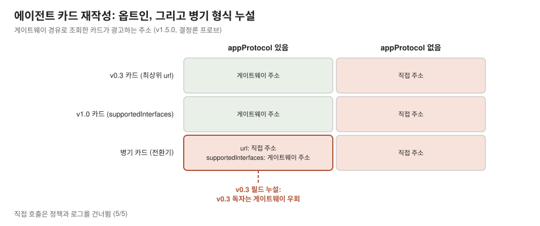
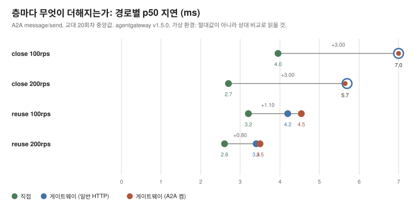

# agentgateway가 A2A에 실제로 강제하고 관측하는 것

[English](README.md)

[agentgateway](https://agentgateway.dev)를 A2A(Agent2Agent protocol) 백엔드
앞에 뒀을 때, 문서에 적힌 것과 실제로 강제되고 관측되는 것의 거리를
실측한다. [Gateway API 구현체 비교](../gateway-PoC/)와
[agentgateway의 MCP 표면](../agentgateway-study/)에 이은 같은 질문의
세 번째 적용이다. 선언된 기능과 강제되는 기능은 다르다.

요약하면 A2A에 대한 게이트웨이의 프로토콜 처리는 옵트인이고 그 스위치
(Service의 `appProtocol: agentgateway.dev/a2a`)가 세 가지를 한꺼번에
결정한다. 에이전트 카드가 게이트웨이 주소로 재작성되는지, 액세스 로그에
A2A 필드가 남는지, 그리고 작은 프로토콜 처리 비용을 내는지. 스위치를 끄면
게이트웨이는 바이트를 통과시키지만 카드는 백엔드의 직접 주소를 광고하고
디스커버리 단계가 라우팅 계층을 그대로 우회하게 된다.

측정 환경은 agentgateway v1.5.0, Kubernetes v1.37.0(VirtualBox 3노드),
2026-09-02~03. 앞선 v1.4.1과 Kubernetes v1.36.2 회차(2026-08-27)는 결정론
프로브 전부에서 같은 결과를 냈고 지연 표만 교체했다. 앞선 수치는 차이가
나는 자리에 함께 적었다. 가상 환경 수치이므로
절대값이 아니라 조건 간 상대 비교로 읽어야 한다.

## 요약

- **카드 재작성은 옵트인이고 혼합 형식 카드는 샌다.** appProtocol을 켜면
  v0.3 형식(최상위 `url`)도 v1.0 형식(`supportedInterfaces[].url`)도
  게이트웨이 주소로 재작성된다. 그런데 두 필드를 병기한 전환기 카드는
  supportedInterfaces만 재작성되고 최상위 url은 직접 주소로 남아, v0.3
  독자는 게이트웨이를 우회한다. 원인은 재작성 경로의 if/else 분기다
  (`a2a/mod.rs::apply_to_response`, v1.4.1부터 v1.5.0 릴리스까지 같은
  구조). 광고된 직접 주소로의 호출은 5/5 성공했고 정책과 관측을 모두
  건너뛴다.
- **v1.5.0의 A2A에는 요청 인가 표면이 없다.** MCP는 CEL 규칙
  (`mcpAuthorization`)을 받지만 A2A 쪽 데이터 플레인 `A2aPolicy`는 필드
  없는 빈 구조체이고 appProtocol이 켜는 것은 카드 재작성, JSON-RPC 파싱,
  로그 필드다. 관측은 있고 강제는 없다.
- **비용은 깨끗하게 갈라진다.** 직접 연결 대비 게이트웨이 홉은 호출마다 새
  연결이면 p50 +3.0ms, 연결을 재사용하면 +0.8~1.1ms. 일반 HTTP 프록시에
  얹히는 A2A 프로토콜 처리는 재사용 조건에서 +0.1~0.2ms이고 새 연결
  조건에서는 20회차 중앙값이 +0.00ms로 0과 구분되지 않는다. 조건당 회차
  20개의 중앙값이다.

## 결과

### 1. 카드 재작성: 옵트인, 그리고 혼합 형식 칸의 누설

A2A 디스커버리는 에이전트 카드(`/.well-known/agent.json`)에서 시작하고
카드에는 에이전트가 자기 엔드포인트 URL을 광고한다. 클라이언트가
게이트웨이를 거쳐야 한다면 이 URL이 재작성되어야 하고 아니면 카드가 직접
주소를 나눠 주게 된다.

appProtocol 스위치와 카드 형식 3종을 교차한 매트릭스:

| 셀 | 최상위 `url` (v0.3) | `supportedInterfaces[].url` (v1.0) |
|---|---|---|
| appProtocol + v0.3 카드 | 게이트웨이로 재작성 | (없음) |
| appProtocol + v1.0 카드 | (없음) | 게이트웨이로 재작성 |
| appProtocol + 병기 카드 | **직접 주소 유지** | 게이트웨이로 재작성 |
| appProtocol 없음(전 형식) | 직접 주소 유지 | 직접 주소 유지 |
| 직접 조회 통제(전 형식) | 직접 주소 유지 | 직접 주소 유지 |

병기 행이 이번 발견이다. v0.3 호환용 `url`과 v1.0 `supportedInterfaces`를
같이 담은 카드는 전환기 배포가 내놓는 바로 그 형태인데, 이때 v0.3 필드는
스위치를 켜도 직접 주소로 남는다. 코드 경로가 이유를 설명해 준다.
재작성은 supportedInterfaces의 존재를 v1.0 카드의 표지로 삼고 없을 때만
최상위 url로 내려간다(`crates/agentgateway/src/a2a/mod.rs`
apply_to_response. v1.4.1부터 v1.5.0 릴리스까지 같은 분기).
혼합 형식 카드에서 두 필드를 모두 재작성해야 하는지는 결함 주장이 아니라
업스트림에 물을 질문으로 남긴다. 이 표가 기록하는 것은 동작 그 자체다.

우회는 가설이 아니다. 광고된 직접 주소로 message/send를 보내면 5/5
에이전트에 도달했고 게이트웨이의 정책과 로그는 아무것도 남기지 않았다.

### 2. A2A 요청 인가 없음 (강제 없는 관측)

같은 게이트웨이가 MCP 표면에서는 도구와 인자에 CEL 규칙을 강제한다. A2A
표면에는 v1.5.0 기준 대응물이 없다(v1.4.1도 같다). 데이터 플레인 `A2aPolicy` 구조체에
필드가 없고 백엔드 정책은 프로토콜 스위치 역할이다. 누가 어떤 메서드나
스킬을 부를 수 있는지 평가하는 지점이 경로에 없다(v1.5.0 소스 확인으로
세운 결과이고 없는 표면이라 프로브 셀은 없다). 버전 한정 사실로
기록한다. A2A 지원이 게이트웨이에 추가된 지 오래되지 않았고 MCP 표면이
정책 장치가 갈 자리를 보여 준다.

### 3. 트레이스: 이어지지만 본문 주입은 없다

에코 에이전트가 수신 헤더를 응답 metadata로 반사하게 만들어 다운스트림이
받는 값을 호스트에서 판독했다.

- traceparent를 붙여 게이트웨이 경유: trace-id 유지, span-id는 게이트웨이
  것으로 교체(5/5). MCP 결과와 같은 방향.
- MCP와 달리 본문 주입은 없다. 메시지 `metadata`는 보낸 그대로 통과하고
  MCP의 `_meta.traceparent` 주입에 해당하는 동작이 없다.
- traceparent 없이 보내면 게이트웨이가 만들어 주지 않는다(5/5).
- 직접 경로 통제: 무변형(5/5).

조건 한정: 게이트웨이 트레이싱 설정은 켜지 않은 조건이다. 켠 조건의 스팬
부모 관계 문제는 별도 업스트림 항목(#2904, v1.4.1 이후 수정 병합)으로 범위 밖.

### 4. 오류는 HTTP 200에 실리고 잡는 것은 게이트웨이 로그다

미지원 메서드(tasks/get)는 HTTP 200 안의 JSON-RPC 오류 -32601로 돌아온다.
상태 코드만 보는 모니터링은 이를 성공으로 센다. 게이트웨이는 JSON-RPC
응답을 파싱해 `a2a.method=tasks/get a2a.response.outcome=error
a2a.response.error_code=-32601`을 액세스 로그에 남긴다(3/3). appProtocol이
없으면 같은 라우트의 요청이 `protocol=http`로 남고 A2A 필드는 없다(카드
조회에서 확인했고 오류 형태 프로브는 plain 경로에서 다시 재지 않았다).
관측도 재작성과 같은 스위치의 옵트인이다.

### 5. 비용: 3팔 교대

대상 세 개, 설치 상태는 동일하고 부하 생성기의 대상 주소만 다르다.
direct(LoadBalancer로 에이전트 직접), gw-plain(게이트웨이 경유, appProtocol
없음), gw-a2a(게이트웨이 경유, appProtocol 있음). 서브밀리초 비교를 팔
순서대로 몰아 재면 시간 드리프트가 섞이므로(MCP 표면 연구의 교훈) 회차
안에서 세 팔을 인접 교대하고 회차마다 순서를 로테이션했다. 회차 안 인접
쌍의 p50 차이, 조건당 회차 20개(밤사이 캠페인 1회, 240셀, 오류 0)의 중앙값:

| 조건 | 프록시 홉 (gw-plain - direct) | A2A 처리 (gw-a2a - gw-plain) | 합계 |
|---|---|---|---|
| close 100rps | +3.00ms | +0.00ms | +3.10ms |
| close 200rps | +3.00ms | +0.00ms | +3.00ms |
| reuse 100rps | +1.10ms | +0.20ms | +1.35ms |
| reuse 200rps | +0.80ms | +0.10ms | +0.90ms |

각 열은 회차별 차이의 독립적인 중앙값이라 열끼리 정확히 더해지지 않는다.

- 프록시 홉 비용은 연결 처리가 지배한다. 호출마다 새 연결이면 게이트웨이
  구간 TCP 수립이 더해져 +3.0ms, 재사용이면 +0.8~1.1ms.
- A2A 프로토콜 처리(카드 재작성, JSON-RPC 파싱, 로그 필드)는 재사용
  조건에서 +0.1~0.2ms로 분리된다. 새 연결 조건에서는 20회차 중앙값이
  +0.00ms로, A2A 처리 증분이 관측되지 않았다. 기제는 추측이 되므로 관측만
  적는다. v1.4.1 회차는 같은 재사용 셀에서 +0.6~0.8ms였는데, 두 회차
  사이에 게이트웨이 버전과 클러스터가 함께 바뀌어 그 차이를 버전에
  귀속하지 않는다.
- 게이트웨이 경유 p99는 모든 조건에서 직접 경로보다 3~6ms 높다(중앙값
  직접 6.6~7.8ms, 게이트웨이 10.1~13.3ms). 이 초경량 백엔드에서는 게이트웨이
  홉의 꼬리 이점이 보이지 않는다.
- 전 셀이 목표 rps(100/200)에 도달했고 오류 0. 생성기 자기검증(셀당 재연결
  수)으로 연결 모드가 설계대로 동작했음을 확인했다(close = 요청 수와 동일,
  reuse = 한 자릿수에서 수십).

## 운영 관점 정리

1. 클라이언트가 카드로 에이전트를 발견한다면 카드가 곧 라우팅 표면이다.
   `appProtocol: agentgateway.dev/a2a`를 설정한 뒤 게이트웨이 경유로
   카드를 조회해 실제로 광고되는 주소를 확인한다. 카드에 v0.3과 v1.0 URL
   필드가 병기되어 있다면 특히.
2. 게이트웨이가 호출 주체를 강제한다고 가정하지 않는다. v1.5.0의 A2A
   표면은 관측하고 인가하지 않는다. 지금 강제가 필요하면 다른
   곳(네트워크 정책, 에이전트 자신, 인증 프록시)에 둬야 한다.
3. HTTP 상태가 아니라 JSON-RPC 오류 코드를 본다. 게이트웨이 액세스 로그가
   이미 뽑아 주지만 appProtocol이 켜져 있을 때만이다.
4. 게이트웨이 비용은 홉 하나 값이다. 연결 재사용 기준 전체 우회 비용이
   p50 +0.9~1.35ms이고 실제 에이전트 작업(LLM 호출, 도구 실행)에 비하면
   사라지는 크기다.

## 재현

측정은 `aaif-benchmark` 클러스터(Kubernetes v1.37.0,
`../agentgateway-study/test-cluster/`로 구축)와
`../agentgateway-study/harness/`의 게이트웨이 설치 스크립트를 썼다.
v1.4.1 회차는 [mcp-migration](../mcp-migration/) 클러스터였다. A2A
고유분은 이 저장소에 있다.

- `k8s/server.py`: 최소 A2A 에코 에이전트(표준 라이브러리만. `CARD_FORMAT`
  env로 카드 형식 전환, 수신 헤더를 응답 metadata로 반사).
  `disable_nagle_algorithm = True`가 필수인데, 없으면 delayed ACK가
  게이트웨이 경로에 상수 ~40ms를 얹어 측정을 삼킨다(이 문제로 초기 캠페인
  하나를 폐기했다).
- `k8s/agent.yaml`: Deployment와 Service 3개(appProtocol 유무, direct 팔용
  LoadBalancer), HTTPRoute.
- `harness/probes.sh`: 카드 매트릭스, 우회, 트레이스, 오류 형태의 결정론
  프로브.
- `harness/loadgen_a2a.py`: A2A message/send 부하 생성기(열린/닫힌 루프,
  연결 모드 제어, 재연결 계수).
- `harness/ab_matrix.sh`: 3팔 교대 비용 캠페인.
- `harness/read_abm.py`: 캠페인 디렉토리를 위 표로 판독.
- `harness/rv_probes.sh`, `harness/rv_ab_matrix.sh`: v1.5.0 회차에 쓴
  사본(클러스터 컨텍스트 교체, 체인 단계 사이에 게이트웨이 상주).
  `harness/chart.py`가 캠페인 디렉토리에서 그림을 재생성한다.

셀 단위 원자료 JSON은 저장소에 넣지 않는다. 이 README의 표와 재생성
스크립트가 발행물이다.

## 한계

- 백엔드는 공식 A2A SDK 서버가 아니라 목적 제작한 최소 에이전트다.
  게이트웨이가 검사하는 표면(카드 GET, JSON-RPC POST)은 구현했지만 SDK
  고유의 카드 구성은 다를 수 있다.
- 가상 환경이므로 상대 비교만 유효하다.
- 전 구간 agentgateway v1.5.0 고정. 비용 수치는 이 스택에 고정된 값이다
  (앞선 v1.4.1 회차는 차이가 나는 자리에 함께 적었다).
- 스트리밍(SSE)과 tasks/* 메서드는 범위 밖이다(에이전트 미구현).
