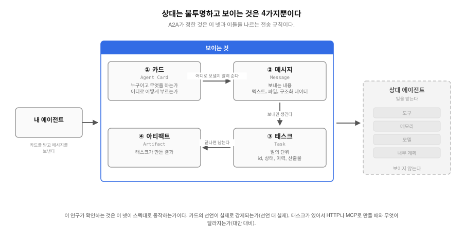
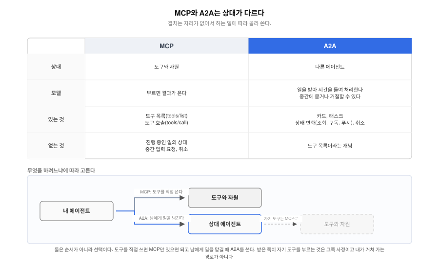
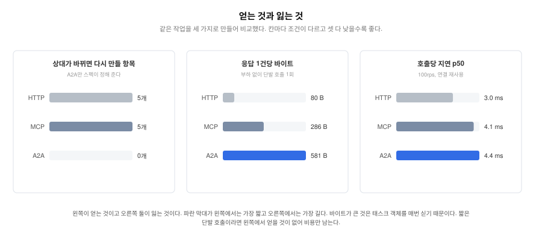

# A2A는 어떤 상황에서 어떻게 사용하면 유용할까?

**[Read in English: README.md](README.md)**

> 상태: 1단계 측정 완료(2026-09-10). 선언 대 실제, 대안 대비, 오버헤드 셋의 결과가
> 아래에 있다. 두 세대 상호운용과 게이트웨이 통과는 2단계로 남겼다.

## A2A는 무엇이고 어디서 어떻게 쓰이는가

**Q1. A2A란 무엇인가?**

A2A(Agent2Agent)는 에이전트가 다른 에이전트에 일을 맡기고 결과를 받는 방식을
정한 프로토콜이다. 이름 그대로 에이전트 대 에이전트다. 사람이 중개하지 않아도
한쪽이 다른 쪽을 찾아 일을 넘기고 진행을 확인하고 결과를 받는 것이 목적이다.

상대 에이전트의 도구, 메모리, 모델, 내부 계획은 보이지 않는다는 전제에서 출발한다.
보이는 것은 넷이다. 카드(Agent Card)는 상대가 누구이고 무엇을 하며 어디로 어떻게
호출하는지 적은 JSON이다. 태스크(Task)는 일의 단위로 id와 상태와 이력과 산출물을 가진다.
메시지(Message)는 텍스트나 파일이나 구조화 데이터 파트의 묶음이다. 아티팩트(Artifact)는
태스크가 만든 결과다. 나머지는 이 넷을 나르는 전송 규칙이고 JSON-RPC, HTTP+JSON, gRPC
세 바인딩을 정의한다.



그림의 넷이 이 연구가 확인하는 대상이다. 카드가 선언한 것이 실제로 강제되는지, 태스크가
있어서 무엇이 달라지는지가 시험 기록의 1번과 2번이다.

**Q2. 어디서 어떻게 쓰이나?**

전형적인 자리는 팀이나 회사가 다른 에이전트끼리 일을 주고받는 곳이다. 예를 들어
사내 계획 에이전트가 외부 업체의 배송 에이전트에 경로 계산을 맡긴다면, 계획
에이전트는 상대의 카드를 받아 어디로 어떻게 호출할지 알아내고 메시지를 보낸 뒤
태스크 id로 진행을 확인하다가 결과를 받는다. 상대가 어떤 프레임워크로
만들어졌는지, 어떤 모델을 쓰는지는 몰라도 된다. 재단 발표문은 공급망, 금융,
모바일 플랫폼에서 프로덕션으로 쓰이고 150곳이 넘는 조직이 지지한다고
적었다(2026-08-17).

**Q3. 이게 없다면 어떻게 되나?**

에이전트끼리 일을 주고받는 것 자체는 A2A 없이도 된다. 지금도 대부분은 그렇게
한다. 흔히 쓰는 방법은 둘이고 둘 다 대가가 있다. 하나는 상대 에이전트마다 HTTP
API를 따로 맞추는 것이다. 주소와 인증과 요청 형식을 상대별로 알아야 하고 오래
걸리는 일의 진행 확인과 취소도 상대별로 다르게 구현한다. 에이전트가 늘수록 맞출
쌍이 늘어난다. 다른 하나는 상대 에이전트를 MCP 도구로 감싸는 것이다. 도구 호출
규약은 하나로 통일되지만 도구는 "호출하면 결과가 온다"는 모델이라 진행 중인 일의
상태, 중간 입력 요청, 취소 같은 개념이 없다(MCP 2.0.0 코어에는 태스크 수명주기가
없다는 것을 이 연구에서 확인했다). A2A가 표준으로 두려는 것이 이 자리다. 상대를
찾는 방법(카드), 일의 단위와 상태(태스크), 진행을 아는 방법(조회, 구독, 푸시)을
상대와 무관하게 하나로 정한다. 그래서 이 연구의 대조군은 순수 HTTP와 MCP다.
A2A가 없을 때 실제로 쓰는 두 방법과 나란히 놓아야 무엇이 달라지는지가 보인다.

**Q4. MCP와 비슷해 보이는데 차이가 뭘까?**

둘 다 JSON-RPC로 무언가를 호출하고 결과를 받는 규약이라 겉모습이 닮았다. 차이는
상대가 무엇이냐에 있다. 스펙 부록의 한 문장대로 MCP(Model Context Protocol)는
에이전트가 도구와 자원을 쓰는 방식을, A2A는 에이전트가 다른 에이전트에 일을
맡기는 방식을 표준화한다. 도구는 호출하면 결과가 오는 것이고 에이전트는 일을
받아 시간을 들여 처리하다가 중간에 물어볼 수도 있고 거절할 수도 있는 상대다.
그래서 MCP에는 도구 목록과 호출이 있고 A2A에는 카드와 태스크와 상태 변화가 있다.
역할이 다르니 둘은 경쟁하지 않는다. 다만 순서가 아니라 선택이다. 도구를 직접
쓰면 MCP만 있으면 되고 남에게 일을 맡길 때 A2A를 쓴다. 스펙 부록도 A2A로 일을 받은
에이전트가 MCP로 도구를 호출하는 구성을 예로 드는데, 그것은 맡은 쪽의 사정이지 내가
거쳐 가는 경로가 아니다. 같은 서버가 둘 다 낼 수도 있다.



## 이력과 동작 원리, 그리고 잰 버전

**Q5. 누가 왜 만들었나?**

구글이 2025년 4월에 공개했고(저장소 생성 2025-03-25, 공개 커밋 2025-04-14) AWS,
시스코, 마이크로소프트, 세일즈포스, SAP, 서비스나우 등을 창립 조직으로 리눅스
재단에 기부했다. 2026년 6월 18일에 AAIF(Agentic AI Foundation) 프로젝트로
제안되어(#37) 기술위원회 승인 7월 15일, 이사회 승인 8월 4일을 거쳐 2026년 8월
17일에 AAIF 호스티드 프로젝트가 되었다(Growth 단계). 스펙 v1.0.0은 2026년 3월
12일에 고정됐고 이 연구가 기준으로 삼는 v1.0.1(2026년 5월 28일)이 이 글을 쓰는
2026년 9월 10일 기준으로도 최신이다. v1.0에서 메서드 이름(`message/send` ->
`SendMessage`), Part 타입, 태스크 상태 이름이 바뀌어 0.x 시절 글의 필드 수준
서술은 대부분 맞지 않게 되었다.

**Q6. 스펙과 SDK는 어떻게 다른가?**

스펙과 SDK는 다른 것이고 버전도 따로 간다. 스펙은 규약 문서와 스키마(JSON,
protobuf)이며 `a2aproject/A2A` 저장소가 정본이다. SDK는 그 스펙을 언어별로
구현한 라이브러리로 공식 SDK가 Python, JavaScript, Java, Go, .NET, Rust 6개가
있고 각자 자기 버전 번호로 릴리스한다. 이 연구가 쓰는 Python SDK(a2a-python)는
스펙 v1.0.1을 구현한 1.1.x 계열이다. 스펙이 반드시 하라고(MUST) 적은 것을 SDK가
기본 구성에서 반드시 해 주지는 않는다. 예를 들어 스펙 7.4절은 서버가 카드에
선언한 요구에 따라 모든 요청을 인증해야 한다고 적지만 SDK 기본 서버는 검사하지
않는다. 그 간격이 이 연구가 첫 번째로 확인하는 것이다. 독자가 "A2A를 쓴다"고 할
때 실제로 손에 쥐는 것은 SDK이므로 스펙 문서만 읽고 기대한 것과 SDK로 만든
서버의 실제 동작을 나눠 봐야 한다.

**Q7. 어떻게 동작하나?**

클라이언트는 `/.well-known/agent-card.json`에서 카드를 받아 인터페이스(바인딩과
버전과 주소)를 고른 뒤 메시지를 보낸다. 서버는 즉시 태스크를 돌려주고(차단
호출이면 완료까지 기다렸다 돌려준다) 클라이언트는 조회, SSE 구독, 푸시 알림 중
하나로 상태 변화를 안다. 태스크 상태는 8종(SUBMITTED, WORKING, COMPLETED,
FAILED, CANCELED, INPUT_REQUIRED, REJECTED, AUTH_REQUIRED)이고 취소는 "성공을
보장하지 않는다". 인증은 카드의 `securitySchemes`로 선언하고 서버는 그 선언에
따라 모든 요청을 인증해야 한다(7.4절). 이 두 문장을 아래 선언 대 실제에서
확인한다.

**Q8. 어느 버전을 측정했나?**

스펙 v1.0.1과 공식 Python SDK a2a-python 1.1.2다. 1.1.2는 2026-07-22 릴리스이고
2026-09-10 기준 최신은 1.1.4(09-08)다. 두 세대가 갈리는 항목은 v0.3 이름과 경로로
직접 호출해 확인했다. 서버는 SDK 샘플(`DefaultRequestHandler` + `InMemoryTaskStore`,
JSON-RPC와 REST, v0.3 호환 켬)을 최소 델타로 고쳐 쓴다. 대조군의 MCP 서버는 mcp
2.0.0(2026-07-28 스테이트리스 스펙), HTTP 서버는 표준 라이브러리 JSON-RPC다.
환경은 VirtualBox 3노드 쿠버네티스 1.37.0(`aaif-benchmark`).

앞의 두 절은 결과를 읽는 데 필요한 만큼으로 줄인 것이다. 프로토콜의 배경과 각
필드의 뜻은 관련 자료 절의 해설 글에 있다.

## 그래서 무엇을 어떻게 재는가?

세 가지를 확인한다. 셋 다 2026년 9월에 측정을 마쳤고 답은 결과 절에 있다.

### 1. 선언 대 실제

스펙 문서를 읽고 기대한 것과 SDK로 만든 서버의 실제 동작 사이의 거리를 본다.

**Q. 무엇을 확인하나?**

A. 스펙이 MUST와 SHOULD로 약속한 것 가운데 공식 SDK의 기본 구성에서 실제로 되는
것과 앱이 직접 만들어야 하는 것을 가른다.

**Q. 어떻게 확인하나?**

A. 카드 탐색, 인증 선언, 태스크 상태 전이, 취소, 스트리밍, 푸시 알림, 트랜스포트
동등성, 오류 표면까지 항목 12개를 같은 입력이면 같은 결과가 나오는 확인
스크립트로 하나씩 확인한다. 호환을 켠 서버와 끈 서버를 나란히 두고 비교한다.

### 2. 대안 대비

A2A를 쓰지 않았다면 실제로 썼을 두 가지와 나란히 놓고 견준다.

**Q. 무엇을 확인하나?**

A. 같은 일을 A2A로 만들 때와 MCP나 순수 HTTP로 만들 때 클라이언트가 겪는 것이
어떻게 다른지를 본다.

**Q. 어떻게 확인하나?**

A. 같은 작업 함수를 세 가지로 감싸 파드 하나에 컨테이너 셋으로 띄운다. 짧은
작업과 15초 작업 두 시나리오에서 왕복 수, 주고받는 바이트, 클라이언트가 알아야
하는 것(주소, 식별자, 상태 값), 진행 확인과 취소 방법, 실패했을 때의 모습을
견준다.

### 3. 오버헤드

프로토콜 표면이 붙이는 지연과 바이트를 부하에서 확인한다.

**Q. 무엇을 확인하나?**

A. 프로토콜 자체가 지연과 바이트를 얼마나 더 쓰는지를 본다.

**Q. 어떻게 확인하나?**

A. 같은 구성의 파드(컨테이너 셋)에 같은 부하를 건다. 초당 요청 수 두 점과 연결 방식
두 가지를 조합해 조건 넷을 만든다. 구현 하나를 한 조건에서 30초 돌린 것이
셀이다. 구현 셋에 조건 넷에 회차 다섯을 곱해 60셀이다.

이 셋의 답에서 "A2A가 어떤 상황에서 유용한가"를 실측으로 그리는 것이 목적이다. 해설과
마이그레이션 안내는 재단과 AAIF 앰배서더의 글이 이미 있으므로 이 저장소는 실측만 둔다.

### 이번에 다루지 않은 것

셋 다 에이전트 앞에 게이트웨이(프록시)를 두지 않고 직접 호출한다. 게이트웨이가 A2A 표면에 무엇을 하고 무엇을 하지
않는지는 [agentgateway 연구의 A2A 절](../agentgateway-study/a2a/README_ko.md)에 있다.
요지는 재작성과 관측은 하고 강제는 하지 않는다는 것이다. 두 세대를 함께 광고하는 카드의 v0.3 필드가
백엔드 주소로 남아 옛 클라이언트가 게이트웨이를 우회한다는 발견도 거기 있다.

두 세대 상호운용 매트릭스와 게이트웨이 통과는 2단계로 남겼고 1단계 발행 뒤에 한다.

## 결과: 무엇이 좋아지고 어떤 비용이 드는가

도입을 검토한다면 아래 네 문답으로 충분하다. 수치와 판정이 필요하면 아래 시험 기록
절로 내려간다.

**Q. 무엇이 좋아지는가?**

A. 진행 확인과 취소의 규약이 생긴다. 오래 걸리는 일을 남에게 맡길 때
클라이언트가 알아야 하는 것을 스펙이 정해 준다. 태스크 식별자, 상태 값, 상태
조회, 취소, 스트리밍, 푸시 알림이 그것이다.

**Q. 그 규약은 어떨 때 쓸모가 있나?**

A. 규약이 없으면 상대마다 다시 만들어야 하는 것들이다. 전형적인 넷은 이렇다.
첫째와 둘째와 넷째는 이 연구가 측정했고 셋째의 MCP 쪽은 스펙과 SDK 소스 확인이다.

- **일이 언제 끝나는지 알아야 할 때.** 15초짜리 작업을 맡기고 기다리는 동안 지금
  접수됐는지 처리 중인지 끝났는지 알아야 한다. A2A는 태스크 식별자 하나로 조회한다.
  원하면 스트리밍으로 받거나 끝났을 때 서버가 알려 주게 할 수 있다. HTTP나 MCP로
  만들면 그 조회 방식을 서버마다 새로 정하고 클라이언트도 서버마다 새로 만든다.
- **하던 일을 멈춰야 할 때.** 사용자가 취소를 눌렀거나 상위 작업이 실패해 하위 일을
  거둬들여야 하는 경우다. A2A는 취소가 스펙에 있고 SDK가 그것을 실행기의
  취소 훅에 연결해 둔다. HTTP와 MCP에는 그 규약이 없어 이 연구는 표시만 바꾸는 최소
  구현으로 두었고 그 구현에서는 작업 스레드가 계속 돌았다. 진짜 취소를 붙이는 것은
  가능하고 그 비용이 규약이 없을 때 치르는 값이다.
- **상대가 중간에 되물을 때.** 어느 환경에 배포할지 같은 것을 처리 도중 물어야 하는
  경우다. A2A에는 그 상태(input-required)가 있어서 같은 태스크로 답을 이어 보내면
  하던 일이 재개된다. MCP 2.0.0 코어에는 그 상태가 없어 앱이 따로 만들지 않으면
  호출을 처음부터 다시 하게 된다.
- **상대가 여럿이거나 바뀔 때.** 사내 에이전트 하나만 부른다면 규약이 없어도 된다.
  상대가 다섯이거나 외부 업체 것이라면 그때마다 클라이언트를 새로 만든다. 이 연구가
  센 항목 수가 그 크기다. 상대 하나당 HTTP와 MCP는 5개, A2A는 없다.

**Q. 어떤 비용이 드는가?**

A. 바이트가 는다. 같은 작업 한 번에 응답이 HTTP 80, MCP 286, A2A 581바이트다. 첫
호출 앞에는 카드 조회 858바이트가 한 번 붙는다. 진행 확인을 폴링으로 하면 한
번에 571바이트를 받는데 이것은 HTTP 앱 핸들(진행 확인 규약이 없어 이 연구가 앱
안에 직접 만든 상태 조회)의 6배가 넘는다.

지연도 는다. 부하를 걸면 A2A는 같은 일을 하는 최소 HTTP보다 호출당 p50(요청 절반이 그 안에 끝나는
시간)이 1.2~2.1ms 더 걸린다. MCP와의 차이는 0.2~0.3ms로 작다. 비용의 큰 부분은 구조화된 프로토콜 공통의 것이다.

**Q. 그래서 언제 쓸 만한가?**

A. 위 네 가지 중 하나라도 해당하면 값을 한다. 아래 표는 위 수치를 저자가 읽은 것이고
측정값 자체는 아니다.

| 상황 | 권하는가 | 이유 |
|---|---|---|
| 사내 서비스 하나의 도구를 호출한다 | 아니다 | MCP로 충분하다. A2A는 얻을 것 없이 응답이 7배가 되고 지연이 붙는다 |
| 같은 팀 에이전트에 1초 안에 끝나는 일을 맡긴다 | 아니다 | 규약이 값을 할 일이 없다. 상대가 하나면 HTTP로 맞추는 편이 싸다 |
| 오래 걸리는 일을 맡기고 진행을 보거나 취소해야 한다 | 그렇다 | 조회, 스트리밍, 푸시, 취소가 스펙에 있어 상대가 바뀌어도 클라이언트가 같다 |
| 다른 팀이나 다른 조직의 에이전트를 여럿 부른다 | 그렇다 | 카드로 찾고 같은 규약으로 다룬다. 상대마다 다시 만들 5개가 사라진다 |
| 프로토타입을 빨리 만들어 본다 | 나중에 | SDK 기본에는 인증 강제도 푸시 발송기도 없어 배선할 것이 남는다 |

무엇을 쓰든 선언과 강제는 구분해야 한다. 카드가 인증 스킴과 푸시 알림 능력을
선언해도 SDK 기본 구성은 강제하지도 제공하지도 않는다. 스펙은 서버가 선언대로 인증하도록
요구하지만 기본 구성이 그것을 하지 않으므로, 카드만 보고 서버 동작을 믿으면 안 된다.

위 문답을 한 장으로 옮기면 이렇다. 왼쪽 칸은 상대가 바뀌면 다시 만들 항목 수, 가운데는
응답 바이트, 오른쪽은 p50 지연이다. A2A(파란 막대)가 왼쪽에서 가장 짧고 오른쪽 둘에서
가장 길다. 왼쪽의 얻는 것과 오른쪽 둘의 드는 것이 맞바꾸는 관계다.



## 운영자가 알아야 할 것

| 하려는 것 | 되는가 | 주의 |
|---|---|---|
| 카드로 상대 찾기 | 된다 | 경로는 `/.well-known/agent-card.json` 하나다. `/.well-known/agent.json`은 404 |
| 카드에 인증 걸기 | 선언만 된다 | API 키, HTTP Bearer, OAuth2 세 종류를 다 써도 강제가 없다. 스펙은 서버가 인증하라고 하므로 앱이나 앞단이 맡아야 한다 |
| 비공개 정보를 확장 카드에 숨기기 | 안 된다 | SDK 기본은 신원을 보지 않아 무인증 요청에도 그대로 준다 |
| 두 세대 클라이언트 함께 받기 | 된다 | 세대를 고르는 것은 `A2A-Version` 헤더다. 없으면 v0.3으로 판정하므로 v1.0 클라이언트는 헤더를 반드시 붙인다 |
| 카드의 인터페이스 목록 믿기 | 믿으면 안 된다 | v0.3 호환을 끈 서버도 카드에는 v0.3 인터페이스가 남아 있고 부르면 거절된다 |
| 오래 걸리는 일 맡기고 진행 확인 | 된다 | 폴링, 스트리밍, 푸시 셋 다 있다. 폴링은 상태 확인 1회에 571바이트라 비싸므로 스트리밍이나 푸시를 쓴다 |
| 푸시 알림 쓰기 | 배선해야 된다 | SDK 기본에는 설정 저장소도 발송기도 없어 설정 자체가 거절된다. 카드의 선언은 배선과 무관하게 켜진다 |
| 진행 중인 일 취소 | 된다 | 진행 중과 input-required는 취소된다. 완료된 것은 거절되는데 코드가 스펙의 -32002가 아니라 -32603이다 |
| 백엔드 재시작 넘겨 상태 유지 | 안 된다 | `InMemoryTaskStore`는 파드 메모리다. 영속 저장소를 붙여야 한다 |
| 짧은 단발 호출에 도입 | 권하지 않는다 | 얻는 것이 없고 응답이 HTTP의 7배, 지연이 1.2~2.1ms 더 붙는다 |

푸시 알림을 쓸 때 발송이 실패해도 태스크는 completed로 끝나고 클라이언트가 그것을 알
방법이 없다. 발송 실패는 서버 로그에만 남는다.

## 시험 기록

여기부터는 측정 기록이다. 위 결론의 근거를 확인하려는 사람을 위한 것이다. 도입 판단만
필요하다면 읽지 않아도 된다.

회차별 원자료(셀 JSON과 프로브 응답 전문)는 이 저장소에 포함하지 않는다. 아래 표와
수치가 발행하는 값의 전부다. 각 절에 적은 회차 이름은 그 값이 어느 실행에서 나왔는지
가리키는 표시다. 하네스는 함께 공개하므로 같은 절차를 다시 돌릴 수 있다.

### 1. 선언 대 실제

스펙은 RFC 2119를 따라 규칙의 세기를 세 단계로 적는다. 반드시 해야 하는 것(MUST),
하는 편이 좋은 것(SHOULD), 해도 되는 것(MAY)이다. 부정형(MUST NOT, SHOULD NOT)과
동의어(REQUIRED, SHALL, RECOMMENDED, OPTIONAL)도 같이 쓴다. 이 연구가 확인한 항목
12개는 앞의 두 단계를 중심으로 골랐다. 지키지 않으면 스펙에 어긋났다고 말할 수 있는
규칙이기 때문이다. 회차 `axis1-0910`.

확인한 12개는 이렇다.

| 번호 | 확인한 것 | 스펙이 말한 것 | 기본 서버의 실제 | 판정 |
|---|---|---|---|---|
| 1-1 | 카드 경로 | `/.well-known/agent-card.json`에 둔다 | 그 경로에 있다. 다른 경로는 없다 | O |
| 1-2 | 카드의 두 세대 병기 | 새 세대는 `supportedInterfaces`로 알린다 | 병기가 기본이고 끌 수 없다. 호환을 꺼도 카드는 v0.3 주소를 광고하는데 그 주소는 응답하지 않는다 | X |
| 1-3 | 카드가 선언한 인증 스킴 | 선언한 스킴에 따라 모든 요청을 인증한다(7.4절 MUST) | 선언만 되고 강제가 없다. 스킴 3종 모두 무인증과 틀린 키가 통과 | X |
| 1-4 | 확장 카드(인증된 요청에만 주는 추가 정보 카드)의 신원 확인 | 인증된 요청에만 준다 | 무인증 요청에도 준다. 공개 카드에 없는 스킬까지 나온다 | X |
| 1-5 | 태스크 상태 전이 | 접수, 처리 중, 완료로 옮겨 간다 | 5회 모두 0.1초에 처리 중이 되고 15.1~15.6초에 완료(선언 대 실제 서버) | O |
| 1-6 | 되묻고 재개 | 입력이 필요하면 멈추고 받아서 이어 간다 | 같은 태스크로 답을 보내면 재개된다. 무엇을 기다리는지는 앱이 관리 | O |
| 1-7 | 취소 | 성공을 보장하지 않는다. 취소할 수 없는 상태면 `TaskNotCancelableError`(-32002) | 진행 중과 되묻는 중은 취소된다. 완료된 것은 거절되는데 코드가 스펙의 -32002가 아니라 내부 오류(-32603) | △ |
| 1-8 | 태스크 조회와 목록 | 단건 조회와 목록 조회 | 단건은 두 세대 모두, 목록은 v1.0에만 있다. 페이지 나누기도 동작 | O |
| 1-9 | 스트리밍 | SSE로 보내고 첫 이벤트는 태스크 | 이벤트 4개, 첫 이벤트가 태스크, 마지막이 완료 표시 | O |
| 1-10 | 푸시 알림 | 설정을 등록하면 서버가 보낸다 | 저장소와 발송기를 배선해야 동작한다. 배선 전에는 설정 요청 자체가 거절. 없는 수신기 주소로 보내면 태스크는 완료로 끝나고 실패는 서버 로그에만 남는다 | △ |
| 1-11 | 트랜스포트 동등성 | 어느 바인딩으로도 같은 일을 할 수 있다 | JSON-RPC와 REST 두 바인딩에서 헤더를 붙이면 같다. 안 붙이면 v0.3으로 판정된다. gRPC는 재지 않았다 | △ |
| 1-12 | 오류 표면 | 표준 오류 코드를 쓴다 | 바인딩마다 다르다. JSON-RPC는 200에 오류 코드, REST는 404에 다른 형식 | △ |

O는 스펙대로 동작하는 것, △는 조건이 붙는 것, X는 스펙과 다른 것이다.

**X 가운데 1-3과 1-4는 원인이 같다.**

SDK 기본 핸들러에는 호출자가 누구인지 보는 자리가 아예 없어 인증 없는 요청이
그대로 통과된다. 스펙은 서버가 인증하라고 적었으므로 그 몫은 앱이나 앞단이 맡아야 한다.
1-2는 다르다. 카드가 광고하는 주소가 응답하지 않는 것이라 신원 문제가 아니라
카드와 라우팅이 어긋난 것이다.

**△ 셋은 조건만 채우면 된다.**

1-10은 설정 저장소와 발송기를 배선하면 스펙대로 간다. 다만 발송이 실패해도
태스크는 완료로 끝나고 클라이언트는 실패를 알 방법이 없다. 1-11과 1-12는 헤더와
바인딩을 맞추면 된다. 다만 스펙 3.6.1이 헤더를 반드시 보내라고 하면서 없으면 v0.3으로
본다고 함께 적는다. 그래서 빠뜨려도 오류가 아니라 조용한 폴백이 된다.

**1-11의 세대 선택은 따로 적어 둔다.**

한 서버가 두 세대를 함께 서비스하는데 어느 쪽으로 갈지는 `A2A-Version` 헤더
하나가 정한다. 헤더가 없으면 v0.3으로 판정한다. 그래서 v1.0 클라이언트가 헤더를
빠뜨리면 오류 없이 v0.3으로 취급된다. 조용히 어긋나므로 알아채기 어렵다.

가르는 방식도 바인딩마다 다르다. JSON-RPC는 주소 하나에서 헤더로만 갈린다. REST는
경로까지 갈리는데 `/a2a/rest/`가 v1.0이고 `/a2a/rest/v1/`이 v0.3이라 이름과 실제가
반대로 보인다.

### 2. 대안 대비

같은 작업 함수를 A2A와 MCP와 순수 HTTP로 감싸 파드 하나에 나란히 두고 비교했다.
회차 `axis2-0910`.

**짧은 작업에서는 결과가 같고 비용만 다르다.**

세 구현이 돌려준 문자열이 글자까지 같았다. 다른 것은 왕복 수와 바이트와
지연뿐이고 수치는 회차별 수치에 있다.

**오래 걸리는 작업에서 갈린다.**

15초 작업을 맡기고 결과를 받기까지 걸린 시간은 세 구현 다 15.1~15.2초로 같았다.
갈리는 것은 그 15초 동안 클라이언트가 무엇을 할 수 있느냐다.

| 무엇을 | HTTP | MCP | A2A |
|---|---|---|---|
| 진행 확인 방법 | 이 연구가 앱 안에 만든 폴링 | 15초 차단 호출 또는 이 연구가 만든 폴링 | 폴링, 스트리밍, 푸시 셋 다 스펙에 있음 |
| 폴링을 안 할 수 있나 | 없다. 직접 만들어야 한다 | 없다. 직접 만들어야 한다 | 있다. 스트리밍과 푸시가 왕복을 0으로 만든다 |
| 취소 | 규약 없음. 이 연구 구현은 표시만 바꾼다 | 규약 없음. 이 연구 구현은 표시만 바꾼다 | 스펙에 있고 SDK가 실행기의 취소 훅에 연결한다 |
| 재시작 뒤 상태 유실을 알리는 방법 | 서버가 정한 오류 코드 | 정상 결과 문자열(코어에 해당 오류가 없어 이 연구가 그렇게 둠) | 프로토콜 오류 |

폴링만 놓고 보면 A2A가 가장 비싸다. 태스크 객체 전체를 매번 싣기 때문이고
상태 확인 한 번의 바이트가 HTTP 쪽의 6배가 넘는다. 수치는 회차별 수치에 있다.

그런데 A2A는 폴링을 안 해도 된다. 스트리밍과 푸시가 프로토콜에 있어 상태 확인
왕복을 0으로 만든다. 다른 둘에서 같은 것을 하려면 SSE 엔드포인트와 웹훅 발송기를 직접
만들어야 하고 이 측정에서는 만들지 않았다.

MCP는 애초에 선택지가 좁다. `mcp==2.0.0` 코어에 태스크 수명주기가 없어서 15초를
그대로 기다리는 차단 호출이 아니면 도구 이름으로 만든 앱 수준 핸들뿐이다.

**실패의 모양도 다르다.**

백엔드를 재시작하면 셋 다 상태를 잃는다. 저장소가 모두 파드 메모리라 예상된
결과다. 다른 것은 잃었다고 알리는 방식이다. MCP 코어에는 "모르는 태스크" 오류가
없어 이 연구의 앱 핸들은 정상 도구 결과로 `unknown` 문자열을 돌려주게 두었다.
그러면 상태 유실과 정상 상태를 가르는 일이 클라이언트의 문자열 해석이 된다.

**백엔드가 모두 사라지면 셋이 같다.**

전부 연결 실패이고 프로토콜이 개입할 여지가 없다. 이 측정에서 프로토콜 차이가
나타난 것은 백엔드가 살아 있고 요청이 잘못된 경우뿐이었다.

### 3. 오버헤드

세 구현에 같은 부하를 걸어 60셀을 측정했다. 회차 `axis3-0909`.

A2A는 같은 일을 하는 최소 HTTP보다 호출당 p50이 1.2~2.1ms 더 걸린다. MCP보다는
0.2~0.3ms 더 걸린다. 60셀 전부 오류와 버린 요청이 0이었다. 조건별 수치는 아래 회차별 수치에 있다.

읽을 것은 두 수의 크기 차이다. A2A와 MCP의 간격이 작다는 것은 비용의 큰 부분이 A2A라서
붙는 것이 아니라 구조화된 프로토콜이라서 붙는다는 뜻이다. 이 측정의 MCP 대조군 기준으로 A2A는
0.2~0.3ms 더 걸렸다. 순수 HTTP에서 옮겨 온다면 1.2~2.1ms를 그대로 떠안는다.

### 회차별 수치

#### 짧은 작업 한 번 (2026-09-10, 5회)

같은 입력을 세 구현에 보냈고 결과 문자열은 글자까지 같다.

| 구현 | 첫 호출 왕복 | 지연 중앙값 | 요청 바이트 | 응답 바이트 |
|---|---|---|---|---|
| HTTP | 1회 | 3.2ms | 80 | 80 |
| MCP | 1회 | 5.9ms | 297 | 286 |
| A2A | 2회 | 6.1ms | 154 | 581 |

바이트와 지연은 메시지 호출 한 번의 값이다. A2A는 그 앞에 카드 조회가 한 번 붙고 그것이
858바이트다. 이후 호출은 셋 다 1회다.

#### 오래 걸리는 작업 (2026-09-10, 15초)

완료까지는 셋 다 15.1~15.2초로 같다.

| 항목 | HTTP 앱 핸들 | MCP 차단 | MCP 앱 핸들 | A2A 폴링 | A2A 스트리밍 | A2A 푸시 |
|---|---|---|---|---|---|---|
| 첫 응답 | 0.1초 | 15.1초 | 0.1초 | 0.1초 | 첫 이벤트가 바로(시각 미측정) | 0.1초 |
| 상태 확인 왕복 | 15회 | 0회 | 15회 | 15회 | 0회 | 0회(등록 2회) |
| 바이트 | 상태 확인 1회 92 | 해당 없음 | 상태 확인 1회 286 | 상태 확인 1회 571 | 이벤트 4개 합 1,287 | 서버가 보낸 두 요청 합 465 |

폴링 간격은 1초다. 스트리밍은 이벤트 4개의 총합이고 푸시는 서버가 보낸 두 요청의 합이다.

#### 클라이언트가 상대마다 다시 만들어야 하는 것

| 알아야 하는 것 | HTTP | MCP | A2A |
|---|---|---|---|
| 시작 호출 이름 | 서버가 정함 | 서버가 정함 | `message/send` |
| 식별자 이름 | 서버가 정함 | 서버가 정함 | `taskId` |
| 상태 확인 이름 | 서버가 정함 | 서버가 정함 | `tasks/get` |
| 상태 값 | 서버가 정함 | 서버가 정함 | 스펙이 정함 |
| 취소 규약 | 서버가 정함 | 서버가 정함 | `tasks/cancel`(스펙) |
| 합계 | 5 | 5 | 0 |

표의 A2A 열은 v0.3 JSON-RPC 표기다. v1.0에서는 `SendMessage`, `GetTask`, `CancelTask`로
이름이 바뀌었고 이 연구의 프로브는 헤더 없이 부른 경우가 많아 v0.3 이름으로 적었다.

#### 같은 작업을 세 프로토콜로 (2026-09-09, 60셀, 오류 0)

파드 하나에 컨테이너 셋을 두고 셋이 같은 `work()`를 호출한다. 대안 대비와는 다른 회차이고
서버 소스도 따로다(`k8s/three-arms/`). 짧은 작업 경로는 같은 `work()`라 비교가 성립한다.
셀은 30초, 회차 5회,
회차 안에서 HTTP -> MCP -> A2A 교대. p50은 셀 5개의 중앙값(ms)이다.

50rps와 100rps는 생성기 동시성이 8과 16으로 달라 행끼리 비교하지 않는다. 한 행 안에서
구현 사이의 차이만 읽는다.

| 조건 | HTTP | MCP | A2A | A2A - HTTP |
|---|---|---|---|---|
| 50rps 매번 새 연결 | 4.5 | 5.6 | 5.9 | +1.4 |
| 50rps 연결 재사용 | 3.4 | 5.3 | 5.5 | +2.1 |
| 100rps 매번 새 연결 | 3.4 | 4.3 | 4.6 | +1.2 |
| 100rps 연결 재사용 | 3.0 | 4.1 | 4.4 | +1.4 |

성공 응답 1건당 바이트는 50rps에서 HTTP 80, MCP 286, A2A 582다. 100rps에서는 셋 다
1~2바이트 늘어 81, 287, 584가 된다. 위 짧은 작업 표의 581은 부하 없이 단발로 한 번
호출해 잰 값이라 조건이 다르다.

A2A와 MCP의 p50 차이는 0.2~0.3ms로 작다. 비용의 큰 부분은 구조화된 프로토콜 표면
공통의 것이다.

## 한계

- SDK 하나(Python 1.1.2)와 샘플 실행기 기반 서버로 측정했다. 다른 언어 SDK와
  프로덕션 실행기는 다를 수 있다.
- 세 구현의 앱 수준 핸들은 이 연구가 만든 최소한의 것이다. 실제 서비스라면 저장소와 취소
  전파와 알림을 붙일 것이고 그만큼 코드가 는다. 이 측정은 그 하한을 보여 준다.
- 대안 대비는 작업 시간 하나(15초)와 폴링 간격 하나(1초)에서만 측정했다.
- VirtualBox 환경이라 절대값보다 구현 사이 상대 비교로 읽는다.
- MCP 구현의 장시간 작업은 mcp 2.0.0 코어에 태스크가 없어 앱 수준 핸들로 만든 것이다.
- 오버헤드 부하는 두 점(50, 100rps)이고 포화점은 찾지 않았다.
- **대안 대비와 오버헤드의 A2A 호출은 `A2A-Version` 헤더 없이 보냈다.** 그래서 v0.3
  형식으로 오간 값이다. v1.0 형식은 상태 이름이 길고 판별자 필드가 달라 바이트가
  다르므로, 응답 바이트와 지연은 v0.3 형식 기준으로 읽는다. 선언 대 실제에서는 두 형식을
  모두 확인했다.

## 재현

전제: `aaif-benchmark` 클러스터가 실행 중이고 `mcp-pilot` 네임스페이스를 쓸 수 있다.
모든 `kubectl`에 `--context aaif-benchmark`를 붙인다. 러너가 서버를 스스로 배포하고
`KEEP=1`이면 남긴다.

```bash
./harness/axis1_probes.sh        # 선언 대 실제, 약 5분. 결과 runs/axis1-<날짜>/
./harness/axis2_scenarios.sh     # 대안 대비, 약 4분. 결과 runs/axis2-<날짜>/
./harness/axis3_load.sh          # 오버헤드, 약 3.5시간(무인 창). 결과 runs/axis3-<날짜>/
```

오버헤드는 무인 창에서 돌렸다. 재현에는 `axis3_load.sh` 하나면 된다.

서버 소스는 `k8s/axis1/`(선언 대 실제), `k8s/axis2/`(대안 대비), `k8s/three-arms/`(오버헤드)에
있다. 세 구현은 파드 하나에 컨테이너 셋이다.

그림은 `harness/chart.py`가 만든다.

```bash
python3 harness/chart.py surface ko > figures/surface-ko.svg
python3 harness/chart.py surface en > figures/surface-en.svg
python3 harness/chart.py compare ko > figures/compare-ko.svg
python3 harness/chart.py compare en > figures/compare-en.svg
python3 harness/chart.py result ko > figures/result-ko.svg
python3 harness/chart.py result en > figures/result-en.svg
```

## 관련 자료

- 스펙: https://github.com/a2aproject/A2A (v1.0.1, 2026-05-28)
- SDK: https://github.com/a2aproject/a2a-python
- AAIF 발표: https://aaif.io/blog/a2a-joins-aaif (2026-08-17)
- 제안 이슈: https://github.com/aaif/project-proposals/issues/37
- 배경 해설: Rohit Ghumare, "All About the A2A Protocol"(2026-08-17)
