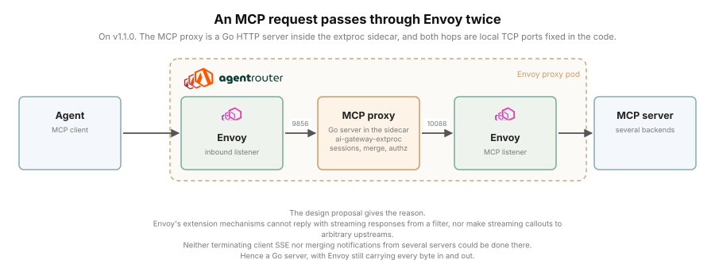
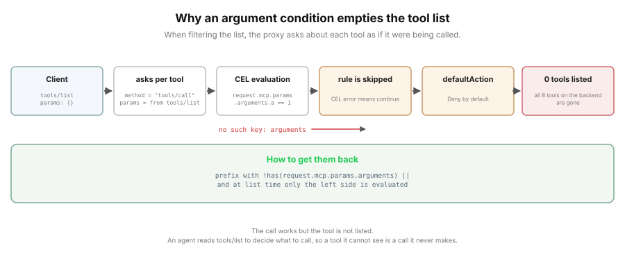
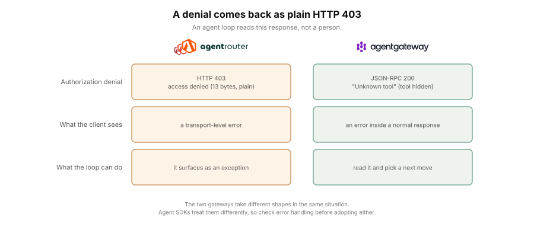
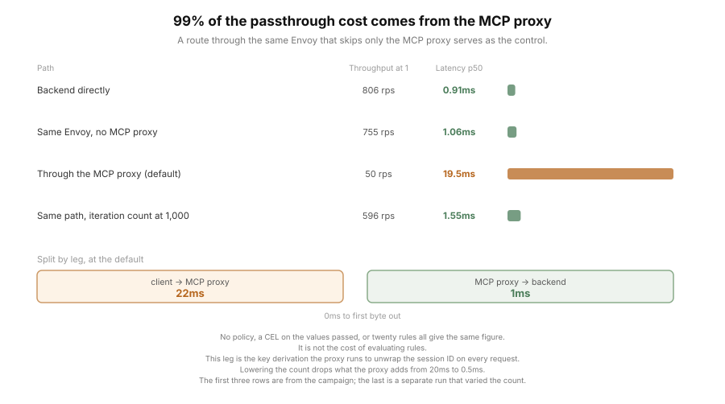
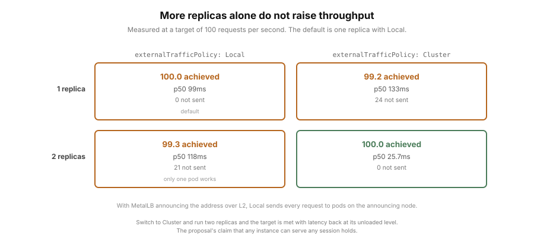

# What does Agent Router enforce and observe on MCP traffic?

**[한국어로 읽기: README_ko.md](README_ko.md)**

> Status: stage 1 measurement complete (2026-09-16). Results for authorization
> enforcement, denial shape, multiple backends, observability and passthrough cost are below.
> The comparison with agentgateway is left to stage 2.

## What Agent Router is, and where it is used

**Q1. What is Agent Router?**

Agent Router is a gateway for AI traffic. It sits on top of Envoy Gateway and does two
jobs. One is the LLM gateway: it puts several providers behind one interface and applies
token-based rate limiting and failover. The other is the **MCP gateway**, and that is
what this study looks at.

The MCP gateway stands between an agent (an MCP client) and MCP servers. From the
client's side it is just another MCP server. It fronts several MCP servers and presents
them as one, and along the way it controls which tools may be called and records the
calls.

A single custom resource, `MCPRoute`, holds that configuration: which backends to group,
what path to serve, and under `securityPolicy.authorization`, who may call what.
Authorization rules can carry a CEL expression, and **the documentation says the call's
arguments are available as a condition.** That is where this study starts.

**Q2. Where is it used?**

Wherever an agent connects to several MCP servers. Once every team has a server with its
own tools, client configuration grows with the server count, and so does the work of
tracking who may call which tool. One gateway in front means the client needs one address,
and control and records live in one place.

Another project under the same foundation does the same job: agentgateway. So this study
uses the same frame as [agentgateway-study](../agentgateway-study/) but **does not copy
its axes.** The two have different origins and advertise different things, so the starting
point here is what Agent Router itself claims to do.

## History, how it works, and the version measured

**The name changed recently.** It used to be Envoy AI Gateway; the rename was announced on
2026-09-09 and took effect on 09-10. The repository moved from `envoyproxy/ai-gateway` to
`theagentrouter/agent-router` (the old address redirects). The stated reason is
organizational alignment: the Agentic AI Foundation (AAIF) is the home of the agent stack
ecosystem, and belonging there puts the project closer to the people building that stack.

Foundation review ran from the proposal on 2026-04-24 (`#18`) through technical committee
approval and Growth stage on 05-21 to board approval on 08-18.

**What changed is the foundation, not only the name.** As `envoyproxy/ai-gateway` it sat
under the Envoy project and therefore followed CNCF governance; the READMEs at both
v1.0.0 (2026-06-23) and v1.1.0 (2026-08-21) say it adheres to the CNCF Code of Conduct.
It was not separately onboarded to CNCF but inherited that governance as a subproject of
Envoy. Board approval came three weeks before the rename announcement, so the foundation
move finished first and the name followed.

**One thing about how it works explains most of the results.** An MCP request passes
through Envoy twice.

```
client -> Envoy (inbound listener) -> 127.0.0.1:9856 -> MCP proxy (Go)
       -> 127.0.0.1:10088 -> Envoy (MCP listener) -> MCP server
```

Both legs are local TCP ports. There is a Unix domain socket in the same pod
(`-extProcAddr unix:///etc/ai-gateway-extproc-uds/run.sock`), but it belongs to the
ext_proc gRPC channel on the LLM path and MCP requests never cross it. The upstream design
proposal says the MCP proxy listens on a UDS; the v1.1.0 code and the deployed arguments
say TCP 9856.



The MCP proxy is not a separate pod. It is a Go HTTP server running inside a sidecar
(`ai-gateway-extproc`) in the Envoy proxy pod. The design proposal gives the reason:
Envoy's extension mechanisms cannot reply with streaming responses from a filter, nor make
streaming callouts to arbitrary upstreams, so terminating client SSE and merging
notifications from several servers could not be done in a filter. Hence a Go server, with Envoy still carrying traffic in and out.

**This structure is the background to most of what follows**: where the passthrough cost
comes from, and what scales when replicas are added.

The version measured is **Agent Router v1.1.0** (released 2026-08-21) over Envoy Gateway
v1.8.1. The latest Envoy Gateway is v1.9.1; v1.8.1 was used because that is the
combination Agent Router v1.1.0's own CI pins and tests.

## So what is measured, and how?

Five things. Each takes the form "the documentation says X, is X so?"

### 1. What authorization actually blocks

The documentation says `request.mcp.params` is in the CEL context and ships an example.
agentgateway, under the same foundation, cannot see call arguments in its MCP
authorization policy (`mcpAuthorization`), which this repository measured and reported
upstream (`#3092`). So the first question is how this one handles it.

A rule in the documented shape goes on, and calls that match and do not match the condition
go in. What `tools/list` returns under the same policy is recorded alongside.

### 2. What shape a denial takes

Authorization denials and backend-selection failures are recorded as the client sees them.
What reads these strings is an agent loop, not a person.

### 3. Multiple backends and tool names

Two MCP servers are attached to one endpoint, to see the relationship between the tool
names a client sees and the names a policy targets, and what `backendSelector` does.

### 4. Observability

Whether trace context reaches the MCP server through the gateway. To check both the HTTP
header and the JSON-RPC `_meta`, I built a backend that reflects back whatever it received.

### 5. Passthrough cost

The path through the gateway and the path around it, measured the same way. A third path
is added: **through the same Envoy but skipping only the MCP proxy**, so the cost can be
attributed to a leg.

### Out of scope this time

- **The LLM routing features**: provider-unifying API, token rate limiting, provider
  failover. Vendor documentation covers these and they are not this repository's axis.
- **A throughput contest between the two gateways**: the deployment shapes differ, so it
  would not be fair. Stage 2 sets the conditions first.
- **Authorization with OAuth**: the condition on values passed alone makes the question
  stand, so I measured without an issuer.
- **The path with tracing enabled**: result 4 was measured with it off.

## Results: what improves and what it costs

The questions below are enough to judge adoption. For figures and verdicts, go down to
the test record.

**Q. What improves?**

A. **You can decide whether a tool may be used not only by its name but by the values
passed on the call.** For a tool called `get-sum`, instead of "this tool may be used" you
can write "it may be used only when the first value is 1". Calling the same tool by the
same name, `a=1` passes and `a=2` is blocked.

That is where this parts from a gateway that can only block by tool name. agentgateway
under the same foundation cannot do it in its MCP authorization policy and needs a
route-level policy instead, a path opened by PR #3301 (merged 2026-09-03) and therefore
absent from the v1.5.0 this repository measured.

Beyond that, it puts several backends behind one address, and the tool name a client sees
carries the backend name so you can tell which server a tool belongs to.

**Q. What does it cost?**

A. **With the default settings, responses take about 20ms longer and throughput stops
rising around 100 requests per second. That cost comes from one configuration value, not
from the structure.**

The MCP proxy has to decrypt the session ID that rides along with every request before it
knows which backend to use. It derives that key with 100,000 PBKDF2 iterations each time
and does not cache the result. 100,000 is the default. Under load the proxy container uses
1.87 of the node's 2 CPUs.

Lower the count to 1,000, change nothing else, and this is what happens.

| Measure | 100,000 iterations (default) | 1,000 iterations |
|---|---|---|
| Low-load p50 | 21.0ms | 1.55ms |
| Saturated throughput | 96 rps | 805 rps |
| Target of 100 rps | 97.2 achieved | 100.0 achieved |
| Proxy CPU | 1,874m | 329m |

The control sits at 1.06ms at the same concurrency, so **what the proxy adds drops from
20ms to 0.5ms**, not to zero
([evidence 4](#evidence-4-99-of-the-passthrough-cost-comes-from-the-mcp-proxy)).

To raise throughput while keeping the default, replicas are the other route, and they do
nothing unless the traffic policy changes with them
([evidence 5](#evidence-5-replicas-only-help-with-the-traffic-policy-changed)).

**Q. Anything to watch out for besides the cost?**

A. Yes. **Writing a rule that conditions on the values passed, in the shape the
documentation shows, makes the endpoint look to an agent like a server with no tools at
all.** The call itself is handled normally, but `tools/list` returns an empty list. An
agent reads that list to decide what to call, so a tool it cannot see is a call it never
makes.

This is not a cost but a behavior you can fix. Wrap the CEL in `has()` and the tools stay
listed while the value condition is still enforced. Cause and fix are in [evidence 2](#evidence-2-that-rule-leaves-nothing-in-the-tool-list).

**Q. So when is it a good fit?**

A. **When deciding whether a tool may be used has to take the values passed into account,
not just the name, and the load is tens of requests per second.** If blocking by tool name
is enough, or latency is tight, 20ms per response is not a small cost.

### Evidence 1. A rule conditioned on the values passed is enforced

One rule. The target is the `get-sum` tool on the `mcpb` backend and the condition is
"allow only when the value `a` passed on the call is 1", written in CEL as
`request.mcp.params.arguments.a == 1`. Values passed to a tool are its arguments, and
that is what the word means below.

| Probe | Result |
|---|---|
| `tools/call mcpb__get-sum a=1` | 200, result 3.0 |
| `tools/call mcpb__get-sum a=2` | 403 |

Identical across all 75 cycles. It works as documented.

### Evidence 2. That rule leaves nothing in the tool list

Under the same condition the list returns nothing. Not just `get-sum`, the rule's target,
but all 8 tools the backend has.



The proxy log says why: `failed to evaluate authorization CEL ... no such key: arguments`.
When filtering the list, the proxy asks about each tool as a `tools/call` ("would calling
this be allowed?"), but the `params` it passes are those of the list request, which have
no `arguments` key. When CEL evaluation ends in an error the source skips that rule, and
what remains is the default action, Deny.

**There is one way back.** Prefix the argument condition with
`!has(request.mcp.params.arguments) ||` and the left side is true at list time, so the
expression short-circuits. The tools stay listed and the argument condition is still
enforced. The three other candidate workarounds each leak in their own way ([test record 1](#1-what-authorization-blocks)).

### Evidence 3. A denial comes back as plain HTTP 403



An authorization denial is HTTP 403 with a 13-byte plain-text body, `access denied`. It
surfaces as a transport-level error, not a JSON-RPC error object. agentgateway, in the same
situation, puts `Unknown tool` inside a JSON-RPC response and hides the tool itself. The
two gateways take different shapes in the same situation, so agent SDKs treat them
differently.

### Evidence 4. 99% of the passthrough cost comes from the MCP proxy

A route through the same Envoy on the same Gateway that skips the MCP proxy serves as the
control. These are campaign figures.



| Path | Concurrency 1 | Concurrency 16 |
|---|---|---|
| Backend directly | 806rps / 0.91ms | 675rps / 10.8ms |
| Same Envoy, no MCP proxy | 755rps / 1.06ms | 683rps / 10.8ms |
| Through the MCP proxy | 50rps / 19.5ms | 98rps / 159.6ms |

No policy, an argument-condition CEL, or twenty rules all give the same figure, so this is
not the cost of evaluating rules. The Envoy access log splits it by leg: **the backend call
is 1ms and the client-facing leg is 22ms.**

Those 22ms are the session ID decryption. The MCP proxy has to decrypt the
`Mcp-Session-Id` that rides along with every request before it knows which backend to use,
and it derives that key with PBKDF2 each time, with no cache
(`internal/mcpproxy/crypto.go`). The helm value
`controller.mcp.sessionEncryption.iterations` sets the count and defaults to 100,000. I
lowered it to 1,000, left everything else alone, and ran the same load again.

| Measure | 100,000 iterations (default) | 1,000 iterations |
|---|---|---|
| Low-load p50 | 21.0ms | 1.55ms |
| Low-load throughput | 47 rps | 596 rps |
| Saturated throughput (concurrency 16) | 96 rps | 805 rps |
| Target of 100 rps, reuse | 97.2 achieved, 168 not sent | 100.0 achieved, 0 not sent |
| Proxy CPU under load | 1,874m | 329m |

**Under load the proxy container uses 1.87 of the node's 2 CPUs.** The Envoy container in
the same pod sits at 30 to 44m under the same load. At saturation it serves 96 requests per
second on 1.87 cores, which works out to about 19.5ms of CPU per request, close to the
21.0ms response at concurrency 1. The latency is CPU time.

Whether to lower it is a question for your threat model. The same chart ships
`default-insecure-seed` as the seed and its comment tells you to replace it with a secure
random string in production. Raising the iteration count is what slows down guessing a weak
secret, so getting the seed right comes first.

### Evidence 5. Replicas only help with the traffic policy changed

The gateway Service defaults to `externalTrafficPolicy: Local`. Where MetalLB announces the
address over L2, only pods on the announcing node receive requests, so **adding a replica
leaves one pod doing all the work.**



I measured all four combinations back to back in one run, opening a new connection per
request.

| Condition (target 100rps) | Achieved | p50 | Not sent |
|---|---|---|---|
| 1 replica, `Local` (default) | 100.0 | 99.0ms | 0 |
| 1 replica, `Cluster` | 99.2 | 132.6ms | 24 |
| 2 replicas, `Local` | 99.3 | 118.2ms | 21 |
| 2 replicas, `Cluster` | **100.0** | **25.7ms** | **0** |

**Only the combination that changes both works.** More replicas alone push latency up
(99.0ms to 118.2ms), and the traffic policy alone does the same (99.0ms to 132.6ms).
Change both and it comes back to 25.7ms, its unloaded level.

It also means the proposal's claim that any instance can serve any session holds.

Whether the default condition meets a 100rps target varies between runs. It met it here,
but the 19-run baseline came in at 98.3 with 1,146 requests not sent. The default
deployment sits right at the edge around 100 requests per second.

## What an operator should know

Before adopting, check the following.

- **Wrap argument-condition CEL in `has()`.** Without
  `!has(request.mcp.params.arguments) ||` in front, `tools/list` goes empty. Print the list
  once after applying a policy.
- **Write the backend-side original tool name in a policy.** The client sees
  `<backend>__<tool>` after renaming, but the policy looks at the original. Writing the
  renamed name blocks everything, and there is no setting to turn the prefix off.
- **`*` does not work in `target.tools[].backend`.** Spell the backend name out.
- **Do not leave `backendSelector` rules empty.** No backend can be chosen, `initialize`
  returns 403, and the whole endpoint is closed.
- **Denials arrive as plain HTTP 403.** A client expecting a JSON-RPC error will treat it
  as a transport failure. Check the agent loop's error handling.
- **Trace headers do not reach the backend.** The `traceparent` a client sends disappears
  and the gateway injects none of its own. If end-to-end tracing matters, check the path
  with tracing enabled separately.
- **`protocolVersion` is a fixed value.** Whatever a client asks for, `2025-06-18` comes
  back. Check this before attaching a client that speaks only an older spec.
- **If throughput matters, look at `externalTrafficPolicy` first.** Replicas alone do
  nothing.
- **If latency or throughput disappoints, look at
  `controller.mcp.sessionEncryption.iterations` first.** The default of 100,000 runs on
  every request. Lowering it to 1,000 took responses from 21.0ms to 1.55ms and saturated
  throughput from 96 to 805 requests per second on the same cluster. It trades security for
  speed, so check that the seed is set properly before deciding.
- **Envoy Gateway needs the extension-manager configuration.** A default install will not
  run Agent Router.

## Test record

The figures of record are in [`RESULTS.md`](RESULTS.md); only verdicts are carried here.

Measurement ran from 2026-09-14 to 09-16 over 75 cycles, with zero measurement
errors and zero pod restarts. **All 21 cells gave the same verdict in all 75
cycles.**

### 1. What authorization blocks

| Policy | List | a=1 | a=2 | Other tool | Verdict |
|---|---|---|---|---|---|
| none | 8 | pass | pass | pass | baseline |
| name only, no CEL | 1 | pass | pass | blocked | no argument control |
| documented shape | **0** | pass | blocked | blocked | enforced, but list empties |
| `defaultAction: Allow` + Allow rule | 8 | pass | **pass** | pass | enforcement disappears |
| `defaultAction: Allow` + Deny rule | 8 | pass | blocked | **pass** | everything else opens |
| `method != "tools/call" \|\| ...` | 0 | pass | blocked | blocked | does not work |
| `!has(...arguments) \|\| ...` | **1** | pass | blocked | blocked | **intact** |
| renamed name as policy target | 0 | **blocked** | blocked | blocked | blocks everything |

What CEL sees at list-filtering time was settled with three diagnostic cells. A rule with
`request.mcp.method == "tools/list"` empties the list; one with `== "tools/call"` leaves one
tool. The proxy asks as if the tool were being called.

### 2. The shape of a denial

| Situation | Code | Body |
|---|---|---|
| authorization denial | 403 | `access denied` |
| `backendSelector` blocks every backend | 400 | `missing session ID` |
| call by the pre-rename name | 400 | `invalid tool name X: invalid resource name: X` |

### 3. Multiple backends

| Condition | List | Observation |
|---|---|---|
| no policy | 10 | 8 `mcpb__*` plus 2 `reflect__*` |
| Allow `mcpb/get-sum` only | 1 | backend scoping lines up |
| Allow `reflect/get-sum` only | 1 | the same-named tool on the other backend is blocked |
| `*` as backend | **0** | the wildcard does not match |
| `backendSelector` keeping one | 8 | the other backend disappears |
| `backendSelector` with no rules | **403 from initialize** | the whole endpoint closes |

The set of tools in the merged list is identical across all 75 cycles, but **the order comes
in two variants** (58 against 17). A client that truncates the tool list may see different
tools from session to session.

### 4. Observability

| What the client sent | Direct call | Through the gateway |
|---|---|---|
| HTTP header `traceparent` | received | **not received** |
| `params._meta.traceparent` | received | received |
| nothing | none | none |

`_meta` getting through is the JSON body passing along, not the gateway injecting anything.
The last row is the evidence.

The backend does receive `x-ai-eg-mcp-backend` and `x-ai-eg-mcp-route`.

### 5. Passthrough cost

Target rps held fixed with paths alternating within a round. Medians of 19 repetitions.

| Target | Mode | Direct | Envoy only | Gateway | Increment |
|---|---|---|---|---|---|
| 50rps | close | 6.53ms | 7.03ms | 23.69ms | **+17.2ms** |
| 50rps | reuse | 3.82ms | 4.23ms | 20.33ms | **+16.5ms** |
| 100rps | close | 5.41ms | 5.74ms | 152.29ms | target missed |
| 100rps | reuse | 2.86ms | 2.98ms | 126.99ms | target missed |

At 50rps all three meet the target with nothing left unsent. At 100rps only the gateway
falls short and starts leaving requests unsent.

### 6. Resources

Over 37 hours the proxy pod's memory went from 60Mi to 62Mi. Both controllers held steady.
Zero pod restarts.

## Limits

- The path with tracing enabled was not measured. Result 4 was taken with it off.
- Only two iteration counts were compared, 100,000 (the default) and 1,000. How latency
  and throughput move between them is unmeasured.
- Both backends are servers this repository wrote. They have few tools (8 and 2) and small
  responses. What list filtering costs on a server with hundreds of tools is unknown.
- Replicas were measured only up to two. The ceiling above that is unknown.
- Authorization with OAuth was not measured.
- One cluster, one host, arm64. Absolute figures are tied to the environment; what this
  measurement claims is the relative comparison between paths.
- This is not a direct comparison with agentgateway. The deployment shapes differ, and
  setting the conditions is stage 2's job.

## Reproducing

```bash
cd agent-router-study
./harness/preflight.sh                         # gate
./harness/launch.sh "<stop time>" <tag>        # run the campaign
python3 harness/readout.py runs/campaign-<tag> # read out
```

The environment lives in `k8s/`: `envoy-gateway-values.yaml` (extension manager),
`backends.yaml`, `reflect/` (the reflecting backend), `control-httproute.yaml` (the control
that skips the MCP proxy), and `proxy-r{1,2}-{local,cluster}.yaml` (replicas and traffic
policy).

Cell definitions are in `harness/cells/*.json` with descriptions in `index.json` beside
them. Six harnesses: `probe.py` (cell battery), `loadgen.py` (concurrency load),
`rategen.py` (fixed target rps), `trace_probe.py` (trace propagation), `accesslog.py` (leg
attribution), `readout.py` (read-out).

## Related

- [agentgateway-study](../agentgateway-study/): the other MCP gateway under the same
  foundation, measured earlier with the same frame.
- [mcp-migration](../mcp-migration/): MCP's stateless transition and scale-out, measured.
- [mcp-server-benchmark](../mcp-server-benchmark/): six MCP servers for Kubernetes,
  compared quantitatively.
