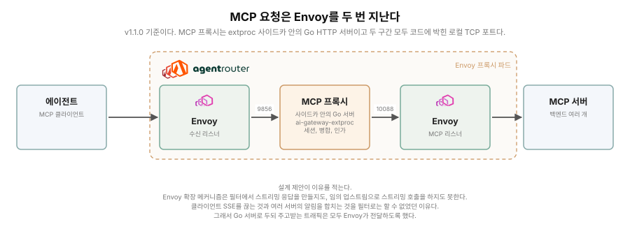
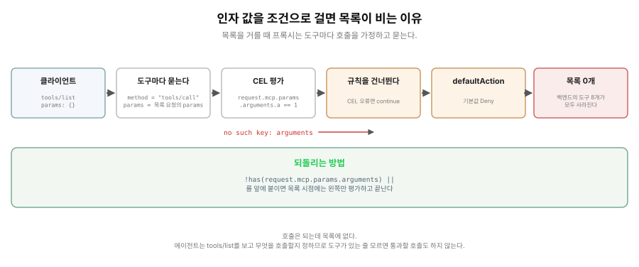
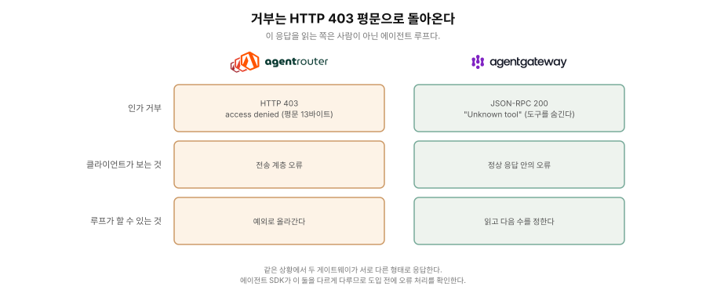
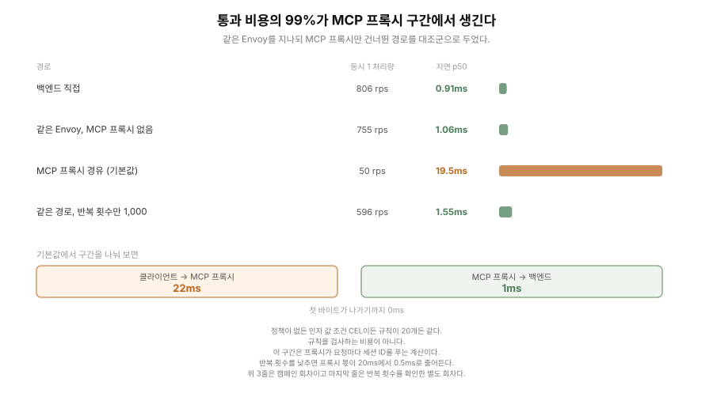
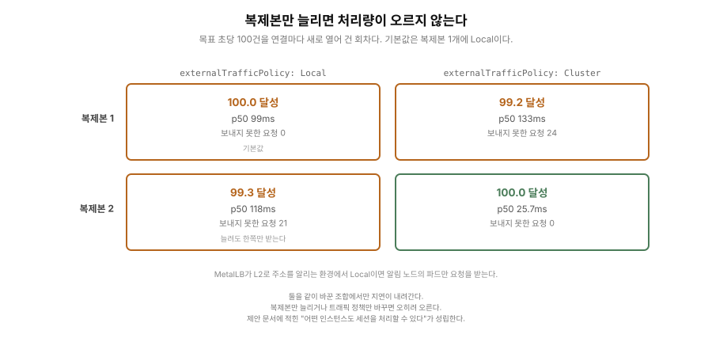

# Agent Router는 MCP에 무엇을 강제하고 무엇을 관측하는가?

**[Read in English: README.md](README.md)**

> 상태: 1단계 측정 완료(2026-09-16). 인가 강제, 거부의 형태, 다중 백엔드, 관측,
> 통과 비용 다섯의 결과가 아래에 있다. agentgateway와의 비교는 2단계로 남겼다.

## Agent Router는 무엇이고 어디서 어떻게 쓰이는가

**Q1. Agent Router란 무엇인가?**

Agent Router는 AI 트래픽을 위한 게이트웨이다. Envoy Gateway 위에 얹혀 두 가지 일을
한다. 먼저 LLM 게이트웨이로서 여러 제공자의 API를 한 인터페이스로 묶고 토큰 기반
요율 제한과 장애 조치를 건다. 그리고 **MCP 게이트웨이**로서 동작하는데, 이 연구가
보는 것은 이쪽이다.

MCP 게이트웨이는 에이전트(MCP 클라이언트)와 MCP 서버 사이에 선다. 클라이언트 쪽에서
보면 그냥 MCP 서버 1개다. 뒤에 여러 MCP 서버를 두고 1개로 합쳐 보여 주며 그
과정에서 어느 도구를 부를 수 있는지 통제하고 호출을 기록한다.

`MCPRoute`라는 사용자 정의 리소스 1개가 그 설정을 가진다. 어느 백엔드를 묶을지,
어떤 경로로 받을지, 그리고 `securityPolicy.authorization`에 누가 무엇을 부를 수
있는지를 적는다. 인가 규칙은 CEL 식을 쓸 수 있고 **호출 인자까지 조건으로 쓸 수 있다고
문서가 적는다.** 이것이 이 연구의 출발 질문이다.

**Q2. 어디서 어떻게 쓰이나?**

에이전트가 여러 MCP 서버에 붙는 자리다. 도구를 가진 서버가 팀마다 생기면 클라이언트
설정이 서버 수만큼 늘어나고 누가 어떤 도구를 부를 수 있는지도 서버마다 따로 관리하게
된다. 게이트웨이를 1개 두면 클라이언트는 주소 1개만 알면 되고 통제와 기록이 한곳에
모인다.

같은 일을 하는 프로젝트가 같은 재단 아래 1개 더 있다. agentgateway다. 그래서 이
연구는 [agentgateway-study](../agentgateway-study/)와 같은 프레임을 쓰되 **같은 축을
그대로 옮기지 않는다.** 태생이 다르고 내세우는 것도 달라서, Agent Router가 스스로
할 수 있다고 적은 것부터 확인한다.

## 이력과 동작 원리, 그리고 측정한 버전

**이름이 바뀐 지 얼마 되지 않았다.** 원래 이름은 Envoy AI Gateway였고 2026-09-09에
이름을 바꾼다고 발표해 09-10부터 새 이름을 쓰고 있다. 저장소도 `envoyproxy/ai-gateway`에서
`theagentrouter/agent-router`로 옮겼다(옛 주소는 리다이렉트된다). 사유는 조직 정렬이다.
에이전틱 AI 재단(AAIF, Agentic AI Foundation)이 에이전트 스택 생태계의 본거지이고
거기 속하면 그 스택을 만드는 프로젝트와 가까워진다는 것이다.

재단 심사는 2026-04-24 제안(`#18`), 05-21 기술 위원회 승인과 Growth 단계 부여,
08-18 이사회 승인이다.

**바뀐 것은 이름만이 아니라 소속 재단이다.** `envoyproxy/ai-gateway`였을 때는 Envoy
프로젝트 아래에 있었으므로 CNCF 거버넌스를 따랐다. v1.0.0(2026-06-23)과
v1.1.0(2026-08-21) 태그의 README가 둘 다 CNCF 행동 강령을 따른다고 적는다. 따로
올라간 CNCF 프로젝트가 아니라 Envoy의 하위 프로젝트로 그 거버넌스를 물려받은
형태였다. 이사회 승인이 이름 변경 발표보다 3주 앞서므로 재단 이관이 먼저 끝나고 이름이
따라온 순서다.

**동작 원리는 한 가지만 알면 결과를 읽을 수 있다.** MCP 요청은 Envoy를 두 번 지난다.

```
클라이언트 -> Envoy(수신 리스너) -> 127.0.0.1:9856 -> MCP 프록시(Go)
           -> 127.0.0.1:10088 -> Envoy(MCP 리스너) -> MCP 서버
```

두 구간 모두 로컬 TCP 포트다. 같은 파드에 유닉스 도메인 소켓이 있기는 한데
(`-extProcAddr unix:///etc/ai-gateway-extproc-uds/run.sock`) 그것은 LLM 경로의
ext_proc gRPC 채널이고 MCP 요청은 지나지 않는다. 업스트림 설계 제안 문서는 MCP 프록시가
UDS로 듣는다고 적어 두었는데 v1.1.0 코드와 배포 인자는 TCP 9856이다.

MCP 프록시는 별도 파드가 아니라 Envoy 프록시 파드 안의 사이드카
(`ai-gateway-extproc`) 안에서 도는 Go HTTP 서버다. 설계 제안이 그 이유를 적는다.
Envoy의 확장 메커니즘(ExtProc 등)이 스트리밍 응답을 필터에서 직접 만들지 못하고
임의의 업스트림으로 스트리밍 호출도 못 해서, 클라이언트 SSE를 끊는 것과 여러 서버의
알림을 합치는 것을 필터로는 할 수 없었다는 것이다. 그래서 Go 서버로 빼되 들어오고 나가는 트래픽은 모두 Envoy가 나르게 했다.



**이 구조가 결과 대부분의 배경이다.** 통과 비용이 어디서 생기는지도, 복제본을 늘릴 때
무엇이 같이 늘어나는지도 여기서 나온다.

측정한 버전은 **Agent Router v1.1.0**(2026-08-21 릴리스)이고 아래는 Envoy Gateway
v1.8.1이다. 최신 Envoy Gateway는 v1.9.1이지만 v1.8.1을 쓴 이유는 Agent Router v1.1.0의
CI가 고정해 테스트하는 조합이 그것이기 때문이다.

## 그래서 무엇을 어떻게 재는가?

5가지를 본다. 전부 "문서가 적은 것이 실제로 그런가"의 형태다.

### 1. 인가가 실제로 무엇을 막는가

문서가 CEL 컨텍스트에 `request.mcp.params`가 있다고 적고 예시도 함께 안내한다. 같은 재단의
agentgateway는 같은 자리에서 호출 인자를 볼 수 없고 그것을 이 저장소가 실측해
업스트림에 제보했다(`#3092`). 그러니 이쪽은 어떻게 푸는지가 첫 질문이다.

문서 예시 형태의 규칙을 걸고 조건에 맞는 호출과 안 맞는 호출을 각각 보낸다. 같은
정책 아래에서 `tools/list`가 무엇을 돌려주는지 함께 본다.

### 2. 거부가 어떤 모양으로 오는가

인가 거부와 백엔드 선택 실패가 클라이언트에 어떤 모양으로 오는지 기록한다. 이 문자열을
읽는 것은 사람이 아니라 에이전트 루프다.

### 3. 다중 백엔드와 도구 이름

MCP 서버 둘을 한 엔드포인트에 연결한다. 클라이언트가 보는 도구 이름과 정책이 가리키는
이름의 관계, 그리고 `backendSelector`가 무엇을 하는지를 본다.

### 4. 관측

트레이스 컨텍스트가 게이트웨이를 넘어 MCP 서버까지 가는지 본다. HTTP 헤더와 JSON-RPC
`_meta` 양쪽을 확인하려고 받은 것을 그대로 돌려주는 백엔드를 1개 만들었다.

### 5. 통과 비용

게이트웨이를 거친 경로와 거치지 않은 경로를 같은 방식으로 잰다. 여기에 **같은 Envoy를
지나되 MCP 프록시만 건너뛰는 경로**를 1개 더 두어, 비용이 어느 구간 것인지 나눈다.

### 이번에 다루지 않은 것

- **LLM 라우팅 기능**: 제공자 통합 API, 토큰 요율 제한, 제공자 장애 조치. 벤더 문서가
  이미 다루고 이 저장소의 축이 아니다.
- **두 게이트웨이의 처리량 경쟁**: 배치 구조가 달라 공정하지 않다. 2단계에서 조건을
  정한 뒤에 한다.
- **OAuth를 쓰는 인가**: 인자 값 조건만으로도 질문이 성립해 발급자 없이 측정했다.
- **트레이싱을 켠 경로**: 결과 4는 끄고 측정한 것이다.

## 결과: 무엇이 좋아지고 어떤 비용이 드는가

도입을 검토한다면 아래 문답으로 충분하다. 수치와 판정이 필요하면 아래 시험 기록
절로 내려간다.

**Q. 무엇이 좋아지는가?**

A. **도구 이름만이 아니라 그 도구를 호출할 때 넘긴 값까지 보고 허용 여부를 정할 수
있다.** 예를 들어 `get-sum`이라는 도구가 있을 때 "이 도구는 써도 된다"가 아니라
"첫 번째 값이 1일 때만 써도 된다"고 적을 수 있다. 실제로 같은 도구를 같은 이름으로
호출하는데 `a=1`은 통과하고 `a=2`는 차단된다.

도구 이름 단위로만 차단할 수 있는 게이트웨이와 나누어지는 지점이다. 같은 재단 아래의
agentgateway가 같은 자리에서 하지 못한 것이기도 하다.

그 밖에 백엔드 여러 개를 한 주소로 묶어 주고 클라이언트가 보는 도구 이름에 백엔드
이름이 붙어 어느 서버의 도구인지 구분된다.

**Q. 어떤 비용이 드는가?**

A. **기본 설정에서는 응답이 20ms 늦어지고 처리량이 초당 100건에서 더 늘지 않는다.
그런데 이 비용은 구조가 아니라 설정값 1개에서 온다.**

MCP 프록시는 요청마다 따라오는 세션 ID를 풀어야 어느 백엔드로 보낼지 정한다. 그
복호화 키를 PBKDF2로 10만 회 반복해 매번 새로 만들고 캐시하지 않는다. 기본값이
10만이다. 부하를 거는 동안 프록시 컨테이너가 2코어 노드의 1.87코어를 쓴다.

반복 횟수를 1,000으로 낮추고 다른 조건을 그대로 두면 이렇게 바뀐다.

| 측정 | 반복 10만 (기본값) | 반복 1,000 |
|---|---|---|
| 저부하 응답 p50 | 21.0ms | 1.55ms |
| 포화 처리량 | 초당 96건 | 초당 805건 |
| 목표 초당 100건 | 97.2 달성 | 100.0 달성 |
| 프록시 CPU | 1,874m | 329m |

같은 동시 1에서 대조군이 1.06ms이므로 **프록시 몫이 20ms에서 0.5ms로 줄어든다**
([근거 4](#근거-4-통과-비용의-99가-mcp-프록시-구간에서-생긴다)). 0이 되지는 않는다.

기본값 그대로 쓰면서 처리량을 올리려면 복제본을 늘리는 길이 있는데, 트래픽 정책을
같이 바꾸지 않으면 효과가 없다([근거 5](#근거-5-복제본만-늘리면-처리량이-오르지-않는다)).

**Q. 비용 말고 주의할 동작이 있는가?**

A. 있다. **호출할 때 넘긴 값을 조건으로 쓰는 규칙을 문서 예시 그대로 적으면 그
엔드포인트가 에이전트에게 도구가 전혀 없는 서버로 보인다.** 호출 자체는 정상으로
처리되는데 `tools/list`가 빈 목록을 돌려준다. 에이전트는 그 목록을 보고 무엇을
호출할지 정하므로 도구가 있는 줄 모르면 통과할 호출도 시도하지 않는다.

이것은 비용이 아니라 고칠 수 있는 동작이다. CEL 식을 `has()`로 감싸면 목록에 도구가
남고 값 조건도 그대로 강제된다. 원인과 해결책은 [근거 2](#근거-2-그-규칙을-걸면-도구-목록에-아무것도-남지-않는다)에 있다.

**Q. 그래서 언제 쓰면 좋은가?**

A. **도구를 쓰게 할지 말지를 이름만이 아니라 넘긴 값까지 보고 정해야 하고 부하가
초당 수십 건 규모라면 맞다.** 도구 이름 단위로 차단하는 것으로 충분하거나 지연
시간이 빠듯한 서비스라면 응답당 20ms는 작지 않은 비용이다.

### 근거 1. 넘긴 값을 조건으로 쓰는 규칙이 실제로 강제된다

규칙 1개를 건다. 대상은 `mcpb` 백엔드의 `get-sum` 도구이고 조건은 "호출할 때 넘긴
값(인자) `a`가 1일 때만 허용"이다. CEL로는
`request.mcp.params.arguments.a == 1`이다. 아래에서 인자라고 부르는 것은 이 값이다.

| 프로브 | 결과 |
|---|---|
| `tools/call mcpb__get-sum a=1` | 200, 결과 3.0 |
| `tools/call mcpb__get-sum a=2` | 403 |

75사이클 모두 같다. 문서에 적힌 대로 동작한다.

### 근거 2. 그 규칙을 걸면 도구 목록에 아무것도 남지 않는다

같은 조건에서 목록이 0개로 돌아온다. 규칙이 대상으로 지정한 `get-sum` 1개만
사라지는 것이 아니라 그 백엔드가 가진 도구 8개가 모두 없어진다.



프록시 로그가 이유를 적는다. `failed to evaluate authorization CEL ... no such key:
arguments`. 목록을 거를 때 프록시는 도구마다 "이 도구를 호출하면 허용인가"를
`tools/call`로 묻는데, 그때 넘기는 `params`는 목록 요청의 것이라 `arguments` 키가
없다. CEL 평가가 오류로 끝나면 소스가 그 규칙을 건너뛰고 남는 것은 기본값 Deny다.

**되돌리는 방법은 1가지다.** 인자 조건을 `!has(request.mcp.params.arguments) ||`로
감싸면 목록 시점에 왼쪽이 참이 되어 짧은 회로로 끝난다. 그러면 목록에 도구가 남고
인자 조건도 그대로 강제된다. 다른 우회 후보 셋은 각각 다르게 샌다([시험 기록 1번](#1-인가가-무엇을-막는가)).

### 근거 3. 거부는 HTTP 403 평문으로 돌아온다



인가 거부는 HTTP 403에 본문이 평문 `access denied` 13바이트다. JSON-RPC 오류 객체가
아니라 전송 계층 오류로 올라간다. agentgateway는 같은 상황에서 JSON-RPC 응답 안에
`Unknown tool`을 넣어 도구 자체를 숨겼다. 같은 상황에서 두 게이트웨이가 서로 다른
모양을 내므로 에이전트 SDK가 이 둘을 다르게 다룬다.

### 근거 4. 통과 비용의 99%가 MCP 프록시 구간에서 생긴다

같은 Gateway의 같은 Envoy를 지나되 MCP 프록시를 거치지 않는 경로를 대조군으로 두었다.
캠페인 회차의 값이다.



| 경로 | 동시 1 | 동시 16 |
|---|---|---|
| 백엔드 직접 | 806rps / 0.91ms | 675rps / 10.8ms |
| 같은 Envoy, MCP 프록시 없음 | 755rps / 1.06ms | 683rps / 10.8ms |
| MCP 프록시 경유 | 50rps / 19.5ms | 98rps / 159.6ms |

정책이 없든 인자 조건 CEL이든 규칙이 20개든 같다. 규칙을 검사하는 비용이 아니다. Envoy
접근 로그가 구간을 나눠 준다. **백엔드 호출은 1ms이고 클라이언트 쪽이 22ms다.**

그 22ms는 세션 ID 복호화다. MCP 프록시는 요청마다 따라오는 `Mcp-Session-Id`를 풀어야
어느 백엔드로 보낼지 알 수 있는데, 그 키를 PBKDF2로 매번 새로 만들고 캐시하지
않는다(`internal/mcpproxy/crypto.go`). 반복 횟수는 helm 값
`controller.mcp.sessionEncryption.iterations`로 정하고 기본값이 10만이다. 그 값만
1,000으로 낮추고 다른 조건을 그대로 둔 채 같은 부하를 다시 걸었다.

| 측정 | 반복 10만 (기본값) | 반복 1,000 |
|---|---|---|
| 저부하 응답 p50 | 21.0ms | 1.55ms |
| 저부하 처리량 | 초당 47건 | 초당 596건 |
| 포화 처리량 (동시 16) | 초당 96건 | 초당 805건 |
| 목표 초당 100건 reuse | 97.2 달성, 168건 유실 | 100.0 달성, 유실 0 |
| 부하 중 프록시 CPU | 1,874m | 329m |

**부하 중 프록시 컨테이너가 2코어 노드의 1.87코어를 쓴다.** 같은 파드의 Envoy
컨테이너는 같은 부하에서 30~44m다. 포화 부하에서 초당 96건에 1.87코어이므로 요청당
CPU가 약 19.5ms이고 동시 1의 응답 21.0ms에 가깝다. 이 지연은 CPU 시간이다.

낮출지는 위협 모형이 정한다. 같은 Helm 차트의 주석에는 시드 기본값이
`default-insecure-seed`로 되어 있으니 운영에서는 안전한 난수 문자열로 바꾸라고 적혀 있다. 반복 횟수를 올리는 것은
추측하기 쉬운 비밀을 느리게 만드는 장치이므로 시드를 제대로 넣었는지가 먼저다.

### 근거 5. 복제본만 늘리면 처리량이 오르지 않는다

게이트웨이 Service의 `externalTrafficPolicy` 기본값이 `Local`이다. MetalLB가 L2로
주소를 알리는 환경에서는 알림 노드의 파드만 요청을 받으므로 **복제본을 늘려도 한쪽이
전부 받는다.**



네 조합을 한 회차에서 연달아 측정했다. 연결을 요청마다 새로 여는 모드다.

| 조건 (목표 100rps) | 달성 | p50 | 보내지 못한 요청 |
|---|---|---|---|
| 복제본 1, `Local` (기본값) | 100.0 | 99.0ms | 0 |
| 복제본 1, `Cluster` | 99.2 | 132.6ms | 24 |
| 복제본 2, `Local` | 99.3 | 118.2ms | 21 |
| 복제본 2, `Cluster` | **100.0** | **25.7ms** | **0** |

**둘을 같이 바꾼 조합에서만 지연이 내려간다.** 복제본만 늘리면 지연이 오히려 오르고(99.0ms ->
118.2ms) 트래픽 정책만 바꿔도 마찬가지다(99.0ms -> 132.6ms). 둘을 같이 바꾸면 25.7ms로
저부하 수준에 돌아온다. 제안 문서가 적은 "어떤 인스턴스도 세션을 처리할 수 있다"가
성립한다는 뜻이기도 하다.

기본값 조건이 목표 100rps를 달성하는지는 회차마다 일정하지 않다. 이 회차는 달성했지만 19회를 모은
기준선에서는 98.3에 1,146건을 보내지 못했다. 기본 배포는 초당 100건 근처가 경계다.

## 운영자가 알아야 할 것

도입한다면 아래를 확인한다.

- **인자 조건 CEL은 `has()`로 감싼다.** `!has(request.mcp.params.arguments) ||`를
  앞에 붙이지 않으면 `tools/list`가 빈다. 정책을 넣은 뒤 목록을 한 번 찍어 본다.
- **정책에는 백엔드 쪽 원래 도구 이름을 쓴다.** 클라이언트가 보는 이름은
  `<백엔드>__<도구>`로 재작명되는데 정책은 원래 이름을 본다. 재작명된 이름을 적으면
  전량 차단된다. 접두사를 끄는 설정은 없다.
- **`target.tools[].backend`에 `*`는 통하지 않는다.** 백엔드 이름을 정확히 적는다.
- **`backendSelector`에 규칙을 비워 두지 않는다.** 고를 수 있는 백엔드가 없어져
  `initialize`부터 403이 되고 엔드포인트 전체가 차단된다.
- **거부는 HTTP 403 평문으로 온다.** JSON-RPC 오류를 기대하는 클라이언트라면 전송
  실패로 처리된다. 에이전트 루프의 오류 처리를 확인한다.
- **트레이스 헤더가 백엔드에 닿지 않는다.** 클라이언트가 보낸 `traceparent`가
  사라지고 게이트웨이가 자기 것을 주입하지도 않는다. 종단 추적이 필요하면 트레이싱을
  켜는 경로를 따로 확인한다.
- **`protocolVersion`이 고정값이다.** 클라이언트가 무엇을 요청해도 `2025-06-18`이
  온다. 옛 스펙만 말하는 클라이언트를 붙이기 전에 확인한다.
- **처리량이 필요하면 `externalTrafficPolicy`를 먼저 본다.** 복제본만 늘리면 듣지
  않는다.
- **지연이나 처리량이 아쉬우면 `controller.mcp.sessionEncryption.iterations`를 먼저
  본다.** 기본값 10만 회는 요청마다 도는 계산이다. 1,000으로 낮추면 같은 클러스터에서
  응답이 21.0ms에서 1.55ms로, 포화 처리량이 초당 96건에서 805건으로 바뀐다. 보안과
  속도를 바꾸는 설정이므로 시드를 제대로 넣었는지부터 확인하고 정한다.
- **Envoy Gateway에 확장 관리자 설정을 얹어야 한다.** 기본 설치로는 Agent Router가
  동작하지 않는다.

## 시험 기록

수치의 정본은 [`RESULTS.md`](RESULTS.md)다. 여기에는 판정만 옮긴다.

측정은 2026-09-14부터 09-16까지 75사이클을 돌렸다. 측정 오류 0건,
파드 재시작 0건이다. **셀 21종이 75회 모두 같은 판정을 냈다.**

### 1. 인가가 무엇을 막는가

| 정책 | 목록 | a=1 | a=2 | 다른 도구 | 판정 |
|---|---|---|---|---|---|
| 없음 | 8개 | 통과 | 통과 | 통과 | 기준선 |
| 이름만, CEL 없음 | 1개 | 통과 | 통과 | 차단 | 인자 통제가 없다 |
| 문서 예시 그대로 | **0개** | 통과 | 차단 | 차단 | 강제되나 목록이 빈다 |
| `defaultAction: Allow` + Allow 규칙 | 8개 | 통과 | **통과** | 통과 | 강제가 사라진다 |
| `defaultAction: Allow` + Deny 규칙 | 8개 | 통과 | 차단 | **통과** | 나머지가 열린다 |
| `method != "tools/call" \|\| ...` | 0개 | 통과 | 차단 | 차단 | 목록이 그대로 빈다 |
| `!has(...arguments) \|\| ...` | **1개** | 통과 | 차단 | 차단 | **온전하다** |
| 재작명된 이름을 정책 대상으로 | 0개 | **차단** | 차단 | 차단 | 전량 차단 |

목록을 거르는 시점에 CEL이 무엇을 보는지는 진단 셀 셋으로 나누어 확인했다.
`request.mcp.method == "tools/list"`인 규칙은 목록을 0개로 만들고
`== "tools/call"`인 규칙은 1개를 남긴다. 목록을 거를 때 프록시가 호출을 가정하고
묻는다는 뜻이다.

### 2. 거부의 형태

| 상황 | 코드 | 본문 |
|---|---|---|
| 인가 거부 | 403 | `access denied` |
| `backendSelector`가 백엔드를 다 막음 | 400 | `missing session ID` |
| 재작명 전 이름으로 호출 | 400 | `invalid tool name X: invalid resource name: X` |

### 3. 다중 백엔드

| 조건 | 목록 | 관찰 |
|---|---|---|
| 정책 없음 | 10개 | `mcpb__*` 8개 + `reflect__*` 2개 |
| `mcpb/get-sum`만 Allow | 1개 | 백엔드 범위가 맞물린다 |
| `reflect/get-sum`만 Allow | 1개 | 다른 백엔드의 같은 이름 도구는 차단 |
| backend에 `*` | **0개** | 와일드카드가 맞지 않는다 |
| `backendSelector`로 1개만 | 8개 | 나머지 백엔드가 사라진다 |
| `backendSelector` 규칙 없음 | **초기화부터 403** | 엔드포인트 전체가 차단된다 |

병합 목록의 도구 집합은 75회 모두 같지만 **순서는 두 가지로 나온다**(58회 대 17회).
도구 수를 잘라 쓰는 클라이언트에서는 세션마다 보이는 것이 달라질 수 있다.

### 4. 관측

| 클라이언트가 보낸 것 | 직접 호출 | 게이트웨이 경유 |
|---|---|---|
| HTTP 헤더 `traceparent` | 받는다 | **받지 못한다** |
| `params._meta.traceparent` | 받는다 | 받는다 |
| 아무것도 안 보냄 | 없음 | 없음 |

`_meta`가 지나가는 것은 JSON 본문이 그대로 전달된 것이지 게이트웨이가 넣은 것이
아니다. 마지막 줄이 그 근거다.

백엔드가 받는 헤더에 `x-ai-eg-mcp-backend`와 `x-ai-eg-mcp-route`가 붙는다.

### 5. 통과 비용

목표 rps를 고정하고 경로를 번갈아 돈 값이다. 회차 19회의 중앙값이다.

| 목표 | 모드 | 직접 | Envoy만 | 게이트웨이 | 증분 |
|---|---|---|---|---|---|
| 50rps | close | 6.53ms | 7.03ms | 23.69ms | **+17.2ms** |
| 50rps | reuse | 3.82ms | 4.23ms | 20.33ms | **+16.5ms** |
| 100rps | close | 5.41ms | 5.74ms | 152.29ms | 달성 실패 |
| 100rps | reuse | 2.86ms | 2.98ms | 126.99ms | 달성 실패 |

50rps에서는 셋 다 목표를 달성하고 보내지 못한 요청이 0이다. 100rps에서는 게이트웨이만
달성률이 떨어지고 보내지 못한 요청이 생긴다.

### 6. 자원

37시간 동안 프록시 파드 메모리가 60Mi에서 62Mi로 거의 그대로다. 컨트롤러 둘도 같다.
파드 재시작 0건이다.

## 한계

- 트레이싱을 켠 경로를 재지 않았다. 관측 결과는 끄고 측정한 것이다.
- 반복 횟수는 10만(기본값)과 1,000 2개 값만 비교했다. 그 사이에서 지연과 처리량이 어떤
  모양으로 움직이는지는 재지 않았다.
- 백엔드 둘 다 이 저장소가 만든 서버다. 도구가 적고(8종, 2종) 응답이 작다. 도구가
  수백 개인 서버에서 목록 필터링 비용이 어떻게 되는지는 모른다.
- 복제본은 2개까지만 측정했다. 그 위의 천장은 모른다.
- OAuth를 쓰는 인가를 재지 않았다.
- 한 클러스터, 한 호스트, arm64다. 절대 수치는 환경에 매인다. 경로 사이의 상대 비교가
  이 측정이 주장하는 것이다.
- agentgateway와의 직접 비교가 아니다. 배치 구조가 달라 조건을 정하는 것이 2단계의 일이다.

## 재현

```bash
cd agent-router-study
./harness/preflight.sh                          # 사전 점검
./harness/launch.sh "<종료 시각>" <태그>         # 캠페인 실행
python3 harness/readout.py runs/campaign-<태그>  # 판독
```

환경 구성은 `k8s/`에 있다. `envoy-gateway-values.yaml`(확장 관리자), `backends.yaml`,
`reflect/`(받은 것을 돌려주는 백엔드), `control-httproute.yaml`(MCP 프록시를 건너뛰는
대조군), `proxy-r{1,2}-{local,cluster}.yaml`(복제본과 트래픽 정책).

셀 정의는 `harness/cells/*.json`이고 설명은 같은 폴더 `index.json`에 있다. 하네스는
여섯이다. `probe.py`(셀 배터리), `loadgen.py`(동시성 부하), `rategen.py`(목표 rps 고정),
`trace_probe.py`(트레이스 전파), `accesslog.py`(구간 귀속), `readout.py`(판독).

## 관련 자료

- [agentgateway-study](../agentgateway-study/): 같은 재단의 다른 MCP 게이트웨이.
  같은 프레임으로 먼저 측정했다.
- [mcp-migration](../mcp-migration/): MCP 무상태 전환과 스케일아웃 실측.
- [mcp-server-benchmark](../mcp-server-benchmark/): K8s용 MCP 서버 6종 정량 비교.
