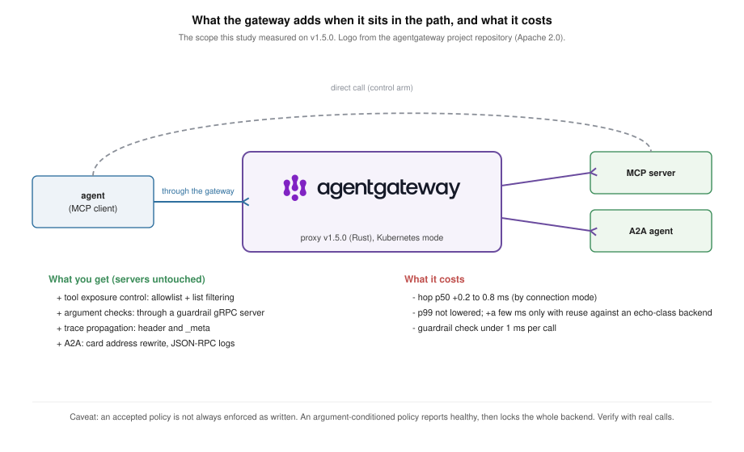
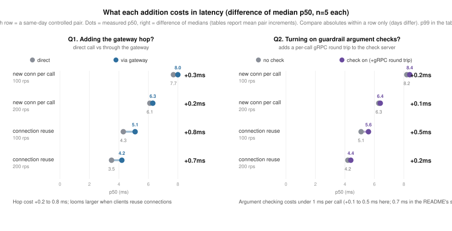
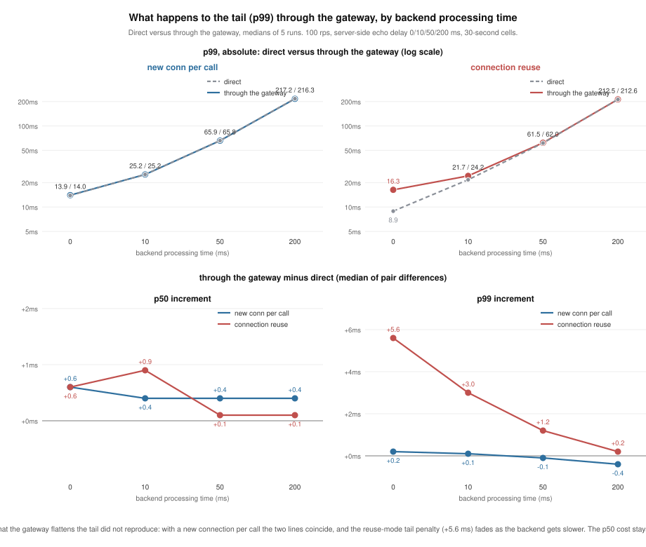
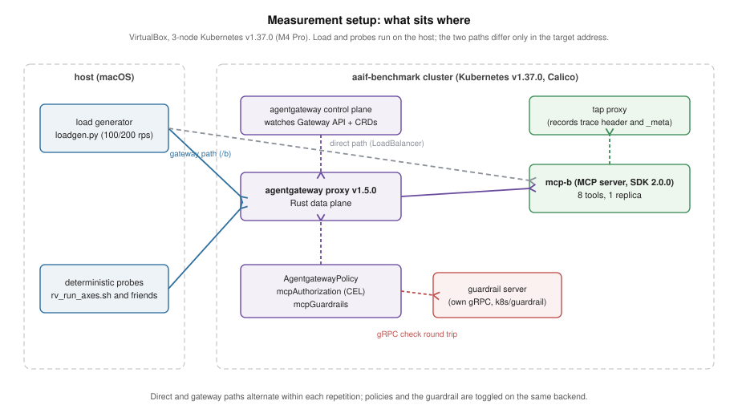

# agentgateway-study: what the gateway actually enforces and observes for MCP

[한국어](README_ko.md)

This study measures the distance between what the agentgateway documentation
says and what the gateway actually enforces and observes when it fronts MCP
(Model Context Protocol) servers. Instead of reading feature tables, I
verified behavior: what CEL authorization policies block, what they silently
block by mistake, how far trace context travels, what putting the gateway
in the path costs, and what argument-level control actually takes when the
policy path cannot do it. It applies the "declared versus enforced" frame from
[gateway-PoC](../gateway-PoC) to an MCP gateway.

agentgateway is an Agentic AI Foundation (AAIF) project at the Linux
Foundation. The target is agentgateway v1.5.0 in Kubernetes mode on
Kubernetes v1.37.0, with the new-spec (2026-07-28) MCP server built in
[mcp-migration](../mcp-migration) as the backend. This is a re-measurement
(2026-09-02) of the original v1.4.1 round (2026-08-18, preserved on the
`agentgateway-study/v1.4.1` branch): every deterministic finding reproduced
unchanged, and the latency tables were replaced with the new stack's numbers.

## What agentgateway is, and why measure it

agentgateway is an open-source proxy for the traffic that agentic AI systems
generate: agents calling tools over MCP, agents calling agents over A2A,
applications calling LLM providers, and plain HTTP and gRPC. Solo.io created
it (repository opened 2025-03-18, first release v0.0.2 on 2025-03-27, Rust,
Apache 2.0), contributed it to the Linux Foundation on 2025-08-25, and it
became a hosted project of the Agentic AI Foundation on 2026-06-04. The
stated reason for its existence is that infrastructure built for web traffic
lacks the governance, observability, routing and security controls that
agent traffic needs, so one gateway should provide them for all of those
protocols without changing the servers behind it. Version 1.0.0 shipped on
2026-03-16; the versions measured here are v1.4.1 (2026-07-29) and v1.5.0
(2026-08-27).

It runs in two modes. As a standalone binary it is configured by file. On
Kubernetes, which is the mode measured here, a built-in control plane
watches Gateway API resources plus its own CRDs (`AgentgatewayBackend` for
the target servers, `AgentgatewayPolicy` for what to enforce on them) and
programs the Rust data plane. For MCP the data plane understands the
protocol: it parses JSON-RPC, can merge several servers into one endpoint,
optionally renames tools with a prefix, and evaluates CEL authorization
rules per tool; guardrails let an external gRPC server inspect each call.
For A2A it rewrites agent cards and parses JSON-RPC for logging.

That is a long list of declared capabilities, and this study measures the
distance between the list and what actually happens on the wire: what a
policy blocks, what it silently blocks by mistake, how far trace context
travels, what the hop costs, and what argument-level control actually
takes. Adopters are choosing between this and doing the same work inside
each server; the numbers below are what that choice rests on.

## What adopting it buys, and what it costs

- **There is no performance gain.** Putting the gateway in front of an MCP
  server does not make calls faster and does not steady the tail. The
  v1.4.1 round had suggested a tail benefit; the v1.5.0 re-measurement
  across backend processing times from 0 to 200 ms and a 30-minute
  sustained window found none.
- **The cost is one hop.** 0.2 to 0.8 ms at p50 depending on how clients
  connect, plus a few milliseconds at p99 only when clients reuse
  connections against a backend that does almost nothing. Once a tool does
  real work (tens of milliseconds or more) the hop disappears in the noise.
  Argument checks through a guardrail add under 1 ms per call on top.
- **What you get is control and observation without touching the servers:**
  per-client tool exposure (allowlist with list filtering), argument-level
  control (through a guardrail server you write yourself), trace context
  carried into the server, and, on the A2A side, agent-card rewriting and
  A2A-aware logs ([a2a-study](../a2a-study)).
- **One caveat before relying on it.** Some policies are accepted without
  being enforced as written: an argument-conditioned policy locks the whole
  backend while reporting healthy. Turn a policy on, then verify it with
  real calls.

In one sentence: this is not something to adopt for performance; when you
need the control, the price is small, and a policy is not done until a real
call has confirmed it.

## Findings

1. **A tool-name allowlist blocks calls and filters the list.** With a policy
   allowing only `echo`, calls to other tools are rejected with 400 and the
   tools disappear from `tools/list`. The rejection is not an authorization
   error but `"Unknown tool"` (-32602). The code comes from the JSON-RPC
   standard that MCP inherits, and -32602's standard meaning is "invalid
   params", so a permission denial is reported with an argument-error code.
   It is a deliberate design that makes blocked
   tools look nonexistent (anti-enumeration, discussed in upstream #758). The
   cost is that a client cannot tell "no permission" from "no such tool".
2. **A policy that conditions on tool arguments is accepted, then locks the
   whole backend.** This is the core finding. A rule like
   `mcp.tool.arguments.a == 1` passes validation (`Accepted`) and reports
   healthy status. But the authorization-time CEL context has no tool
   arguments, so the condition can never evaluate, and since
   `matchExpressions` is an allowlist, every call is rejected, including calls
   that satisfy the written condition. Under this rule `tools/list` returns an empty
   list, and the natural `has(...)` guard lifts the lockout but
   short-circuits for every call, so the rule evaluates on the name only and
   the argument condition never applies (`a=2`, which the rule meant to
   block, passes; measured). The empty `tools/list` and the two `has(...)`
   variants were measured on v1.4.1; the v1.5.0 round repeated the three
   call probes, and the source path is unchanged. So within this policy
   path there is no workaround for argument-level control: the operator
   believes it is in place, and what they actually have is every call
   blocked, or a vanished condition. Upstream status (as of 2026-08-27): the
   identity-only authorization context is itself a design choice (the policy
   applies to both tools/list and tools/call, and no arguments can exist at
   list time; the maintainer filed #2069 with an improvement proposal,
   pending decision). The architecture docs state the limitation, but the
   user-facing schema docs do not mark the phase; this study reported the
   gap as #3092, and a community PR (#3127) that adds a warning to those
   docs is open. First measured on v1.4.1 and reproduced unchanged on the
   v1.5.0 release (re-verification posted to #3092 on 2026-08-31).
3. **Policies evaluate the original tool name, and renaming is not a
   bypass.** Across all three prefixMode settings, no renamed (prefixed) name such as
   `mcp-b-80_echo` slipped past a block. Two traps instead: writing the policy against the renamed
   name that clients actually see in `tools/list` produces the same total
   lockout as finding 2, and a name the policy allows reaches the server even
   if the tool does not exist there, failing as 200 + isError rather than the
   gateway's 400.
4. **Rule count does not affect latency at this scale.** With 0, 1, and 21
   rules, median p50 stayed within 6.2 to 8.1 ms and every run held the
   offered rate.
5. **traceparent crosses the gateway and lands in `_meta` too.** The
   downstream server receives a traceparent header with the client's trace-id
   preserved and the gateway's own span-id, and the same value injected into
   `params._meta.traceparent`, the spot the MCP spec reserves (5 out of 5
   probes). I did not find this behavior in the documentation. I measured
   with gateway tracing not configured; the span-parenting issue in the
   tracing-enabled path was reported upstream as #2904 and fixed after
   v1.4.1, and that path was not measured here.
6. **The gateway costs 0.2 to 0.8 ms at p50 depending on how clients
   connect, and it does not lower the tail.** With a new connection per
   call, p50 rose by 0.2 to 0.3 ms and median p99 was equal (200 rps) or
   0.8 ms higher (100 rps). With connection reuse, the cost was 0.7 to 0.8 ms and
   p99 rose by 3 to 7 ms (tables below). Both paths held the offered rate
   with zero errors in every cell. The v1.4.1 round had shown a lower p99
   through the gateway in close mode, which I read as the gateway absorbing
   connection churn; that did not reproduce on this stack, so I no longer
   make that claim. A follow-up sweep of backend processing time (0, 10,
   50 and 200 ms of server-side delay) and a 30-minute sustained window at
   50 ms confirmed the shape: the p50 cost stays within +0.1 to 0.9 ms at
   every delay, close-mode p99 is unchanged (within 0.4 ms), and the
   reuse-mode p99 penalty shrinks from +5.6 ms at 0 ms to +0.2 ms at
   200 ms. Against a backend that does real work, the gateway's tail effect
   vanishes in either direction, and over 30 minutes (180,000 requests per
   cell, zero errors) the increments did not drift (tables below).
7. **Argument-level control works through mcpGuardrails (an external gRPC
   policy server).** A minimal server enforcing "get-sum only when a == 1"
   passed a=1, denied a=2, and passed unrelated tools; the gateway ships the
   tool arguments to the gRPC server verbatim. Unlike the authorization
   path, the denial comes back as HTTP 200 with a JSON-RPC error carrying
   the server's own reason string, and when the policy server is down the
   FailClosed default blocks every tools/call while FailOpen lets calls
   through, both as documented. The guardrail hop costs under 1 ms at p50
   per call, 0.1 to 0.7 ms across the measured loads and both connection
   modes (zero gateway errors in every cell; table below), and the `Full`
   phase setting routes both the request and the response body
   through the gRPC server.

## What an operator writing policies should know

| Intent | Works? | Caveat |
|---|---|---|
| Tool-name allowlist | Yes | List filtering comes with it. Rejection is 400 + "Unknown tool" (-32602), not an authorization error |
| Argument-based control ("block delete, but only for prod") | Not via policy; yes via guardrail | The policy is accepted while the backend locks up, and a `has(...)` guard drops the condition. mcpGuardrails works but means building a gRPC server yourself, adds under 1 ms at p50 per call, and its denial surfaces as 200 + a JSON-RPC error |
| Policies under renaming (prefixMode) | Yes | Always write the original name. Using the prefixed name clients see locks everything out |
| Adding rules and worrying about latency | No need | No difference up to 21 rules |
| Distributed tracing | Yes | Propagated in both the header and `_meta` (verified with tracing not configured) |

The error codes in the figure follow the JSON-RPC standard. -32602 (invalid
params) and -32603 (internal error) are standard codes; -32001 sits in the
band the standard leaves to implementations (-32000 to -32099), a value
agentgateway chose, so generic JSON-RPC knowledge alone does not decode it.

Most of the time these responses are read by an agent loop, not a person:
the LLM consumes the denial text as a tool result and decides its next
move. An agent that receives shape 1, which is indistinguishable from a
missing tool, may conclude the tool does not exist and route around it,
while shape 2's reason string gives it grounds to fix the arguments and
retry. A guardrail's denial reason therefore works as input the LLM reads,
in effect a prompt. Agent behavior itself was not measured in this study;
this paragraph is the interpretation I act on.

## Numbers

Environment: 3-node VirtualBox Kubernetes v1.37.0 (MacBook Pro M4 Pro),
agentgateway v1.5.0, backend at 1 replica, echo tool, 30-second runs,
measured 2026-09-02 to 09-03 behind a preflight gate with no other workload
on the host: the rule-count, close-mode A/B and guardrail cells in one
unattended window (2026-09-02 18:00 to 2026-09-03 13:19), the reuse A/B in a
second window on 2026-09-03 (18:00);
connection mode and cooldowns are stated per table (60 s between rule-count
repetitions, 180 s between A/B and guardrail cells).
Absolute numbers are
from a virtual environment; read them comparatively.

Latency by rule count (median of 5 runs each):

| Rules | 100 rps p50 | 200 rps p50 |
|---|---|---|
| 0 | 8.1 ms | 6.3 ms |
| 1 | 8.0 ms | 6.3 ms |
| 21 | 8.1 ms | 6.2 ms |

Gateway versus direct (median of 5 runs each). The gateway control plane and
proxy stayed installed while both arms ran, so resource conditions were
identical and the only difference between arms was the load generator's
target address. The two arms alternated within each repetition:

| Path | Offered rps | Achieved | p50 | p99 | Errors |
|---|---|---|---|---|---|
| direct | 100 | 100.0 | 7.7 ms | 13.7 ms | 0 |
| gateway | 100 | 100.0 | 8.0 ms | 14.5 ms | 0 |
| direct | 200 | 200.0 | 6.1 ms | 9.2 ms | 0 |
| gateway | 200 | 200.0 | 6.3 ms | 9.2 ms | 0 |

One gateway cell at 100 rps had a p99 of 139 ms with 11 requests shed; the
medians are unaffected and the cause was not investigated.

The same comparison with connection reuse instead of close mode (second
window, 2026-09-03). Increments quoted in the text are differences of the
medians in these tables (close +0.2 to 0.3 ms, reuse +0.7 to 0.8 ms); the
medians of the per-repetition pair differences are +0.3 ms for both close
rates and +0.7 and +0.8 ms for reuse.

| Path | Offered rps | Achieved | p50 | p99 | Errors |
|---|---|---|---|---|---|
| direct | 100 | 100.0 | 4.3 ms | 9.3 ms | 0 |
| gateway | 100 | 100.0 | 5.1 ms | 15.9 ms | 0 |
| direct | 200 | 200.0 | 3.5 ms | 10.5 ms | 0 |
| gateway | 200 | 200.0 | 4.2 ms | 13.6 ms | 0 |

In close mode the gateway's p99 was equal or slightly higher than direct;
in reuse mode it was 3 to 7 ms higher. The v1.4.1 round had measured a lower
p99 through the gateway in close mode (21.6 to 17.9 ms at 100 rps) and a
larger p50 cost under reuse (1.2 to 1.6 ms). Neither reproduced here, and
since the gateway version and the cluster (Kubernetes 1.36.2 to 1.37.0, new
nodes) changed together, I do not attribute the shift to either.

Guardrail overhead. The gateway and the guardrail pod stayed installed in
both arms and only the policy routing tools/call through the gRPC server
changed. To keep time drift out of the increment, each repetition measured
off and on back to back (odd repetitions off first, even repetitions on
first). Five pairs each:

| Connection | Offered rps | Achieved | off p50 | on p50 | off p99 | on p99 | Mean pair increment |
|---|---|---|---|---|---|---|---|
| new per call | 100 | 100.0 | 8.2 ms | 8.4 ms | 13.9 ms | 14.1 ms | +0.32 ms (sd 0.16) |
| new per call | 200 | 200.0 | 6.3 ms | 6.4 ms | 9.4 ms | 9.5 ms | +0.10 ms (sd 0.06) |
| new per call | 400 | 239 to 315 | 4.0 ms | 4.7 ms | 18.9 ms | 19.4 ms | +0.72 ms (sd 0.04) |
| reuse | 100 | 100.0 | 5.1 ms | 5.6 ms | 17.6 ms | 15.4 ms | +0.44 ms (sd 0.14) |
| reuse | 200 | 200.0 | 4.2 ms | 4.4 ms | 11.3 ms | 10.5 ms | +0.16 ms (sd 0.05) |

A caveat on the 400 rps row: the load generator saturated there, shedding
about 16% of requests and achieving 239 to 315 rps (the runs also overran
the 30-second window, up to 42 s, which is why the achieved rate falls below
the shed-adjusted rate), so that row measures a
higher-throughput saturated condition rather than a clean 400 rps. Its pair
increment is the largest of the five rows. Another open observation: p50
drops as the rate rises across several tables (for example 8.2 to 6.3 to
4.0 ms here); batching under higher concurrency is a plausible cause, and
this was not investigated.

Two readings. First, the latency cost of argument checking is **under 1 ms
per call, 0.1 to 0.7 ms across the measured loads and both connection
modes**. The v1.4.1 round had measured 0.4 to 0.7 ms and read the increment
as roughly constant; on this stack it varies more (0.1 ms at 200 rps,
0.7 ms in the saturated row), so I keep only the bound and drop the
constancy claim. Second, the attribution measured on v1.4.1 still describes
the mechanism: during 3,000 close-mode calls the number of new TCP
connections to the check server was one, the same as an idle baseline, and
the source routes checks over a shared client pool, so the cost is one
round trip over a maintained gRPC channel rather than per-call channel
setup.

One methods note from the v1.4.1 round. Before interleaving, sequential-arm runs (all off cells,
then all on cells) painted a different picture: about +1 ms in close mode
and nothing distinguishable from zero under reuse. That contrast did not
reproduce under interleaving. Time drift between arms had inflated one
increment and masked the other, and the interleaved numbers above are the
canonical ones. The lesson: comparisons whose difference sits below 1 ms
need paired interleaving, not sequential arms.

Backend processing time and sustained load (follow-up, 2026-09-03 to
09-04). The echo tool was given a server-side delay (`k8s/b-server-delay/`,
`B_DELAY_MS`), gateway installed throughout with no policy, 100 rps, direct
and gateway alternated within each of 5 repetitions, concurrency scaled
with the delay (8, 8, 16, 40). Medians of 5 runs and medians of the
per-repetition pair differences:

| Delay | Connection | direct p50 | gateway p50 | pair p50 diff | direct p99 | gateway p99 | pair p99 diff |
|---|---|---|---|---|---|---|---|
| 0 ms | new per call | 7.0 ms | 7.7 ms | +0.6 ms | 13.9 ms | 14.0 ms | +0.2 ms |
| 0 ms | reuse | 4.4 ms | 5.0 ms | +0.6 ms | 8.9 ms | 16.3 ms | +5.6 ms |
| 10 ms | new per call | 17.7 ms | 18.2 ms | +0.4 ms | 25.2 ms | 25.2 ms | +0.1 ms |
| 10 ms | reuse | 15.0 ms | 15.9 ms | +0.9 ms | 21.7 ms | 24.2 ms | +3.0 ms |
| 50 ms | new per call | 57.7 ms | 58.2 ms | +0.4 ms | 65.9 ms | 65.8 ms | -0.1 ms |
| 50 ms | reuse | 55.2 ms | 55.3 ms | +0.1 ms | 61.5 ms | 62.0 ms | +1.2 ms |
| 200 ms | new per call | 207.9 ms | 208.3 ms | +0.4 ms | 217.2 ms | 216.3 ms | -0.4 ms |
| 200 ms | reuse | 205.3 ms | 205.5 ms | +0.1 ms | 212.5 ms | 212.6 ms | +0.2 ms |

All 40 cells: zero errors, nothing shed; achieved rate 100.0 at 0 and 10 ms,
99.8 at 50 ms and 99.3 at 200 ms on both paths (initial ramp under long
delays). Then a 30-minute continuous window at 50 ms, order reversed
between the two repetitions, 180,000 requests per cell:

| Connection | Path | run 1 p50 / p99 | run 2 p50 / p99 |
|---|---|---|---|
| new per call | direct | 57.7 / 66.2 ms | 57.7 / 66.4 ms |
| new per call | gateway | 58.2 / 66.5 ms | 58.2 / 66.3 ms |
| reuse | direct | 55.1 / 60.7 ms | 55.2 / 61.3 ms |
| reuse | gateway | 55.3 / 61.5 ms | 55.3 / 61.6 ms |

Zero errors in all 8 cells, and the two repetitions agree within 0.1 ms, so
nothing drifted over 30 minutes. The reading: the hop's p50 cost does not
depend on backend time, the gateway never lowers p99, and its reuse-mode
p99 penalty is a fixed few milliseconds that becomes invisible once the
backend itself takes tens of milliseconds. Mixing fast and slow backends
behind one gateway (head-of-line effects) was not measured.

## v1.4.1 round versus v1.5.0 round

The study was first measured on agentgateway v1.4.1 (Kubernetes v1.36.2,
2026-08-18) and re-measured on v1.5.0 (Kubernetes v1.37.0, a fresh cluster,
2026-09-02 to 09-04). Every deterministic probe gave the same result:

| Probe | v1.4.1 | v1.5.0 |
|---|---|---|
| Allowlist: blocked call, list filtering | 400 "Unknown tool", list shows only `echo` | same |
| Argument-conditioned policy (#3092) | Accepted, then a=1, a=2 and `echo` all blocked | same |
| prefixMode x policy name (3 modes, plus actual `mcp-b-80_` prefix) | original name evaluated, renamed-name policy locks out, no bypass | same |
| traceparent | trace-id kept, gateway span-id, also in `_meta` (5/5) | same |
| Guardrail: a=1 pass, a=2 deny, FailClosed, FailOpen | as documented, deny as 200 + -32001 reason | same |
| A2A card, bypass, trace, error log ([a2a-study](../a2a-study)) | mixed-format card leaks, no A2A authz | same |

The latency numbers moved, but the gateway version and the cluster changed
together, so the differences below are not attributed to either. The v1.5.0
column is the canonical one; the v1.4.1 column is kept for the record.

| Quantity (p50 unless noted) | v1.4.1 round | v1.5.0 round |
|---|---|---|
| Gateway hop, new connection per call | +0.5 to 0.8 ms | +0.2 to 0.3 ms |
| Gateway hop, connection reuse | +1.2 to 1.6 ms | +0.7 to 0.8 ms |
| Gateway p99 versus direct, new connection per call | lower through the gateway (21.6 to 17.9 ms at 100 rps) | equal or 0.8 ms higher |
| Gateway p99 versus direct, connection reuse | higher (9.7 to 17.4 ms at 100 rps) | higher (9.3 to 15.9 ms at 100 rps) |
| Guardrail increment | +0.4 to 0.7 ms, read as roughly constant | +0.1 to 0.7 ms, largest in the saturated 400 rps row |
| Rule count 0 to 21 | no effect (5.8 to 7.2 ms) | no effect (6.2 to 8.1 ms) |
| Backend delay sweep, 30-minute window | not measured | measured (tables above) |

Two readings changed as a result. The v1.4.1 round's "the gateway absorbs
connection churn and lowers the tail" is withdrawn, and "the guardrail
increment is constant and does not fit queueing" is reduced to "under 1 ms
per call". The v1.4.1 round is preserved on the `agentgateway-study/v1.4.1`
branch.

## What was measured

- **Policy enforcement (P0 to P4)**: no-policy baseline, allowlist
  enforcement and list filtering, three probes against the argument-condition
  policy (condition true, condition false, unrelated tool), the full matrix
  of three prefixMode settings x two policy name forms x four call names, and
  rule count x offered rate x 5 repetitions. Follow-up probes covered
  `tools/list` under the argument rule and two `has(...)` guard variants.
- **Observability (T1/T2)**: a tap proxy behind the gateway recorded the
  exact traceparent header and `params._meta` the downstream server receives
  (5 probes).
- **Gateway versus direct (A/B)**: 20 cells against the same backend with
  only the target address changed, then the same 20 cells with connection
  reuse instead of close mode.
- **Alternative path for argument control (axis 3)**: a minimal ExtMcp gRPC
  policy server (`k8s/guardrail/`) verified argument-level enforcement, the
  denial shape, FailClosed and FailOpen behavior, the request-and-response
  routing of the `Full` phase setting, and the latency overhead of the
  guardrail hop.
- **Replay**: the full policy-and-observability harness was re-run once end
  to end; findings 1 through 5 reproduced with no contradictions.
- **Re-measurement (2026-09-02)**: the whole matrix was re-run on
  agentgateway v1.5.0 and Kubernetes v1.37.0 on a fresh cluster, in
  unattended windows behind a preflight gate. The deterministic probes behind
  findings 1, 2, 3, 5 and 7 (including the actual-prefix follow-up,
  FailClosed and FailOpen) reproduced identically, and every latency table
  above comes from this round.
- **Backend delay sweep and sustained window (2026-09-03 to 09-04)**: the
  gateway-versus-direct comparison repeated at four server-side delays
  (40 cells) and in 30-minute continuous runs (8 cells), all behind the
  same gate.
- Two integrity notes from the v1.4.1 round. A mid-run process kill during the rule-count cells
  was resumed for the remaining 6 cells with the gateway and policy
  configuration kept identical. And the first verdict on trace propagation
  was a false negative caused by a probe-tool defect; after fixing the
  probe, the valid re-measurement reversed the verdict to "propagated".
  Both are recorded internally together with the raw data. The v1.5.0
  round's one incident was a preflight failure at the window's start (a
  presentation app was open on the host); the gate retried ten minutes
  later and passed, and no cell was affected.

## Limits

- Only the MCP surface was measured. The same gateway also fronts A2A, LLM
  inference, REST, and gRPC; none of those paths were tested.
- One backend with a small tool set (8 tools). List-filtering cost on large
  tool sets was not measured.
- Among the alternative paths to argument-level control, mcpGuardrails was
  verified (finding 7); extAuthz and extProc were not.
- Within the MCP surface, authentication (MCP Auth) is also out of scope.
- Absolute latency numbers are VirtualBox values.
- The tracing-enabled path (span export) was not measured.
- Backends of mixed speed behind one gateway (whether a slow backend
  degrades a fast one's tail) were not measured; the delay sweep varied one
  backend at a time.

## Reproduction

Run `harness/run_axes.sh` (policy and observability),
`harness/t1p3_addendum.sh` (follow-up), `harness/run_ab.sh` (gateway versus
direct), and `harness/gr_matrix.sh` (guardrail overhead, interleaved) in
that order. The `harness/rv_*.sh` files are the copies used for the v1.5.0
round (cluster context switched, gateway left installed between chained
stages, `rv_p3sup.sh` and `rv_g3.sh` for the follow-up probes, `rv_tail.sh`
with `k8s/b-server-delay/` for the delay sweep and sustained window), the
`harness/chain_rv*.sh` files are the unattended orchestrators with the
preflight gate, and `harness/rv_read.py` prints the tables. The guardrail
policy server lives in `k8s/guardrail/`. Raw run outputs (`runs/`) are not
included in this repository; the tables above document every published
number, and `harness/chart.py` regenerates the figures from raw runs if you
produce your own. Prerequisites for the v1.5.0 round are the cluster in
`test-cluster/` (Kubernetes v1.37.0, VirtualBox) with the new-spec server
deployed by `harness/deploy_backends.sh`; the gateway is installed and
removed by `harness/install_agw.sh` and `harness/uninstall_agw.sh`. The
v1.4.1 round used the [mcp-migration](../mcp-migration) cluster and its
scripts under `studies/stateless-scaleout/k8s/agentgateway/`.

## Related

- Vendor performance benchmark: the agentgateway blog's agentgateway versus
  LiteLLM comparison (2026-08-13) covers proxy throughput and resources, a
  different axis from this study. This study is not a competitive benchmark;
  it measures whether policy and observability behave as documented.
- Upstream issues: #758 (rejection-shape discussion), #2713 (name mismatch in
  the authorization context), #2904 (span-parenting defect in the
  tracing-enabled path, fix merged). Finding 2 was reported by this study as
  [#3092](https://github.com/agentgateway/agentgateway/issues/3092).
