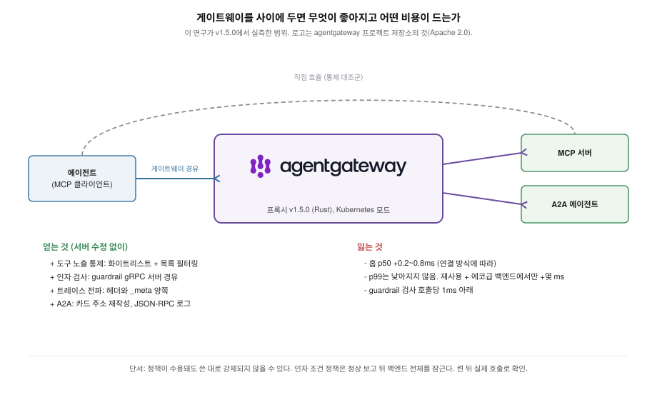
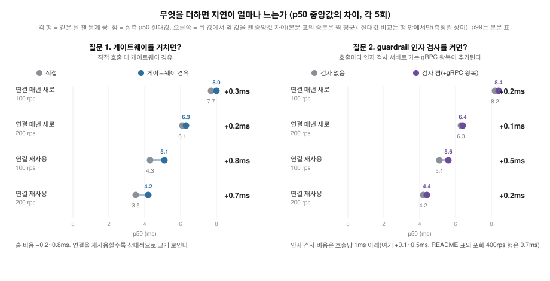
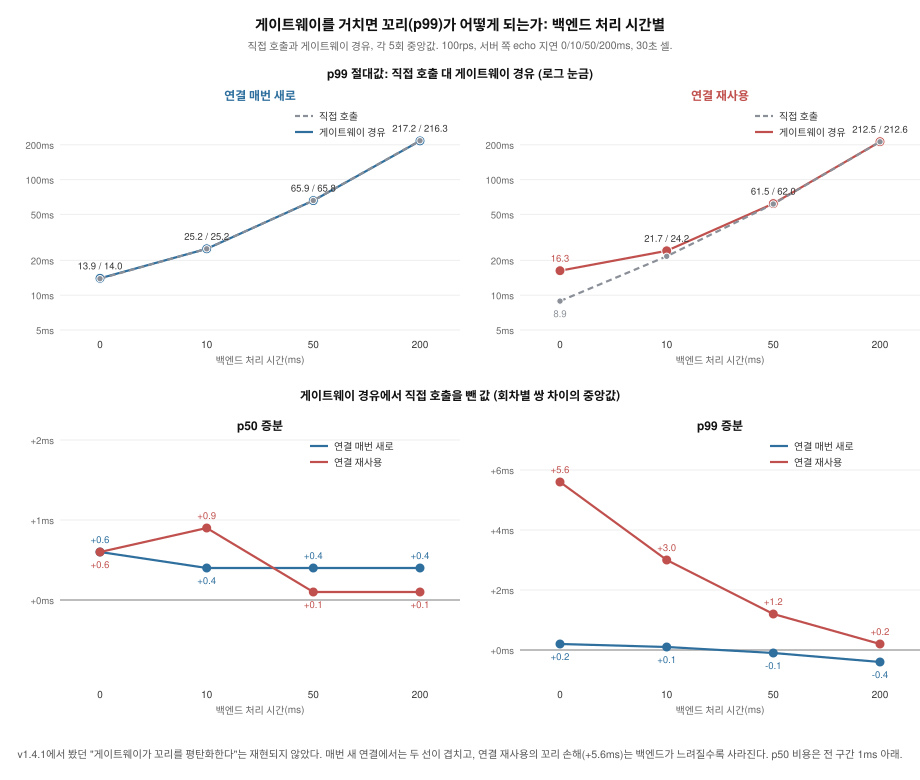
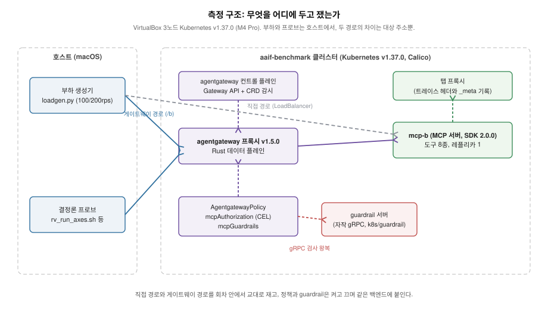

# agentgateway-study: MCP 앞단에서 게이트웨이가 실제로 강제하고 관측하는 것

[English](README.md)

agentgateway를 MCP(Model Context Protocol) 게이트웨이로 쓸 때 문서에 적힌
것과 실제로 강제되고 관측되는 것 사이의 거리를 실측한 연구다. 기능 표가
아니라 동작을 확인했다. 정책(CEL, Common Expression Language 기반 인가)이
무엇을 막고 무엇을 조용히 잘못 막는지, 트레이스가 어디까지 이어지는지,
게이트웨이를 거치는 비용이 얼마인지, 정책으로 안 되는 인자 통제가
무엇으로 되는지를 측정했다.
[gateway-PoC](../gateway-PoC)에서 쓴 "선언 대 실제 강제" 프레임을 MCP
게이트웨이에 적용한 것이다.

agentgateway는 리눅스 재단 산하 Agentic AI Foundation(AAIF)의 호스티드
프로젝트다. 측정 대상은 agentgateway v1.5.0(Kubernetes 모드, Kubernetes
v1.37.0)이고 백엔드는 [mcp-migration](../mcp-migration)에서 만든 신
스펙(2026-07-28) MCP 서버를 그대로 썼다. 원측정은 v1.4.1(2026-08-18,
`agentgateway-study/v1.4.1` 브랜치에 보존)이고 이 문서는 2026-09-02 재측정
결과다. 결정론 결과는 전부 그대로 재현됐고 지연 표만 새 스택 수치로
교체했다.

## agentgateway는 무엇이고 왜 재는가

agentgateway는 에이전트 시스템이 만들어 내는 트래픽을 받는 오픈소스
프록시다. 에이전트가 MCP로 도구를 호출하고 A2A로 다른 에이전트를 부르고
애플리케이션이 LLM 제공자를 부르는 호출과 평범한 HTTP, gRPC까지 한곳에서
받는다. Solo.io가 만들었고(저장소 개설 2025-03-18, 첫 릴리스 v0.0.2
2025-03-27, Rust, Apache 2.0) 2025-08-25에 리눅스 재단에 기여했으며
2026-06-04에 Agentic AI Foundation의 호스티드 프로젝트가 됐다. 존재 이유로
내세우는 것은 웹 트래픽용 인프라에는 에이전트 트래픽이 요구하는 거버넌스,
관측, 라우팅, 보안 통제가 없으니 게이트웨이 하나가 서버를 고치지 않고 그
프로토콜 전부에 그것을 붙여 준다는 것이다. 1.0.0은 2026-03-16에 나왔고 이
연구가 잰 버전은 v1.4.1(2026-07-29)과 v1.5.0(2026-08-27)이다.

실행 방식은 둘이다. 단독 바이너리로 띄우면 파일로 설정한다. 이 연구가 잰
Kubernetes 모드에서는 내장 컨트롤 플레인이 Gateway API 리소스와 자체
CRD(`AgentgatewayBackend`는 대상 서버, `AgentgatewayPolicy`는 거기에 강제할
것)를 읽어 Rust 데이터 플레인을 설정한다. MCP에 대해서는 데이터 플레인이
프로토콜을 이해한다. JSON-RPC를 파싱하고 여러 서버를 엔드포인트 하나로
합치고 도구 이름에 접두사를 붙일 수 있으며 도구별로 CEL 인가 규칙을
평가한다. guardrail은 외부 gRPC 서버가 호출마다 검사하게 해 준다. A2A에
대해서는 에이전트 카드를 재작성하고 로그를 위해 JSON-RPC를 파싱한다.

선언된 기능이 이만큼 길고 이 연구는 그 목록과 실제로 선에서 일어나는
일의 거리를 잰다. 정책이 무엇을 막고 무엇을 조용히 잘못 막는지, 트레이스가
어디까지 가는지, 홉이 얼마인지, 인자 단위 통제에 실제로 무엇이 드는지.
도입을 검토하는 쪽은 이것과 "같은 일을 서버마다 직접 하기" 사이에서 고르게
되고 아래 수치가 그 선택의 근거다.

## 도입하면 무엇이 좋아지고 어떤 비용이 드는가

- **성능 이득은 없다.** MCP 서버 앞에 게이트웨이를 두어도 호출이 빨라지거나
  꼬리가 안정되지 않는다. v1.4.1 회차에서는 꼬리가 좋아지는 것처럼 보였지만
  v1.5.0 재측정에서 백엔드 처리 시간 0~200ms와 30분 지속 창 어디에서도 그
  이점은 없었다.
- **비용은 홉 하나 값이다.** 연결 방식에 따라 `tools/call`은 p50 +0.2~0.8ms,
  `tools/list`는 +1~3ms이고 p99가 몇
  ms 늘어나는 경우는 클라이언트가 연결을 재사용하면서 거의 일을 하지 않는
  백엔드를 부를 때뿐이다. 도구가 실제 일(수십 ms 이상)을 하는 순간 홉은
  잡음에 묻힌다. guardrail로 인자 검사를 얹으면 호출당 1ms 아래가 더 든다.
- **얻는 것은 서버를 고치지 않고 붙는 통제와 관측이다.** 클라이언트별 도구
  노출(화이트리스트와 목록 필터링), 인자 단위 통제(직접 구현하는 guardrail
  서버 경유), 서버까지 이어지는 트레이스, 그리고 A2A 쪽의 에이전트 카드
  재작성과 A2A 필드가 있는 로그([A2A 표면](a2a/README_ko.md)).
- **믿기 전에 확인할 것 하나.** 일부 정책은 수용되고도 쓴 대로 강제되지
  않는다. 인자 조건 정책은 상태가 정상이라고 보고하면서 백엔드 전체를
  잠근다. 정책은 켠 뒤 실제 호출로 확인해야 한다.

한 문장으로 줄이면, 성능 때문에 넣는 물건이 아니다. 통제가 필요할 때 그
값이 작다는 것이 확인됐고 정책은 실제 호출이 확인해 주기 전까지는 끝난
것이 아니다.

## 결과

1. **도구 이름 화이트리스트는 호출 차단과 목록 필터링을 다 한다.** echo만
   허용하면 다른 도구 호출은 400으로 거절되고 tools/list에서도 사라진다.
   거절 응답은 인가 오류가 아니라 400 + "Unknown tool"(-32602)이다. 오류
   코드는 MCP가 물려받는 JSON-RPC 표준의 것으로 -32602의 표준 의미는
   "잘못된 인자"라, 권한 거부가 인자 오류의 코드까지 입은 셈이다. 차단된
   도구를 처음부터 없는 것처럼 보이게 하는 의도된 설계다(도구 열거 방지,
   업스트림 #758에서 논의). 대신 클라이언트는 권한 문제와 도구 부재를
   구분할 수 없다. 필터링 자체는 게이트웨이에서 공짜이고 지연을 줄여 주지도
   않는다. 서버에 도구가 8, 100, 500개일 때 도구 하나만 남기는 정책을 거친
   `tools/list`는 정책 없는 경우와 같은 시간이 걸린다(p50 차이 0.7ms 안).
   게이트웨이가 서버의 전체 목록을 받은 뒤에 거르기 때문이고 줄어드는 것은
   클라이언트에 가는 바이트뿐이다(500개에서 181KB가 467B로). 목록 자체의
   비용은 두 경로 모두 도구 수에 따라 는다(아래 표).
2. **도구 인자 조건을 쓴 정책은 수용되지만 백엔드 전체를 잠근다.** 이 연구의
   핵심 발견이다. `mcp.tool.arguments.a == 1` 같은 조건이 담긴 정책이 검증을
   통과하고(Accepted) 상태도 정상으로 보고된다. 그러나 인가를 평가하는
   시점의 CEL 컨텍스트에는 도구 인자가 없어 조건이 평가되지 않는다. 규칙
   목록이 화이트리스트라서 결과적으로 조건에 맞는 호출까지 전부 거절되고
   이 규칙 아래에서는 tools/list도 빈 목록을 반환한다. `has(...)` 가드를
   붙이면 잠금은 풀리지만 가드가 모든 호출에서 단락되어 규칙이 이름만으로
   평가되고 인자 조건은 적용되지 않는다(막으려던 a=2도 통과, 실측). 빈
   tools/list와 `has(...)` 가드 2종은 v1.4.1에서 측정했고 v1.5.0 회차는 호출
   프로브 셋을 다시 재현했으며 소스 경로는 그대로다. 즉 이 정책 경로 안에서는 인자
   통제의 워크어라운드가 없다. 운영자는 인자 통제가 걸렸다고 믿게 되는데
   실제로는 모든 호출이 거절되거나 조건이 사라진 상태다. 업스트림 현황(2026-08-27 기준):
   인가 컨텍스트가 identity 전용인 것 자체는 설계다(정책이 tools/list와
   tools/call에 공통 적용되어 list 시점엔 인자가 존재할 수 없다. 메인테이너가
   #2069에서 개선안과 함께 논의 등록, 결정 대기). 아키텍처 문서에는 이
   한정이 적혀 있으나 사용자용 스키마 문서에는 단계 구분이 없다. 이 간극은
   이 연구가 #3092로 제보했고 그 문서에 경고를 추가하는 커뮤니티
   PR(#3127)이 열려 있다. v1.4.1에서 처음 측정했고 v1.5.0 릴리스에서 같은
   동작을 재현했다(2026-08-31 #3092에 재확인 코멘트).
3. **정책은 재작명 이전의 원래 이름을 평가하고 재작명 이름 우회는 없다.**
   prefixMode를 켜면 도구가 재작명 이름(접두사가 붙은 이름, 예:
   `mcp-b-80_echo`)으로 노출되는데, 세 모드 모두에서 그 이름으로 차단을
   우회하는 경로는 없었다. 대신 함정이 둘 있다. 하나, 클라이언트가
   tools/list에서 실제로 보는 재작명 이름으로 정책을 쓰면 결과 2와 같은
   전량 차단이 된다. 둘, 정책이 허용한 이름은 백엔드에 없어도 서버까지
   전달되어 게이트웨이 거절(400)이 아니라 200 + isError로 실패한다.
4. **정책 규칙 수는 이 규모에서 지연에 영향이 없다.** 규칙 0, 1, 21개에서
   p50 중앙값이 6.2~8.1ms 범위로 같았고 모든 회차가 목표 rps를 달성했다.
5. **traceparent는 게이트웨이를 넘어 이어지고 `_meta`에도 실린다.**
   다운스트림 서버는 클라이언트의 trace-id를 그대로 유지하고 span-id만
   게이트웨이 것으로 바뀐 traceparent를 헤더로 받는다. 같은 값이 MCP 스펙이
   `_meta`에 예약한 자리(`_meta.traceparent`)에도 주입된다(5회 전부).
   문서에서는 이 동작을 찾지 못했다. 측정은 게이트웨이 트레이싱 설정이 없는
   조건이다. 트레이싱을 켠 조건에서 스팬의 부모 관계가 잘못 잡히는 문제는
   업스트림 #2904로 보고되어 v1.4.1 이후 수정됐고 그 경로는 여기서 재지
   않았다.
6. **게이트웨이를 거치는 비용은 연결 방식에 따라 p50 +0.2~0.8ms이고 꼬리를
   낮추지는 않는다.** 호출마다 새 연결을 여는 조건에서는 p50이 0.2~0.3ms
   늘고 p99 중앙값은 같거나(200rps) 0.8ms 높았다(100rps). 연결을 재사용하는
   조건에서는 비용이 0.7~0.8ms이고 p99는 3~7ms 높았다(아래 표). 전
   회차에서 두 경로 모두 오류 0으로 목표 rps를 유지했다. v1.4.1 회차에서는
   새 연결 조건의 게이트웨이 p99가 직접보다 낮아 "연결 폭주를 게이트웨이
   층이 받아낸다"로 해석했는데, 새 스택에서 재현되지 않아 그 주장은
   거둔다. 보강으로 백엔드 처리 시간(서버 쪽 지연 0, 10, 50, 200ms)을
   스윕하고 50ms에서 30분 지속 창을 재서 형태를 확인했다. p50 비용은 모든
   지연에서 +0.1~0.9ms 안이고 close 모드 p99는 차이가 없으며(0.4ms 안),
   reuse 모드의 p99 손해는 0ms +5.6ms에서 200ms +0.2ms로 줄어든다. 실제
   일을 하는 백엔드 앞에서는 게이트웨이의 꼬리 효과가 어느 방향으로도
   사라지고 30분(셀당 요청 18만, 오류 0) 동안 증분은 흔들리지 않았다(아래
   표).
7. **인자 단위 통제는 mcpGuardrails(외부 gRPC 정책 서버)로 가능하다.**
   "get-sum은 a==1일 때만 허용"을 강제하는 최소 서버로 a=1 통과, a=2 거부,
   무관 도구 통과를 확인했다. 게이트웨이가 인자를 gRPC 요청에 그대로 실어
   보낸다. 거부는 인가와 달리 HTTP 200 + JSON-RPC 오류에 서버가 정한 사유가
   그대로 나가고 검사 서버가 멈추면 FailClosed 기본값이 tools/call을 전부 막는다.
   FailOpen이면 문서대로 통과한다. guardrail 홉의 비용은 p50 호출당 1ms
   아래로, 측정한 부하와 두 연결 방식 전반에서 +0.1~0.7ms다(전 셀
   게이트웨이 오류 0, 아래 표). `Full` 페이즈 설정은 요청과 응답 본문을
   모두 gRPC 서버에 태우는 것까지 확인했다.
8. **A2A 표면에서 게이트웨이는 재작성하고 관측하며 홉 비용이 붙지만 강제는
   하지 않는다.** 카드 재작성은 Service별 옵트인이고 v0.3과 v1.0 엔드포인트
   필드를 병기한 카드(공식 Python SDK의 기본)는 v1.0 필드만 재작성되어 v0.3
   클라이언트는 백엔드 직접 주소를 받는다. A2A 인가 정책은 없고 트레이스와
   JSON-RPC 오류 코드는 액세스 로그에 기록된다. 표와 그림은
   [A2A 표면](a2a/README_ko.md).

## 정책을 쓰는 운영자가 알아야 할 것

| 하려는 것 | 되는가 | 주의 |
|---|---|---|
| 도구 이름 화이트리스트 | 된다 | 목록 필터링까지 같이 된다. 거절이 인가 오류가 아니라 400 + "Unknown tool"(-32602)로 온다 |
| 도구 인자 기반 통제 ("delete는 막되 prod만") | 정책으로는 안 되고 guardrail로는 된다 | 정책은 수용된 채 백엔드가 잠기고 `has(...)` 가드는 조건을 잃는다. mcpGuardrails는 gRPC 서버를 직접 구현해야 하고 호출당 p50 1ms 아래가 더 들며 거부가 200 + JSON-RPC 오류로 나간다 |
| 재작명(prefixMode) 환경에서 정책 작성 | 된다 | 반드시 원래 이름으로 쓴다. 클라이언트가 보는 재작명 이름으로 쓰면 전량 차단된다 |
| 규칙을 늘리며 지연 걱정 | 걱정 없음 | 21개까지 차이 없음 |
| 큰 도구 집합을 화이트리스트로 가리기 | 된다 | 클라이언트는 짧은 목록을 받지만 `tools/list`에 드는 시간은 서버의 전체 목록 시간 그대로다. 게이트웨이가 다 받은 뒤 거른다 |
| 분산 트레이싱 연계 | 된다 | 헤더와 `_meta` 양쪽으로 전파된다(트레이싱 미설정 조건에서 확인) |

그림의 오류 코드는 JSON-RPC 표준 체계다. -32602(잘못된 인자)와
-32603(내부 오류)은 표준 코드이고 -32001은 표준이 구현체 몫으로 비워 둔
대역(-32000~-32099)에서 agentgateway가 정한 값이라 범용 JSON-RPC 지식만으로는
해석되지 않는다.

이 응답을 읽는 쪽은 대부분 사람이 아니라 에이전트 루프다. LLM이 거부
텍스트를 도구 호출 결과로 읽고 다음 행동을 정하므로, 도구 부재와 구분되지
않는 형태 1을 받은 에이전트는 도구가 없다고 판단해 우회로 갈 수 있고
형태 2의 사유 문자열은 인자를 고쳐 재시도할 근거가 된다. 그래서 guardrail의
거부 사유는 LLM이 읽는 입력, 사실상 프롬프트로 작동한다. 에이전트 행동
자체는 이 연구의 측정 범위 밖이라 이 문단은 해석이다.

- v1.5.0 릴리스 노트의 "guardrails for tool calls"는 LLM 프롬프트 가드
  (`spec.backend.ai.promptGuard`, `scope: [ToolInput, ToolOutput]`)로 LLM
  트래픽 안의 tool_calls를 검사하는 기능이다. `mcpGuardrails`의 새 이름이
  아니다. MCP 백엔드에 붙이면 수용되지만 tools/call에는 효과가 없다(a=2 통과,
  2026-09-09 확인).

## 수치

측정 환경: VirtualBox 3노드 Kubernetes v1.37.0(맥북 프로 M4 Pro), agentgateway
v1.5.0, 백엔드 레플리카 1, echo 도구, 30초 런. 2026-09-02~03에 사전 점검
게이트를 거쳐 호스트에 다른 작업 없이 측정했다. 규칙 수, close 모드 A/B,
guardrail 셀은 무인 창 하나(9/2 18:00~9/3 13:19)에서, reuse A/B는 9/3
18:00의 두 번째 창에서 측정했다. 연결 방식과 쿨다운은 표마다
명기한다(규칙 수 측정은 회차 간 60초, A/B와 guardrail은 셀 간 180초).
절대 수치는 가상 환경 값이라 상대 비교로만 읽는다.

정책 규칙 수에 따른 지연(각 5회 중앙값):

| 규칙 수 | 100rps p50 | 200rps p50 |
|---|---|---|
| 0 | 8.1ms | 6.3ms |
| 1 | 8.0ms | 6.3ms |
| 21 | 8.1ms | 6.2ms |

게이트웨이 유무 비교(각 5회 중앙값). 게이트웨이 컨트롤 플레인과 프록시를
설치한 채로 두 경로를 모두 재서 자원 조건을 동일하게 맞췄고 두 경로의
차이는 부하 생성기의 대상 주소뿐이다. 두 경로는 회차 안에서 교대로 측정했다:

| 경로 | 목표 rps | 달성 rps | p50 | p99 | 오류 |
|---|---|---|---|---|---|
| 직접 | 100 | 100.0 | 7.7ms | 13.7ms | 0 |
| 게이트웨이 | 100 | 100.0 | 8.0ms | 14.5ms | 0 |
| 직접 | 200 | 200.0 | 6.1ms | 9.2ms | 0 |
| 게이트웨이 | 200 | 200.0 | 6.3ms | 9.2ms | 0 |

100rps 게이트웨이 셀 하나는 p99가 139ms였다(요청 11건 shed). 중앙값에는
영향이 없고 원인은 조사하지 않았다.

같은 비교를 close 모드 대신 연결 재사용으로 하면(두 번째 창, 9/3). 본문의
증분은 이 표들의 중앙값끼리 뺀 값이다(close +0.2~0.3ms, reuse
+0.7~0.8ms). 회차별 쌍 차이의 중앙값으로는 close 두 rps 모두 +0.3ms,
reuse +0.7ms와 +0.8ms다.

| 경로 | 목표 rps | 달성 rps | p50 | p99 | 오류 |
|---|---|---|---|---|---|
| 직접 | 100 | 100.0 | 4.3ms | 9.3ms | 0 |
| 게이트웨이 | 100 | 100.0 | 5.1ms | 15.9ms | 0 |
| 직접 | 200 | 200.0 | 3.5ms | 10.5ms | 0 |
| 게이트웨이 | 200 | 200.0 | 4.2ms | 13.6ms | 0 |

close 모드에서 게이트웨이 p99는 직접과 같거나 소폭 높고 재사용에서는
3~7ms 높다. v1.4.1 회차에서는 close 모드의 게이트웨이 p99가 더
낮았고(100rps 21.6 -> 17.9ms) 재사용의 p50 비용이 더 컸는데(1.2~1.6ms),
둘 다 여기서 재현되지 않았다. 게이트웨이 버전과 클러스터(Kubernetes
1.36.2 -> 1.37.0, 새 노드)가 함께 바뀌어 그 차이를 어느 쪽에도 귀속하지
않는다.

guardrail 오버헤드. 게이트웨이와 guardrail 파드를 두 조건 모두 설치한 채
tools/call을 gRPC 서버로 태우는 정책의 유무만 바꿨고 시간 드리프트가
증분에 섞이지 않게 각 회차에서 off와 on을 인접 교대(홀수 회차 off 먼저,
짝수 회차 on 먼저)로 측정했다. 각 5쌍:

| 연결 | 목표 rps | 달성 rps | off p50 | on p50 | off p99 | on p99 | 짝 증분 평균 |
|---|---|---|---|---|---|---|---|
| 매번 새로 | 100 | 100.0 | 8.2ms | 8.4ms | 13.9ms | 14.1ms | +0.32ms (sd 0.16) |
| 매번 새로 | 200 | 200.0 | 6.3ms | 6.4ms | 9.4ms | 9.5ms | +0.10ms (sd 0.06) |
| 매번 새로 | 400 | 239~315 | 4.0ms | 4.7ms | 18.9ms | 19.4ms | +0.72ms (sd 0.04) |
| 재사용 | 100 | 100.0 | 5.1ms | 5.6ms | 17.6ms | 15.4ms | +0.44ms (sd 0.14) |
| 재사용 | 200 | 200.0 | 4.2ms | 4.4ms | 11.3ms | 10.5ms | +0.16ms (sd 0.05) |

400rps 행에는 단서가 붙는다. 그 조건에서 부하 생성기가 포화해 요청의 약
16%를 버렸고(달성 239~315rps. 런이 30초 창을 넘겨 최대 42초까지 걸려서
달성 rps가 shed만 반영한 값보다 낮다), 따라서 그 행은 깨끗한 400rps가 아니라
포화 상태의 고처리량 조건을 잰 것이다. 그 행의 짝 증분이 다섯 행 중
가장 크다. 열린 관찰 하나 더. 여러 표에서 rps가 오를수록 p50이
내려가는데(여기서도 8.2 -> 6.3 -> 4.0ms) 동시성 증가에 따른 배칭이 그럴듯한
원인이나 조사하지는 않았다.

읽기는 두 가지다. 첫째, 인자 검사의 지연 비용은 **호출당 1ms 아래이고
측정한 부하와 두 연결 방식 전반에서 +0.1~0.7ms다**. v1.4.1 회차는
+0.4~0.7ms였고 증분을 대체로 일정하다고 읽었는데, 새 스택에서는 편차가
더 크다(200rps 0.1ms, 포화 행 0.7ms). 그래서 상한만 남기고 상수성 주장은
뺀다. 둘째, v1.4.1에서 한 귀속 실측이 기제를 여전히 설명한다. close 모드
3,000 호출 동안 검사 서버로 새로 열린 TCP 연결은 무부하 기준선과 같은
1개였고 소스도 검사를 공유 클라이언트 풀로 보내는 구조라서, 이 비용은
호출마다 채널을 새로 여는 비용이 아니라 **유지된 gRPC 채널 위의 왕복 한
번**이다.

측정 설계 기록 하나(v1.4.1 회차). 교대 이전의 순차 측정(off 팔 전체를 잰 뒤 on 팔)은
"매번 새로 +1.0~1.1ms, 재사용 0과 구분 불가"라는 다른 그림을 냈는데, 교대
측정에서 재현되지 않았다. 팔 사이의 시간 드리프트가 한쪽 증분을 부풀리고
다른 쪽을 가린 것으로 판정하며 위 교대 수치를 정본으로 삼는다. off/on
비교처럼 차이가 1ms 아래인 측정은 팔 순차가 아니라 쌍 교대로 설계해야
한다는 것이 이 기록의 교훈이다.

도구 수와 목록 필터링(2026-09-05). 서버의 도구가 8, 100, 500개일 때(응답
3.0KB, 36KB, 181KB) `tools/list`를 세 팔에서 측정했다. 직접, 게이트웨이(정책
없음), 게이트웨이(도구 하나만 남기는 화이트리스트). 20rps에 동시 8(100rps에서는
500개 목록이 서버 CPU 0.5개와 생성기를 포화시킴), 30초 셀 교대 5회. 5회
중앙값이고 증분 두 열은 회차별 쌍 차이의 중앙값:

| 도구 | 연결 | 직접 p50 / p99 | 게이트웨이, 정책 없음 | 게이트웨이, 화이트리스트(1개) | 홉 | 필터링 |
|---|---|---|---|---|---|---|
| 8 | 매번 새로 | 10.8 / 20.5ms | 13.0 / 22.5ms | 13.1 / 21.8ms | +2.0ms | +0.1ms |
| 8 | 재사용 | 6.3 / 11.9ms | 9.2 / 17.4ms | 8.7 / 21.3ms | +3.0ms | -0.5ms |
| 100 | 매번 새로 | 12.7 / 39.4ms | 13.6 / 32.2ms | 13.9 / 38.2ms | +1.1ms | +0.3ms |
| 100 | 재사용 | 9.5 / 33.4ms | 11.4 / 32.4ms | 11.1 / 32.3ms | +1.8ms | -0.2ms |
| 500 | 매번 새로 | 15.4 / 36.9ms | 16.4 / 34.9ms | 16.4 / 36.1ms | +1.0ms | +0.0ms |
| 500 | 재사용 | 12.2 / 34.2ms | 13.7 / 33.6ms | 13.2 / 32.6ms | +1.2ms | -0.7ms |

90셀 전부 20rps 달성에 오류 0. 읽기는 셋이다. 필터링은 게이트웨이에서
비용이 없다. 그러나 줄여 주는 것도 없다. 화이트리스트를 거친 목록은
500개에서 467바이트지만 지연은 거르지 않은 목록과 같다. 게이트웨이가
서버의 전체 목록을 먼저 받기 때문이고 큰 서버의 느린 `tools/list`는
게이트웨이 뒤에서도 그대로 느리다. 그리고 `tools/list`의 게이트웨이 홉은
1~3ms로 `tools/call`보다 크지만 목록 크기에 따라 늘지는 않는다(8개 행이
가장 크다. 20rps라 회차 편차가 넓으니 홉 열은 자릿수로만 읽는다).

백엔드 처리 시간과 지속 부하(보강, 2026-09-03~04). echo 도구에 서버 쪽
지연을 넣고(`k8s/b-server-delay/`, `B_DELAY_MS`) 게이트웨이를 정책 없이
상주시킨 채 100rps로 회차 5개 안에서 직접과 게이트웨이를 교대했다.
동시성은 지연에 맞춰 8, 8, 16, 40. 각 5회 중앙값과 회차별 쌍 차이의
중앙값:

| 지연 | 연결 | 직접 p50 | 게이트웨이 p50 | 쌍 p50 차이 | 직접 p99 | 게이트웨이 p99 | 쌍 p99 차이 |
|---|---|---|---|---|---|---|---|
| 0ms | 매번 새로 | 7.0ms | 7.7ms | +0.6ms | 13.9ms | 14.0ms | +0.2ms |
| 0ms | 재사용 | 4.4ms | 5.0ms | +0.6ms | 8.9ms | 16.3ms | +5.6ms |
| 10ms | 매번 새로 | 17.7ms | 18.2ms | +0.4ms | 25.2ms | 25.2ms | +0.1ms |
| 10ms | 재사용 | 15.0ms | 15.9ms | +0.9ms | 21.7ms | 24.2ms | +3.0ms |
| 50ms | 매번 새로 | 57.7ms | 58.2ms | +0.4ms | 65.9ms | 65.8ms | -0.1ms |
| 50ms | 재사용 | 55.2ms | 55.3ms | +0.1ms | 61.5ms | 62.0ms | +1.2ms |
| 200ms | 매번 새로 | 207.9ms | 208.3ms | +0.4ms | 217.2ms | 216.3ms | -0.4ms |
| 200ms | 재사용 | 205.3ms | 205.5ms | +0.1ms | 212.5ms | 212.6ms | +0.2ms |

40셀 전부 오류 0, shed 0. 달성 rps는 0ms와 10ms에서 100.0, 50ms 99.8,
200ms 99.3으로 두 경로가 같다(긴 지연의 초기 램프). 이어서 50ms에서 30분
연속 창을 순서를 뒤집어 2회, 셀당 요청 18만:

| 연결 | 경로 | 1회 p50 / p99 | 2회 p50 / p99 |
|---|---|---|---|
| 매번 새로 | 직접 | 57.7 / 66.2ms | 57.7 / 66.4ms |
| 매번 새로 | 게이트웨이 | 58.2 / 66.5ms | 58.2 / 66.3ms |
| 재사용 | 직접 | 55.1 / 60.7ms | 55.2 / 61.3ms |
| 재사용 | 게이트웨이 | 55.3 / 61.5ms | 55.3 / 61.6ms |

8셀 전부 오류 0이고 두 회차가 0.1ms 안에서 같아 30분 동안 드리프트가
없다. 읽기는 이렇다. 홉의 p50 비용은 백엔드 시간과 무관하고 게이트웨이는
p99를 낮추는 일이 없으며 재사용 모드의 p99 손해는 몇 ms의 고정값이라
백엔드가 수십 ms를 쓰는 순간 보이지 않게 된다.

같은 30분 창을 0ms(재사용 모드의 손해가 가장 큰 조건)와 guardrail 정책을
켠 상태에서도 돌렸고 30초 셀과 같은 값이 나왔다. 0ms에서 매번 새 연결은
직접 7.2 / 13.6ms 대 게이트웨이 7.7 / 14.2ms, 재사용은 4.4 / 9.5 대 5.0 /
16.3ms(인용값은 1회차. 두 회차가 p50은 0.1ms, p99는 0.7ms 안에서 일치,
오류 0)이고 guardrail을 켜면 30분 동안 두 연결 방식 모두 p50 +0.5ms에
p99는 오히려 1ms 낮다(잡음 범위).

혼합 백엔드(2026-09-04~05). 서버 쪽 지연 200ms짜리 두 번째 백엔드(별도
Deployment, Service, 라우트)를 같은 게이트웨이 뒤에 두고 느린 쪽에
100rps를 거는 동안 빠른 백엔드를 100rps로 측정했다. 직접 경로와 게이트웨이
경로 모두, close와 reuse, 30초 셀 교대 5회. 빠른 백엔드의 중앙값:

| 연결 | 셀 | p50 | p99 | 혼합에서 단독을 뺀 값(쌍 중앙값) p50 / p99 |
|---|---|---|---|---|
| 매번 새로 | 직접, 단독 | 7.2ms | 14.0ms | |
| 매번 새로 | 직접, 혼합 | 5.3ms | 8.5ms | -1.9 / -5.5ms |
| 매번 새로 | 게이트웨이, 단독 | 7.7ms | 14.1ms | |
| 매번 새로 | 게이트웨이, 혼합 | 5.9ms | 9.4ms | -1.8 / -4.7ms |
| 재사용 | 직접, 단독 | 4.2ms | 9.7ms | |
| 재사용 | 직접, 혼합 | 3.3ms | 7.8ms | -0.9 / -1.9ms |
| 재사용 | 게이트웨이, 단독 | 4.9ms | 15.5ms | |
| 재사용 | 게이트웨이, 혼합 | 3.7ms | 8.2ms | -1.2 / -6.5ms |

40셀 전부 목표 rps에 오류 0. 느린 백엔드의 부하는 게이트웨이를 통해 빠른
백엔드를 느리게 만들지 않았다. 오히려 느린 쪽이 바쁠 때 빠른 쪽이 p50에서
0.9~1.9ms, p99에서 1.9~6.5ms 빨랐는데 두 경로에서 똑같이 나타나
게이트웨이의 동작이 아니라 동시 부하로
호스트가 덥혀지는 효과로 읽는다. 게이트웨이 홉 자체는 혼합 셀에서도
+0.6ms(매번 새로), +0.4ms(재사용)로 그대로다. 이 부하에서 head-of-line
효과는 없다.

같은 혼합의 30분판은 한 셀에서 다르게 움직였다. 연결 재사용에서는 30분
혼합 창이 30초 셀과 같았다(빠른 백엔드 4.1 / 9.1ms, 요청 18만, 버린 것
0). 매번 새 연결에서는 30분 동안 두 부하 생성기가 모두 요청을
버렸고(빠른 팔 21.8%, 느린 팔 15.3%) 느린 팔의 p99가 3.2초에 닿았다.
게이트웨이는 오류 0이었고 완료된 요청은 빠른 그대로였다(빠른 팔 p95
7.9ms). 30초 혼합 셀과 30분 단독 close 창(초당 새 연결 100개)에는 없던
현상이라 변수는 초당 새 연결 200개가 30분 지속되는 조건이다. 대조 런으로
출처가 갈렸다. 같은 30분 혼합을 게이트웨이 없이 직접 경로로 돌리니
똑같은 양을 버렸고(빠른 팔 21.8%, 느린 팔 15.2%, 느린 팔 p99 3.2초)
게이트웨이 경로 재측정도 같았다(완료 요청 140,577건 중 HTTP 500 한 건). 한계는
게이트웨이가 아니라 이 실험실의 지속 연결 수립률(호스트 생성기 또는
노드)이고 두 경로의 차이는 빠른 팔 p50 +0.7ms, 곧 평소의 홉이다. 이 부하
범위에서 지속 혼합 부하에 먼저 무너진 것은 게이트웨이가 아니라
실험실이었다.

## v1.4.1 회차와 v1.5.0 회차 비교

이 연구는 agentgateway v1.4.1(Kubernetes v1.36.2, 2026-08-18)에서 처음
측정했고 v1.5.0(Kubernetes v1.37.0, 새 클러스터, 2026-09-02~04)에서 다시 측정했다.
결정론 프로브는 전부 같은 결과였다.

| 프로브 | v1.4.1 | v1.5.0 |
|---|---|---|
| 화이트리스트: 호출 차단, 목록 필터링 | 400 "Unknown tool", 목록에 `echo`만 | 동일 |
| 인자 조건 정책(#3092) | 수용된 뒤 a=1, a=2, `echo` 전부 차단 | 동일 |
| prefixMode x 정책 이름(3모드, 실제 접두사 `mcp-b-80_` 포함) | 원명 평가, 재작명명 정책은 전량 차단, 우회 없음 | 동일 |
| traceparent | trace-id 유지, 게이트웨이 span-id, `_meta`에도(5/5) | 동일 |
| guardrail: a=1 통과, a=2 거부, FailClosed, FailOpen | 문서대로, 거부는 200 + -32001 사유 | 동일 |
| A2A 카드, 우회, 트레이스, 오류 로그([A2A 표면](a2a/README_ko.md)) | 병기 카드 누설, A2A 인가 없음 | 동일 |

지연 수치는 움직였지만 게이트웨이 버전과 클러스터가 함께 바뀌어 아래 차이를
어느 쪽에도 귀속하지 않는다. v1.5.0 열이 정본이고 v1.4.1 열은 기록으로 둔다.

| 항목(표시 없으면 p50) | v1.4.1 회차 | v1.5.0 회차 |
|---|---|---|
| 게이트웨이 홉, 매번 새 연결 | +0.5~0.8ms | +0.2~0.3ms |
| 게이트웨이 홉, 연결 재사용 | +1.2~1.6ms | +0.7~0.8ms |
| 게이트웨이 p99 대 직접, 매번 새 연결 | 게이트웨이 쪽이 낮음(100rps 21.6 -> 17.9ms) | 같거나 0.8ms 높음 |
| 게이트웨이 p99 대 직접, 연결 재사용 | 높음(100rps 9.7 -> 17.4ms) | 높음(100rps 9.3 -> 15.9ms) |
| guardrail 증분 | +0.4~0.7ms, 대체로 일정하다고 읽음 | +0.1~0.7ms, 포화 400rps 행이 최대 |
| 규칙 수 0~21 | 무영향(5.8~7.2ms) | 무영향(6.2~8.1ms) |
| 백엔드 지연 스윕, 30분 창 | 미측정 | 측정(위 표) |

그 결과 읽기 두 가지가 바뀌었다. v1.4.1 회차의 "게이트웨이가 연결 폭주를
받아내 꼬리를 낮춘다"는 거두었고 "guardrail 증분은 일정하며 큐잉과 결이
다르다"는 "호출당 1ms 아래"로 낮췄다. v1.4.1 회차는
`agentgateway-study/v1.4.1` 브랜치에 보존돼 있다.

### v1.5.0 이후: PR #3301 (2026-09-07 dev 빌드로 측정)

업스트림은 v1.5.0 뒤인 2026-09-03에 PR #3301("Parse MCP context for CEL
early")을 병합했고 아직 이것이 들어간 릴리스는 없다. 라우트 수준(`traffic`)
정책이 실행되기 전에 MCP 요청 본문을 해석해서 `mcp.tool.name`과
`mcp.tool.arguments`를 라우트 `authorization` 정책에서 쓸 수 있게 한다. 이
클러스터에서 프록시 이미지만 dev 빌드 `v0.0.0-alpha.748b38b2`(병합 뒤 9커밋,
컨트롤러는 v1.5.0 유지)로 바꿔 확인하고 v1.5.0으로 원복했다:

| 정책 형태 | v1.5.0 | #3301 포함 dev 빌드 |
|---|---|---|
| 라우트 `traffic.authorization`, Deny `mcp.tool.name == "get-sum" && mcp.tool.arguments.a != 1` | 수용, 효과 없음(a=2 통과) | a=2 403 "authorization failed", a=1 200, `echo` 200, 목록 8개 |
| 라우트 `traffic.authorization`, Allow `!has(mcp.tool) \|\| mcp.tool.name != "get-sum" \|\| mcp.tool.arguments.a == 1` | 수용, 효과 없음 | 위 행과 같음 |
| 백엔드 `mcpAuthorization` `mcp.tool.name == "get-sum" && mcp.tool.arguments.a == 1`(#3092) | 전부 차단, 빈 목록 | 전부 차단, 빈 목록(변화 없음) |

따라서 #3301이 들어간 릴리스부터는 인자 단위 통제를 guardrail 서버(결과 7)
말고 라우트 정책으로도 걸 수 있고 거부 형태는 다르다. 라우트 정책은 JSON-RPC
오류가 아니라 HTTP 403 본문으로 답한다. #3092로 보고한 공백은 그대로다.
`mcpAuthorization` 컨텍스트는 설계상 신원 정보만 담고(main의
`architecture/cel.md`도 RBAC 평가 시점에는 페이로드 필드가 없다고 적고 있다)
인자 조건 규칙은 여전히 수용되며 admission 경고 PR #3127은 아직 열려 있다.
v1.5.0에서 라우트 형태가 수용되고 아무 효과가 없는 것도 같은 종류의 조용한
무효다. 스크립트 `harness/rv_3301.sh`, 기록 `runs/pr3301-0907/`.

## 무엇을 측정했나

- **정책 강제(P0~P4)**: 정책 없음 기준선, 화이트리스트 강제와 목록 필터링,
  인자 조건 정책의 세 프로브(조건 참, 조건 거짓, 무관 도구), prefixMode 세
  모드 x 정책 대상 이름 2종 x 호출 이름 4종 전조합, 규칙 수 x 처리량 x 5회.
  보강 프로브로 인자 규칙 아래의 tools/list와 `has(...)` 가드 2종까지 확인.
- **관측(T1/T2)**: 게이트웨이 뒤에 탭 프록시를 두고 다운스트림이 받는
  traceparent 헤더와 `params._meta`를 원문으로 확인(5회).
- **게이트웨이 유무 비교(A/B)**: 같은 백엔드에 대상 주소만 바꿔 20셀,
  이어서 같은 20셀을 close 대신 연결 재사용으로.
- **인자 통제 대안 경로(축 3)**: ExtMcp gRPC 최소 정책 서버(`k8s/guardrail/`)로
  인자 조건 강제, 거부 형태, FailClosed와 FailOpen 동작, `Full` 페이즈의
  요청과 응답 라우팅, guardrail 홉의 지연 오버헤드를 확인.
- **리플레이**: 정책과 관측 하네스 전체를 한 번 더 재실행해 결과 1~5가
  모순 없이 재현됨을 확인.
- **재측정(2026-09-02)**: 새 클러스터의 agentgateway v1.5.0과 Kubernetes
  v1.37.0에서 전체 매트릭스를 사전 점검 게이트를 거친 무인 창으로 다시
  측정했다. 결과 1, 2, 3, 5, 7의 결정론 프로브(실제 접두사 보강, FailClosed와
  FailOpen 포함)가 그대로 재현됐고 위 지연 표는 전부 이 회차 값이다.
- **백엔드 지연 스윕과 지속 창(2026-09-03~04)**: 게이트웨이 유무 비교를
  서버 쪽 지연 4단계(40셀)와 30분 연속 런(8셀)에서 같은 게이트 아래
  반복했다.
- **도구 수와 목록 필터링(2026-09-05)**: 도구 8, 100, 500개에서
  `tools/list`를 세 팔(직접, 게이트웨이, 게이트웨이 + 화이트리스트)로 90셀,
  20rps.
- **혼합 백엔드와 추가 지속 창(2026-09-04~05)**: 같은 게이트웨이 뒤에
  0ms 백엔드 옆에 200ms 백엔드를 두고 느린 쪽 부하 유무에 따라 빠른
  백엔드를 측정했다(40셀 + 30분 4셀). 이어서 0ms의 30분 창(8셀)과 guardrail
  켜고 끈 30분 창(4셀), 그리고 30분 close 혼합을 직접 경로와 게이트웨이
  경로로 각각 다시 잰 대조 2셀(2026-09-05).
- 측정 무결성 기록 둘(v1.4.1 회차). 규칙 수 측정 도중 실행 프로세스가 외부 요인으로
  종료되어 잔여 6셀을 게이트웨이와 정책 구성을 유지한 채 이어 측정했다.
  그리고 트레이스 전파의 첫 판정은 프로브 도구의 결함으로 생긴 허위
  음성이었는데, 결함을 고치고 다시 재니 판정이 "전파함"으로 뒤집혔다.
  두 이력 모두 원자료와 함께 내부 기록에 남겼다. v1.5.0 회차의 사고는
  창 시작 시점의 사전 점검 실패 한 건(호스트에 발표 앱이 열려 있었음)으로,
  게이트가 10분 뒤 재시도해 통과했고 영향을 받은 셀은 없다.

## 한계

- MCP 표면만 측정했다. 같은 게이트웨이가 A2A, LLM 추론, REST, gRPC도 받지만
  그 경로들은 시험하지 않았다.
- 백엔드 구현 1종(에코 서버를 0ms와 200ms 두 변형으로 돌림)이고
  `tools/list` 측정에서만 더미 도구 500개까지 늘렸으며 그것도 20rps 한
  점이다(500개 목록은 CPU 0.5개 제한의 이 클러스터 서버와 부하 생성기를
  100rps에서 포화시킨다).
- 인자 단위 통제의 대안 경로 중 mcpGuardrails는 동작을 검증했다(결과 7).
  extAuthz와 extProc 계열은 시험하지 않았다.
- MCP 표면 안에서도 인증(MCP Auth)은 범위 밖이다.
- 절대 지연 수치는 VirtualBox 환경 값이다.
- 트레이싱을 켠 조건(스팬 내보내기)은 측정하지 않았다.
- 속도가 다른 백엔드 혼합은 부하 한 점(각 100rps)에서만 측정했다. 30분 close
  모드 혼합 창은 두 경로 모두에서 요청을 버렸으므로 게이트웨이가 아니라
  이 실험실의 지속 연결 수립 한계(초당 새 연결 약 200개)를 잰 셈이다.

## 재현

`harness/run_axes.sh`(정책과 관측), `harness/t1p3_addendum.sh`(보강),
`harness/run_ab.sh`(게이트웨이 유무 비교), `harness/gr_matrix.sh`(guardrail
오버헤드, 교대)를 순서대로 실행한다. `harness/rv_*.sh`는 v1.5.0 회차에
쓴 사본(클러스터 컨텍스트 교체, 체인 단계 사이에 게이트웨이 상주,
보강 프로브는 `rv_p3sup.sh`와 `rv_g3.sh`, 지연 스윕과 지속 창은
`rv_tail.sh`와 `k8s/b-server-delay/`)이고 `harness/chain_rv*.sh`는
사전 점검 게이트가 붙은 무인 오케스트레이터, `harness/rv_read.py`가 표를
출력한다. guardrail 정책 서버는 `k8s/guardrail/`에 있다. 측정
원자료(`runs/`)는 이 저장소에 포함하지 않는다. 발행 수치는 위 표가 전부
싣고 있고 직접 측정하면 `harness/chart.py`가 원자료에서 그림을
재생성한다. v1.5.0 회차의 전제는 `test-cluster/`의 클러스터(Kubernetes
v1.37.0, VirtualBox)와 `harness/deploy_backends.sh`의 신 스펙 서버
배포이고 게이트웨이 설치와 제거는 `harness/install_agw.sh`와
`harness/uninstall_agw.sh`가 맡는다. v1.4.1 회차는
[mcp-migration](../mcp-migration)의 클러스터와
`studies/stateless-scaleout/k8s/agentgateway/` 스크립트를 썼다.

## 관련 자료

- 벤더 성능 벤치마크: agentgateway 공식 블로그의 agentgateway 대 LiteLLM
  비교(2026-08-13). 프록시 처리량과 자원을 다루며 이 연구와 축이 다르다.
  이 연구는 성능 경쟁 비교가 아니라 정책과 관측의 실제 동작을 다룬다.
- 업스트림 이슈: #758(거절 형태 논의), #2713(인가 컨텍스트의 이름 불일치),
  #2904(트레이싱 활성 조건의 스팬 부모 결함, 수정 병합됨). 결과 2는 이 연구가
  [#3092](https://github.com/agentgateway/agentgateway/issues/3092)로 제보했다.
  PR #3301(2026-09-03 병합, 2026-09-09 기준 미릴리스)은 `mcp.*`를 라우트 정책에서
  쓸 수 있게 한다. 위 "v1.5.0 이후" 참조.
