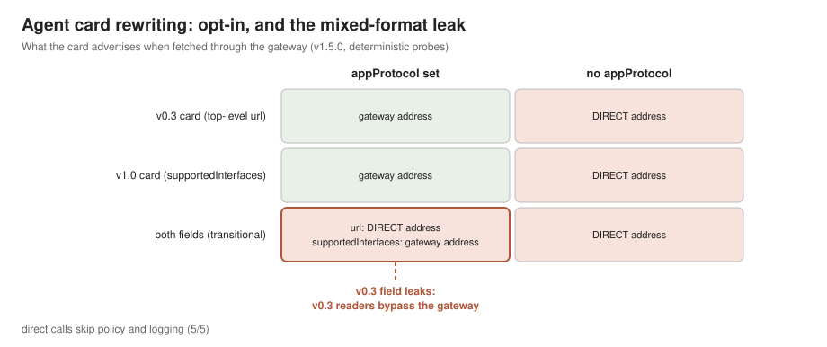
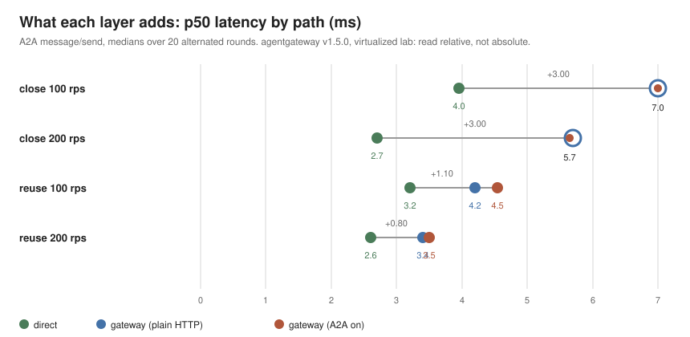

# The A2A surface of agentgateway: what it enforces and observes

[한국어](README_ko.md)

> This is the A2A section of [agentgateway-study](../README.md). It was published as a standalone `a2a-study` on 2026-09-04 and folded in here on 2026-09-07; `a2a-study` now names a separate study of the A2A protocol itself (in progress).

This study measures the distance between what the documentation says and what
is actually enforced and observed when [agentgateway](https://agentgateway.dev)
fronts an A2A (Agent2Agent protocol) backend on Kubernetes. It is the third
round of the same question I asked of
[Gateway API implementations](../../gateway-PoC/) and of
[agentgateway's MCP surface](../README.md): a declared capability is
not the same thing as an enforced one.

The short version: for A2A the gateway's protocol handling is opt-in, and the
switch that turns it on (`appProtocol: agentgateway.dev/a2a` on the Service)
decides three things at once: whether the agent card is rewritten to point at
the gateway, whether A2A fields appear in the access log, and whether you pay
the small protocol-processing cost. Leave the switch off and the gateway
still proxies the bytes, but it advertises the backend's direct address to
every client that reads the card, and the discovery step quietly walks around
your routing layer.

Measured on agentgateway v1.5.0, Kubernetes v1.37.0 (VirtualBox, 3 nodes),
2026-09-02 to 09-03. An earlier round on v1.4.1 and Kubernetes v1.36.2 (2026-08-27)
gave identical results on every deterministic probe; only the latency tables
were replaced, and the earlier numbers are quoted below where they differ.
All numbers are from a virtualized lab: read them as relative comparisons
between conditions, not as absolute performance claims.

## What A2A is, what the gateway does with it, and why measure it

A2A (Agent2Agent) is a protocol for one agent to call another as an opaque
peer: the callee publishes an agent card (`/.well-known/agent.json`) that
advertises its endpoint, skills and interfaces, and the caller sends
JSON-RPC messages to that endpoint, optionally as long-running tasks with
streaming. Google published it in 2025; specification v1.0 shipped on
2026-03-12 and changed the card's endpoint field from a top-level `url` to
`supportedInterfaces[]`, and the project joined the Agentic AI Foundation
on 2026-08-19. agentgateway's A2A support is a switch on the Kubernetes
Service (`appProtocol: agentgateway.dev/a2a`): with it on, the gateway
rewrites the card's endpoint to its own address and parses the JSON-RPC
exchange for its access log. There is no A2A-specific policy beyond that
(measured below), which is itself the first thing an adopter should know.

This study measures that surface the same way the MCP study did: what the
gateway rewrites, what it enforces (nothing, as it turns out), what it
observes, and what the hop costs, on the versions named above.

## What adopting it buys, and what it costs

- **There is no performance gain.** Putting the gateway in front of an A2A
  agent does not make calls faster or steady the tail; against this trivial
  echo agent the gateway's p99 sits 3 to 6 ms above the direct path in
  every condition.
- **The cost is one hop plus a little protocol work.** The hop costs
  +3.0 ms at p50 when the client opens a connection per call and +0.8 to
  1.1 ms when it reuses connections. Turning on A2A handling
  (`appProtocol`) adds +0.1 to 0.2 ms in reuse mode and nothing measurable
  in close mode. Against real agent work (an LLM call, a tool run) all of
  this disappears.
- **What you get is discovery control and observation, not authorization.**
  With `appProtocol` set, the agent card is rewritten to point at the
  gateway so clients that discover the agent through the card stay on your
  routing layer, and the access log carries A2A fields (method, outcome,
  JSON-RPC error code) that status-code monitoring misses. There is no
  request authorization for A2A in v1.5.0: the data-plane `A2aPolicy` is an
  empty struct. Observation exists; enforcement does not.
- **Two caveats before relying on it.** Card rewriting is opt-in, and a
  transitional card that carries both the v0.3 `url` and the v1.0
  `supportedInterfaces` gets only the latter rewritten; a v0.3 reader is
  handed the backend's direct address and walks around the gateway (5/5
  bypass calls succeeded). Fetch the card through the gateway and read what
  it actually advertises.

In one sentence: for A2A the gateway is a discovery and observation layer
today, not a policy layer; its price is a hop, and whether it is even in
the path is decided by one Service field and by what the card says.

## Findings

### 1. Card rewriting: opt-in, and a leak in the mixed-format cell

A2A discovery starts with the agent card (`/.well-known/agent.json`), where
the agent advertises its own endpoint URL. If clients are supposed to reach
the agent through the gateway, that URL must be rewritten; otherwise the card
hands out the direct backend address.

The matrix crossed the `appProtocol` switch with three card formats:

| Cell | top-level `url` (v0.3) | `supportedInterfaces[].url` (v1.0) |
|---|---|---|
| appProtocol + v0.3 card | rewritten to gateway | (absent) |
| appProtocol + v1.0 card | (absent) | rewritten to gateway |
| appProtocol + both fields | **direct address kept** | rewritten to gateway |
| no appProtocol (all formats) | direct address kept | direct address kept |
| direct fetch, control (all) | direct address kept | direct address kept |

The both-fields row is the finding. A card that carries both a v0.3
compatibility `url` and v1.0 `supportedInterfaces` is exactly what a
transitional deployment publishes, and in that case the v0.3 field keeps the
direct address even with the switch on. The code path explains it: the
rewrite treats `supportedInterfaces` as the marker of a v1.0 card and only
falls back to the top-level `url` when it is absent
(`crates/agentgateway/src/a2a/mod.rs`, `apply_to_response`; the branch
structure is unchanged from v1.4.1 through the v1.5.0 release). Whether a
mixed-format card should have both fields rewritten is a question I plan to
raise upstream rather than a defect claim; the behavior itself is what this
table documents.

Bypass is real, not hypothetical: posting `message/send` to the advertised
direct address reached the agent 5/5 times, with no gateway policy or logging
involved.

Reproduced with the official SDK (2026-09-07, agentgateway v1.5.0): a server
built on a2a-python 1.1.2's standard routes (`samples/hello_world_agent.py`)
publishes a mixed card by default, since `agent_card_to_dict()` always merges
the v0.3 compatibility fields into the v1.0 card. Through the gateway,
`supportedInterfaces[].url` was rewritten while `url` and
`additionalInterfaces[].url` kept the backend's address; a 1.1.2 client
followed the rewritten interface through the gateway, and a 0.3.26 client
read `url` and sent its request to the backend address directly. The access
log for the SDK task carried `a2a.task.state` and `a2a.context.id` alongside
`trace.id`/`span.id`.

### 2. No request authorization for A2A (observation without enforcement)

On the MCP surface the same gateway enforces CEL rules over tools and
arguments. On the A2A surface, v1.5.0 has no equivalent (nor did v1.4.1): the data-plane
`A2aPolicy` struct has no fields, and the backend policy acts as a protocol
switch. Nothing in the chain evaluates who may call which method or skill
(established by reading the v1.5.0 source; there is no probe cell for an
absent surface).
This is stated as a version-scoped fact, not a criticism; A2A joined the
gateway recently and the MCP surface shows where the policy machinery can go.

### 3. Trace context: propagated, but nothing is injected into the body

I had the echo agent reflect its received headers back in the response so the
downstream view is measurable from the host.

- With a `traceparent` sent through the gateway: trace-id preserved, span-id
  replaced by the gateway's (5/5). Same direction as the MCP result.
- Unlike MCP, nothing is injected into the message body: A2A `metadata`
  passes through unchanged, and there is no counterpart to the
  `_meta.traceparent` injection seen on the MCP path.
- Without an incoming `traceparent`, the gateway does not create one (5/5).
- Direct path (control): headers arrive unmodified (5/5).

Condition note: the gateway's tracing config was not enabled for these
probes; parent-relation issues under enabled tracing are a separate upstream
item (#2904, fix merged after v1.4.1) and out of scope here.

### 4. Errors ride HTTP 200; the gateway log is what catches them

An unsupported method (`tasks/get` against this agent) returns JSON-RPC
error -32601 inside an HTTP 200. Status-code monitoring counts that as
success. The gateway, however, parses the JSON-RPC response and writes
`a2a.method=tasks/get a2a.response.outcome=error
a2a.response.error_code=-32601` into its access log (3/3). Without
`appProtocol`, requests on the same route are logged as `protocol=http` with
no A2A fields (measured on the card fetch; the error-shape probe was not
repeated on the plain path): observation is opt-in through the same switch
as rewriting.

### 5. Cost: three arms, alternated

Three targets, identical installation state, only the load generator's
target address differs: `direct` (LoadBalancer straight to the agent),
`gw-plain` (through the gateway, no `appProtocol`), `gw-a2a` (through the
gateway, `appProtocol` set). Arms alternate inside each round with the order
rotated per round, because sub-millisecond comparisons measured arm-by-arm
in sequence pick up clock drift (a lesson from the MCP-surface study).
Per-round adjacent-pair p50 differences, medians over 20 rounds per
condition (one overnight campaign, 240 cells, zero errors):

| Condition | Proxy hop (gw-plain minus direct) | A2A processing (gw-a2a minus gw-plain) | Total |
|---|---|---|---|
| close, 100 rps | +3.00ms | +0.00ms | +3.10ms |
| close, 200 rps | +3.00ms | +0.00ms | +3.00ms |
| reuse, 100 rps | +1.10ms | +0.20ms | +1.35ms |
| reuse, 200 rps | +0.80ms | +0.10ms | +0.90ms |

Each column is an independent median of per-round differences, so the
columns do not add exactly.

- The proxy hop is dominated by connection handling: per-call connections
  pay the gateway-leg TCP setup (+3.0ms), reused connections pay +0.8 to
  1.1ms.
- A2A protocol processing (card rewriting, JSON-RPC parsing, log fields)
  separates out as +0.1 to 0.2ms in reuse mode. In close mode the 20-round
  median is +0.00ms: no A2A-processing increment was observable there. I
  record the observation and leave the mechanism unexplained rather than
  guess. The v1.4.1 round had measured +0.6 to 0.8ms for the same reuse
  cells; the gateway version and the cluster changed together between the
  rounds, so I do not attribute the difference to the version.
- Through the gateway, p99 sits 3 to 6ms above the direct path in every
  condition (medians: direct 6.6 to 7.8ms, gateway 10.1 to 13.3ms). This
  trivial backend does not show a tail benefit from the gateway hop.
- Every cell hit its offered rate (100/200 rps achieved), zero errors; the
  generator self-check counts reconnects per cell (equal to request count in
  close mode, single digits to a few dozen in reuse mode), so the connection
  modes did what they claim.

## What an operator should take from this

1. If clients discover the agent through its card, the card is part of your
   routing surface. Set `appProtocol: agentgateway.dev/a2a` and then fetch
   the card through the gateway and read what it actually advertises,
   especially if the card carries both v0.3 and v1.0 URL fields.
2. Do not assume the gateway enforces who can call the agent. On v1.5.0 the
   A2A surface observes; it does not authorize. If you need enforcement
   today, it has to live elsewhere (network policy, the agent itself, or an
   auth proxy).
3. Watch JSON-RPC error codes, not HTTP status. The gateway's access log
   already extracts them for you, but only with `appProtocol` set.
4. The gateway costs what a hop costs. With connection reuse the whole
   detour is +0.9 to 1.35ms p50 against a trivial backend; against real agent work
   (LLM calls, tool execution) this disappears.

## v1.4.1 round versus v1.5.0 round

First measured on agentgateway v1.4.1 (Kubernetes v1.36.2, 2026-08-27),
re-measured on v1.5.0 (Kubernetes v1.37.0, a fresh cluster, 2026-09-02 to
09-03). Every deterministic probe gave the same result:

| Probe | v1.4.1 | v1.5.0 |
|---|---|---|
| Card matrix (appProtocol x v0.3 / v1.0 / both) | mixed-format card keeps the direct `url` | same |
| Bypass via the advertised direct address | 5/5 reach the agent | same |
| A2A request authorization | none (`A2aPolicy` empty) | same |
| traceparent | trace-id kept, gateway span-id, no body injection (5/5) | same |
| Error shape and access log | HTTP 200 + -32601, logged as `a2a.response.error_code` (3/3) | same |

The latency numbers moved, but the gateway version and the cluster changed
together, so the differences are not attributed to either. The v1.5.0
column is canonical.

| Quantity (p50, medians over 20 rounds) | v1.4.1 round | v1.5.0 round |
|---|---|---|
| Proxy hop, new connection per call | +2.3 to 2.5 ms | +3.0 ms |
| Proxy hop, connection reuse | +0.5 to 1.0 ms | +0.8 to 1.1 ms |
| A2A processing, connection reuse | +0.6 to 0.8 ms | +0.1 to 0.2 ms |
| A2A processing, new connection per call | +0.00 to +0.05 ms | +0.00 ms |
| Gateway p99 versus direct | higher (by 5 to 10 ms) | higher (by 3 to 6 ms) |

No reading changed between the rounds.

## Reproduction

Everything ran on the `aaif-benchmark` cluster (Kubernetes v1.37.0, built
by `../test-cluster/`) with the gateway install scripts in
`../harness/`. The v1.4.1 round used the
[mcp-migration](../../mcp-migration/) cluster. The A2A-specific pieces are here:

- `k8s/server.py`: minimal A2A echo agent (stdlib only; card format
  switchable via `CARD_FORMAT` env; reflects received headers into the
  response metadata so trace probes are measurable). Note
  `disable_nagle_algorithm = True`: without it, delayed ACK adds a flat
  ~40ms to gateway-path latency and swallows the measurement (an earlier
  campaign was discarded for exactly this).
- `k8s/agent.yaml`: Deployment plus three Services (with `appProtocol`,
  without, LoadBalancer for the direct arm) and the HTTPRoutes.
- `harness/probes.sh`: deterministic card matrix, bypass, trace, and
  error-shape probes.
- `harness/loadgen_a2a.py`: A2A `message/send` load generator (open/closed
  loop, connection-mode control, reconnect counting).
- `harness/ab_matrix.sh`: the three-arm alternating cost campaign.
- `harness/read_abm.py`: reads a campaign directory into the tables above.
- `harness/rv_probes.sh`, `harness/rv_ab_matrix.sh`: the copies used for the
  v1.5.0 round (cluster context switched, gateway left installed between
  chained stages); `harness/chart.py` regenerates the figures from a campaign
  directory.

Raw per-cell JSON stays out of this repository; the tables in this README
and the scripts to regenerate them are the published artifact.

## Limits

- The measured backend is a purpose-built minimal agent. The card-rewrite
  finding was afterwards reproduced with an official a2a-python 1.1.2 server
  (above); the cost numbers and the other probes remain on the minimal agent.
- Virtualized lab: relative comparisons only.
- agentgateway v1.5.0 throughout; the cost numbers are pinned to this stack
  (the earlier v1.4.1 round is quoted where it differs).
- Streaming (SSE) and `tasks/*` methods are out of scope; the agent does not
  implement them.
