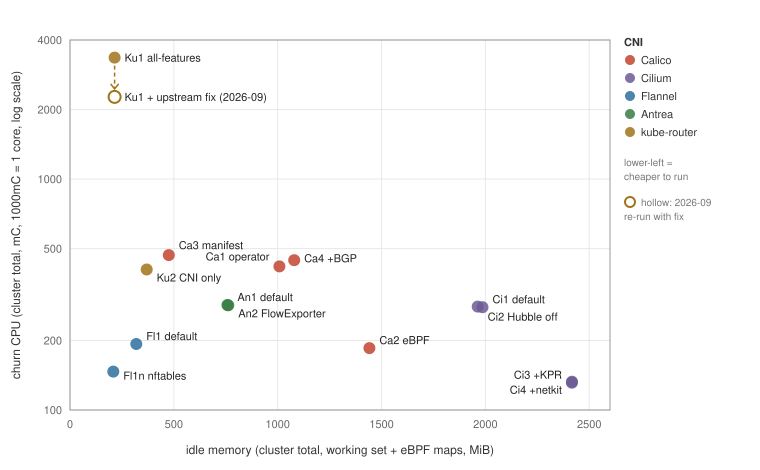
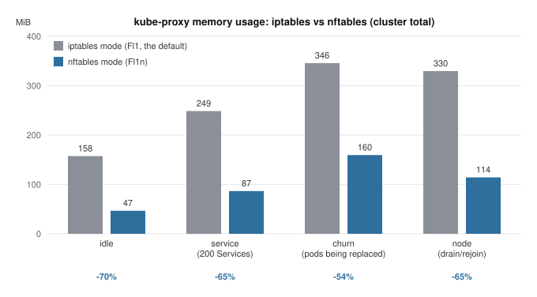

# How much CPU and memory does a CNI actually use?

[한국어](README_ko.md)

> **This README is a reference sheet for numbers, conditions, and reproduction.** The motivation, market context, and narrative walk-through live in the [blog post](https://kuberneteslab.dev/en/blog/cni-standing-cost/).

A CNI (Container Network Interface, the component that wires pods into the
network) is something you pick once when you build a cluster and rarely look at
again. As a result, it is hard to find any organized data on how much CPU and
memory CNI agents and controllers consume day to day. Throughput benchmarks are
everywhere, but I could not find a public source that compares standing cost
under identical conditions, and vendor docs do not state it either: Cilium
ships its helm chart without resource requests, and in projectcalico/calico#5418
one Calico maintainer explained that a heuristic default would be wrong for
somebody, while another pointed to per-cluster overrides. Search results for these
numbers are often filled by sources with no traceable origin.

This repository is the result of measuring that standing cost with one
procedure and one toolset. I split Calico Open Source, Cilium, Flannel,
Antrea, and kube-router into 14 conditions and collected CPU, memory, and eBPF
map kernel memory (the kernel-side storage that eBPF programs use for state)
across 6 phases, from a quiet idle to pod churn (pods being deleted and
recreated repeatedly, as happens during frequent deployments or failure
recovery). Each condition ran the full phase sequence 5 to 6 times, giving 73
valid measurement runs. The main campaign ran unattended for 9 days
(2026-07-21 to 07-30), an extra round followed through 08-02, and An2 was
re-measured on 08-03 after its install script was fixed.

CPU values are in millicores (mC): 1,000mC is one core, the same unit as a
`100m` CPU request in Kubernetes. Memory is container working set (the in-use memory the
OS will not reclaim, as kubelet reports it per container).

## Summary

- What separates the conditions is memory usage, not CPU. Idle CPU stayed
  under 0.13 cores (cluster total) in every condition, but memory usage spans
  an 8x range between the lightest and heaviest configurations.
- Where eBPF map memory is counted depends on the CNI. Cilium's maps are
  charged to the cilium-agent container and are already in its working set,
  while Calico eBPF's maps sit at the pod level, outside container metrics, so
  a comparison on container working set alone leaves out Calico eBPF's maps.
- Just switching kube-proxy from iptables mode to nftables mode cut
  kube-proxy memory usage by 70%. Official material covers the latency
  improvement of nftables mode; the resident-memory saving had not been
  published as a number.
- kube-router in all-features mode (pod networking, NetworkPolicy, and the
  service proxy all handled by one kube-router daemon) was the lightest of all
  conditions at idle. But after going through pod churn, its CPU stayed at
  about one core per node even though the number of Services and pods was
  unchanged. The cause turned out to be how random numbers are generated when
  shuffling endpoint order. I reported it upstream and the maintainer opened a
  fix PR (not merged as of 2026-09). With the fix applied, CPU after churn
  drops from 3,158mC to 59mC.
- On the same dataplane, installing Calico through the operator uses 533MiB
  more memory than the manifest install. Switching to the eBPF dataplane changes
  container memory by only 85MiB but adds 521MiB of eBPF maps at the pod level,
  so counting those maps the two choices change memory usage by a similar amount.
- Turning on observability features such as Hubble or FlowExporter added very
  little: +5 to 22MiB of agent memory.
- In 2026-09 I measured the three CNIs with new minor versions again. Cilium
  1.20.2 matched 1.19, and Antrea 2.7.0 used 11% less idle memory. The ranking
  and the scale did not change.

## Which one should you pick?

Plotting the 14 conditions on two axes gives the picture below. The x-axis is
idle memory, what the stack occupies all the time; the y-axis is churn-phase
CPU, what it additionally burns while pods keep getting replaced (1,000mC =
1 core). The further toward the lower left, the less a configuration consumes
both at rest and under load.



Filled points are the July measurement, with the versions in the results table
below. The one hollow point is kube-router all-features (Ku1) re-measured in
2026-09 with the upstream fix applied. Its churn-phase CPU drops from 3,355mC to
2,268mC but is still the highest of all conditions. Most of the fix's effect
shows up after churn ends (3,158mC to 59mC), which this chart's axes do not fully
show. The hollow point keeps the July x position, for the reason given in the
round comparison section. See finding 3 for details and the round comparison
section for the numbers.

Organized by situation, the results read as follows. Standing cost is only one
of several criteria for choosing a CNI; features, performance, and operational
experience belong in the decision too. The recommendations below are grounded
only in what this measurement covered.

| Situation | Suggested configuration | Basis (this measurement) |
|---|---|---|
| Small nodes, no need for NetworkPolicy | Flannel + kube-proxy nftables (Fl1n) | Lowest memory of all conditions (209MiB), and the smallest extra CPU during pod replacement (churn 147mC) |
| NetworkPolicy required, memory tight | Calico manifest install (Ca3) | Lowest memory among policy-capable conditions (472MiB) |
| Calico managed via operator | Calico operator (Ca1) | Same features as Ca3 with 533MiB more memory; that is the price of the management convenience |
| Heading toward eBPF dataplane, observability, kube-proxy replacement | Cilium (Ci1~Ci4) | Budget about 520~570MiB per node (container working set, which on Ci1 already includes the maps); CPU stays flat even during pod replacement (churn 131mC in the KPR configuration) |
| OVS required, or already in the Antrea ecosystem | Antrea (An1) | Mid-range on both memory (758MiB) and pod-replacement CPU (churn 285mC) |
| BGP routing without an overlay, minimal footprint | kube-router CNI only + kube-proxy (Ku2) | Light at 369MiB idle. All-features mode (Ku1) is hard to recommend for clusters with frequent pod replacement, because of the churn behavior in finding 3 below. Worth revisiting once the fix is released |

Whichever configuration you pick, if it uses kube-proxy, the nftables mode
switch is worth evaluating alongside it. It was the largest saving in this
measurement that did not involve changing the CNI.

## Conditions

| Code | Configuration | Variable isolated |
|---|---|---|
| Ca1 | Calico operator install, iptables, BGP off | Calico baseline |
| Ca2 | Ca1 + eBPF dataplane | dataplane |
| Ca3 | Calico manifest install (vxlan) | install method |
| Ca4 | Ca1 + BGP on | routing protocol |
| Ci1 | Cilium helm defaults (veth, VXLAN, Hubble on) | Cilium baseline |
| Ci2 | Ci1 + Hubble off | observability |
| Ci3 | Ci2 + kube-proxy replacement (KPR; Cilium takes over kube-proxy) | service plane |
| Ci4 | Ci3 + netkit (the kernel 6.7 pod-link device replacing veth) | datapath device |
| Fl1 | Flannel + kube-proxy iptables | minimal baseline |
| Fl1n | Fl1 + kube-proxy nftables | kube-proxy mode |
| An1 | Antrea defaults (OVS, Open vSwitch based) | Antrea baseline |
| An2 | An1 + FlowExporter on | observability |
| Ku1 | kube-router all-features: pod networking + NetworkPolicy + IPVS (IP Virtual Server, the kernel L4 load balancer) service proxy, kube-proxy removed | integrated |
| Ku2 | kube-router pod networking and NetworkPolicy, Services stay on kube-proxy | split |

Versions are pinned: Calico 3.32, Cilium 1.19, Flannel 0.28.7, Antrea 2.6.2,
kube-router 2.10.0, Kubernetes 1.36.2. kube-proxy runs in iptables mode in
every condition except Fl1n. nftables mode went GA in 1.33, but iptables is
still the default in 1.36, so the default that most clusters actually run is
what I used as the baseline.

Phases run in order: idle (1~2h), pod density ramp (0 to 60), 100
NetworkPolicies, 200 Services, churn (delete 10 pods every 20 seconds), node
drain and rejoin. Every condition switch restores a CNI-less base snapshot so
nothing from the previous condition survives.

## Environment

- 3 nodes (1 control plane, 2 workers), 2 CPUs and 4GB each, Ubuntu 24.04
  arm64, kernel 6.8, VirtualBox, hosted on a single Apple Silicon laptop.
- Because this is a virtualized environment, I did not measure throughput or
  latency: the virtual switch would blend into the numbers and they could not
  be attributed to the CNI itself. Traffic and object load are used only as
  stimuli that trigger resource consumption.
- Collection uses kubelet cadvisor metrics (via the API-server proxy, 15s
  interval) and per-node bpftool (eBPF map memlock). I installed no
  collection components into the cluster under test, since those would
  themselves become measurement noise.

## Results: networking stack totals

Each cell is "CPU / memory": what the whole networking stack (every CNI
component, plus kube-proxy where present) used during that phase as a
3-node-cluster total, CPU in mC and working set in MiB, median across repeats.
For example, Ca1's idle cell 84 / 1005 means 84mC (0.08 cores) of CPU and
1,005MiB of memory at rest. Conditions that replace kube-proxy (Ca2, Ci3, Ci4,
Ku1) are summed exactly as deployed, which is what makes the totals comparable
across conditions.

Columns are measurement phases: idle is quiet time, service is with 200
Services in place, churn is continuous pod replacement, node is draining and
rejoining one node. Of the 6 phases, density (60 pods) and policy (100
NetworkPolicies) differed little from idle and are omitted here; full-phase
values are in the detailed tables linked below. The last column is eBPF map
memory at idle, node total, in MiB (bpftool). It is not an amount to add on
top: the totals already include Cilium's maps, which are charged to the
cilium-agent container, and leave out Calico eBPF's maps, which are charged at
the pod level (see the section below).

| Condition | idle | service | churn | node | eBPF maps |
|---|---|---|---|---|---|
| Calico operator (Ca1) | 84 / 1005 | 93 / 1163 | 418 / 1319 | 110 / 1233 | 3 |
| Calico eBPF (Ca2) | 87 / 920 | 88 / 1029 | 185 / 1096 | 87 / 1044 | 521 |
| Calico manifest (Ca3) | 80 / 472 | 92 / 614 | 468 / 748 | 118 / 714 | 3 |
| Calico +BGP (Ca4) | 84 / 1077 | 95 / 1249 | 445 / 1458 | 112 / 1340 | 3 |
| Cilium default (Ci1) | 110 / 1574 | 115 / 1795 | 279 / 2003 | 119 / 1943 | 412 |
| Cilium Hubble off (Ci2) | 116 / 1551 | 115 / 1763 | 280 / 1963 | 120 / 1907 | 412 |
| Cilium +KPR (Ci3) | 123 / 1705 | 127 / 1826 | 131 / 1926 | 126 / 1894 | 712 |
| Cilium +netkit (Ci4) | 127 / 1705 | 129 / 1823 | 133 / 1927 | 128 / 1892 | 712 |
| Flannel default (Fl1) | 24 / 319 | 23 / 410 | 193 / 509 | 28 / 492 | 0 |
| Flannel nftables (Fl1n) | 23 / 209 | 21 / 248 | 147 / 323 | 24 / 277 | 0 |
| Antrea default (An1) | 60 / 758 | 61 / 954 | 285 / 1101 | 66 / 1108 | 0 |
| Antrea FlowExporter (An2) | 50 / 762 | 53 / 955 | 284 / 1108 | 60 / 1115 | 0 |
| kube-router all-features (Ku1) | 2 / 215 | 77 / 315 | 3355 / 1159 | 3158 / 1503 | 0 |
| kube-router CNI only (Ku2) | 3 / 369 | 6 / 538 | 406 / 676 | 25 / 626 | 0 |

Per-component tables (agents, controllers, operators split out, RSS included)
are in [studies/standing-cost/analysis/summary.md](studies/standing-cost/analysis/summary.md).

## Before you read the numbers

These are not CNI comparison results; they are things you need to know to
interpret the table above, or to compare these numbers with other sources.
They apply equally if you run a measurement like this yourself.

### Where eBPF map memory is counted depends on the CNI

eBPF-based CNIs keep state in map kernel memory. Measured node totals at idle
(bpftool): Cilium default 412MiB, Cilium KPR 712MiB, Calico eBPF 521MiB. Which
metric this memory shows up in depends on the CNI. On Cilium (Ci1) the maps are
charged to the cilium-agent container, so they are already part of its
container working set: about 412MiB of cilium-agent's 1,137MiB working set at
idle is maps. On Calico eBPF (Ca2) the maps are charged at the pod level,
outside the calico-node container, so container working set leaves them out
and pod-level working set includes them. Calico eBPF has a smaller container
working set than the iptables configuration (920 vs 1005MiB), so leaving its
maps out can flip the comparison.

This was checked on 2026-10-06, once each for Ci1 and Ca2, on one worker with
kernel 6.8 (`harness/bpf_memcg_probe.sh`). The other eBPF conditions and a
direct comparison with `kubectl top` (through metrics-server) will be checked
in the next re-measurement.

### working set and RSS differ by up to 5x per component

Memory values in this document are working set. Working set includes not only
RSS (Resident Set Size, the process's own memory resident in RAM) but also
kernel memory and page cache charged to the cgroup. Which metric you read can
change the same container's number substantially: cilium-agent at idle shows
1,137MiB working set vs 236MiB RSS (4.8x), kube-proxy 157.5 vs 33.4MiB (4.7x).
When comparing against other sources, check which metric they use first; the
detailed tables in this repository carry RSS alongside.

### absolute CPU numbers shift between measurement windows

The same condition showed 20~33% different absolute CPU depending on host
conditions at measurement time (verified using Kubernetes's own components as
a control group). Only comparisons within the same measurement window are
valid, and the CPU column above should be read for ranking and rough scale.
The 14 conditions here rotated within each repetition round, so
condition-to-condition comparisons are not affected by this drift.

## Findings

### 1. Memory usage is what separates the conditions

Idle CPU topped out at 127mC (0.13 cores, cluster total) even in the heaviest
condition, so day-to-day CPU is unlikely to be a problem whichever CNI you
pick. Memory is different: while Flannel with nftables uses 209MiB, Cilium's
kube-proxy-replacement configuration uses 1,705MiB, a container working set
that already includes Cilium's eBPF maps. On 4GB nodes, whether the networking stack occupies
100MiB or 800MiB changes how much memory is left for workloads.

### 2. Switching kube-proxy to nftables mode alone cut memory usage by 70%

Some background first: nftables mode is the successor Kubernetes built to fix
the performance problems of iptables mode, whose rule count grows with the
number of Services and endpoints and whose packet latency grows with it. The
nftables mode uses verdict maps to make lookup cost independent of Service
count. The official blog post
[NFTables mode for kube-proxy](https://kubernetes.io/blog/2025/02/28/nftables-kube-proxy/)
shows the latency improvement in numbers. What that material does not cover is
the CPU and memory of the kube-proxy process itself.

This measurement fills that in. Comparing Fl1 and Fl1n, identical Flannel with
only the kube-proxy mode changed, phase by phase:



kube-proxy's working set dropped from 157.5MiB to 46.8MiB at idle (-70%), and
the direction held with 200 Services in place (-65%), during churn (-54%), and
through node drain (-65%). CPU was lower too: 133mC vs 179mC during churn. So
nftables mode delivers a resident-memory saving on top of the latency
improvement the official material describes. It is still not the default in
1.36 for compatibility reasons, so you have to turn it on, and it was the
largest saving in this measurement that did not involve changing the CNI.

### 3. kube-router all-features mode does not come back down after churn

kube-router can toggle pod networking, NetworkPolicy, and its service proxy
independently. Ku1 enables all three, using the upstream all-features manifest
as-is with kube-proxy removed. Ku1 is the lightest of all conditions at idle
(2mC / 215MiB). But once churn starts, it climbs to 3,355mC cluster total
(about 1.1 cores per node) and stays at 3,158mC through the following phase.
All 5 repetitions produced the same numbers.

I reproduced it once separately to narrow the cause. There were no pod
restarts, no OOM kills, no error logs, no netlink storm, and no lingering IPVS
drain entries; the CPU was consumed by a userspace loop in the kube-router
process. The most telling observation is history dependence: before churn, the
same object scale (200 Services, 12,008 endpoints) cost 77mC, but after one
churn episode the same scale holds at 3,300mC, and deleting the load objects
returns it to idle within 90 seconds. My reading is that churn pushes the
sync loop into continuous re-execution, and since one sync pass costs in
proportion to Services times endpoints, CPU cannot come down while that scale
persists. Ku2, which leaves the service proxy to kube-proxy, was normal under
the same load (churn 406mC, then 25mC), so the cause most likely lies in
kube-router's IPVS service proxy.

**Follow-up (2026-09).** I reproduced it again with profiling enabled and found
the cause. Each time the service proxy builds the endpoint list it shuffles the
order (`shuffle`), calling `crypto/rand.Int` once per endpoint, and each call is
a system call. During churn this path took more than half of kube-router's CPU.
Shuffling does not need cryptographic randomness, so switching to
`math/rand/v2` is enough, and a binary with only that change made the CPU after
churn disappear. I confirmed the same behavior and the same fix on the latest
release (2.11.1) and the development branch, then reported it upstream as
[#2165](https://github.com/cloudnativelabs/kube-router/issues/2165). The
maintainer opened [PR #2175](https://github.com/cloudnativelabs/kube-router/pull/2175)
with the same change plus a fix to endpoint ordering for hashing schedulers; it
is not merged as of 2026-09-28. Reproducing the PR with the same procedure, CPU
also returned to zero within two minutes after churn. The full campaign measured
with the fix applied is in the round comparison section below.

### 4. For Calico, both the install method and the dataplane change memory usage

On the same iptables dataplane, the operator install (Ca1) uses 533MiB more
idle memory than the manifest install (Ca3), because two Typha replicas, two
calico-apiservers, csi-node-driver, tigera-operator, and kube-controllers all
stay resident. By contrast, switching the dataplane to eBPF (Ca2 vs Ca1)
changes container memory by only 85MiB, but Ca2 also keeps 521MiB of eBPF maps
at the pod level, outside container metrics. Counting those maps, the
dataplane switch (about 436MiB) is close to the install-method difference
(533MiB), so both choices weigh on resident memory usage. Turning BGP on (Ca4) added 72MiB
over Ca1.

### 5. Using observability features adds very little

Comparing Ci1 (Hubble on, the helm default, no relay or ui) against Ci2
(Hubble off): about 22MiB of agent working set, with CPU inside
repetition-to-repetition variance. Antrea's FlowExporter (no collector
deployed) trended the same: +5~10MiB agent memory, no CPU increase. The real
cost of an observability stack appears to come from the extra components
(relay, ui, collectors), not from the feature toggle itself. Those extra
components are outside this measurement's scope.

### 6. netkit changes nothing in standing cost

Pods connect to the host through a virtual device. Using netkit, the kernel
6.7 device built to replace the veth standard, lets packets skip the host-side
detour; Cilium supports it from 1.16 as a performance improvement. Comparing
Ci3 (veth) and Ci4 (netkit), every phase is within noise. netkit changes the
path packets take, so I expected it not to show up on the standing-cost axis,
and it did not. From a standing-cost perspective there is no reason to hold
back on netkit.

## Round comparison: re-measured on newer versions (2026-09)

On 2026-09-23 to 27 I measured the three CNIs with new minor versions again, with
the same procedure. Kubernetes (1.36.2), the nodes, the phases and the runner are
the same as in July, with 3 repetitions per condition (July had 5 to 6). Calico
(3.32.2) and Flannel (0.28.9) only had patch releases, so they were left out and
keep their July values.

| Condition | July | September | idle | churn | node |
|---|---|---|---|---|---|
| Cilium default (Ci1) | 1.19.5 | 1.20.2 | 110 / 1574 -> 112 / 1596 | 279 / 2003 -> 273 / 2056 | 119 / 1943 -> 121 / 1986 |
| Cilium +KPR (Ci3) | 1.19.5 | 1.20.2 | 123 / 1705 -> 124 / 1732 | 131 / 1926 -> 131 / 1984 | 126 / 1894 -> 126 / 1936 |
| Antrea default (An1) | 2.6.2 | 2.7.0 | 60 / 758 -> 60 / 676 | 285 / 1101 -> 287 / 1024 | 66 / 1108 -> 68 / 1035 |
| kube-router all-features (Ku1) | 2.10.0 | 2.11.1 + fix | 2 / - -> 3 / - | 3355 / - -> 2268 / - | 3158 / - -> 59 / - |
| kube-router CNI only (Ku2) | 2.10.0 | 2.11.1 + fix | 3 / - -> 4 / - | 406 / - -> 396 / - | 25 / - -> 23 / - |

Values are "CPU mC / working set MiB", computed the same way as the results
table above. The kube-router memory cells are left empty for the reason given
below. The full table per condition is in
[analysis/rev-0923-summary.md](studies/standing-cost/analysis/rev-0923-summary.md).

- **Cilium 1.20.2 matches 1.19.** CPU is within the July repetition range in all
  four conditions, working set is 1 to 2% higher, and RSS and eBPF maps (412MiB,
  715MiB) are practically the same.
- **Antrea 2.7.0 uses less memory.** Idle working set went from 758MiB to 676MiB
  (-11%) and RSS from 297MiB to 205MiB (-31%). All three repetitions gave the
  same value, so this is not repetition noise. CPU is unchanged.
- **kube-router no longer stays high after churn.** The September Ku1 and Ku2
  runs used a binary with the reported fix (the one-line `math/rand/v2` change),
  not stock 2.11.1. The node phase after churn went from 3,158mC to 59mC. During
  churn it still uses 2,268mC, which is the cost of re-syncing 200 Services into
  IPVS, and the profile shows the same. Ku2 does not use this path, so it matches
  July.

The kube-router numbers in this section are not from an upstream release; I will
measure again with the release that includes the fix. Also, because the fixed
binary was mounted as a hostPath file, its page cache is charged outside the
container, and working set reads about 48MiB per node lower. So kube-router
memory is compared on RSS only, and both rounds show the same values: Ku1 66MiB,
Ku2 99MiB.

## Limits

- This is a small 3-node measurement on virtualization. Do not extrapolate the
  absolute values to large clusters: anything that scales with Typha placement
  thresholds, identity counts, or endpoint counts will differ at scale.
- Throughput and latency are not measured. Performance comparisons belong to
  bare-metal benchmarks; this measurement only answers what the stack consumes
  day to day.
- Encryption (WireGuard, IPsec) was off. Observability extras (Hubble relay,
  flow-aggregator) are out of scope.
- The 2026-09 round comparison has 3 repetitions per condition, fewer than July
  (5 to 6). Where the difference is within the July repetition range, read it
  only as "unchanged".

## Reproducing

```
test-cluster/     Vagrant 3-node cluster, CNI-less base snapshot
conditions/       14 install scripts (pinned versions, prefetched images)
harness/          measurement automation (runner, load, collector, aggregation, charts)
```

```bash
# main campaign over 9 days (about 4.5h per condition per repetition)
./harness/launch_campaign.sh 9

# 2026-09 round comparison (versions overridden by env; base snapshot has the new images preloaded)
BASE_SNAP=base-no-cni-0923 CILIUM_VER=1.20.2 ANTREA_VER=v2.7.0 KUBEROUTER_VER=v2.11.1 \
KUBEROUTER_FIXBIN=<fixed binary> CONDITIONS_OVERRIDE="X1 A1 K1 K2 A2 X2 X3 X4" MAX_REP=3 \
  ./harness/run_campaign.sh runs/rev-0923 <deadline epoch>

# aggregation and charts
python3 harness/aggregate.py runs/<run dir> --json analysis/summary.json
python3 harness/chart.py analysis/summary.json en > assets/standing-cost-map.svg
```

The aggregation scripts and the aggregated tables are in this repository. The
raw data (73 JSONL time series, about 170MB) is kept outside git for size and
will be provided alongside the public release. Note that condition codes in
the data directories and scripts keep their original measurement-time names,
which differ from this document: C=Ca (Calico), X=Ci (Cilium), F=Fl (Flannel),
A=An (Antrea), K=Ku (kube-router).
