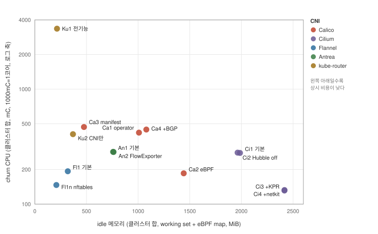
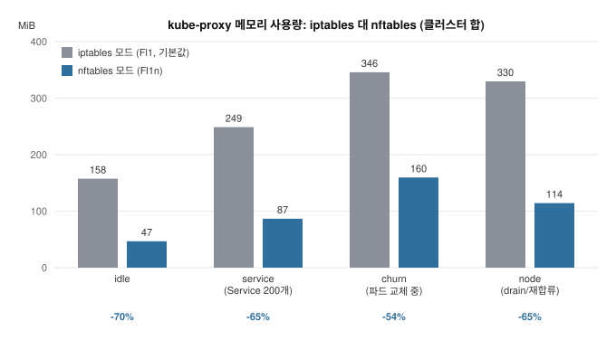

# CNI는 평소에 자원을 얼마나 쓸까

[English](README.md)

> **이 README는 수치, 조건, 재현 방법의 참조 자료다.** 측정 동기와 시장 배경, 서사형 해설은 [블로그 글](https://kuberneteslab.dev/ko/blog/cni-standing-cost/)에 있다.

CNI(Container Network Interface, 파드에 네트워크를 연결해 주는 구성 요소)는
클러스터를 만들 때 한 번 고르고 나면 다시 들여다볼 일이 거의 없다. 그러다 보니 CNI의 에이전트와 컨트롤러가 평소에 CPU와 메모리를 얼마나
쓰는지를 정리한 자료를 찾기 어렵다. 처리량 벤치마크는 많지만 상시 비용을 같은
조건에서 비교한 공개 자료는 확인하지 못했고, 벤더 문서에도 이 값은 나와 있지
않다. Cilium은 helm 차트에 자원 요청값을 넣지 않았고 Calico 메인테이너는
권장치를 공표해 달라는 요청을 거절했다. 그래서 이 값을 검색하면 출처가
불분명한 수치가 먼저 나오는 경우가 많다.

이 저장소는 그 상시 비용을 같은 절차와 같은 도구로 잰 결과다. Calico Open
Source, Cilium, Flannel, Antrea, kube-router 5종을 14개 조건으로 나누고, 아무
일도 없는 idle부터 파드 churn(파드가 반복해서 삭제되고 다시 만들어지는 상황.
잦은 배포나 장애 복구에서 일어난다)까지 6개 구간에서 CPU, 메모리, eBPF
map(커널 안에서 동작하는 eBPF 프로그램이 상태를 저장하는 커널 메모리 영역)을
수집했다. 조건마다 5~6회씩 전체 구간을 반복해서 유효 측정
73회분을 모았고, 9일 동안 사람의 개입 없이 진행했다.

CPU 값은 밀리코어(mC) 단위로 적는다. 1,000mC가 1코어이고, 쿠버네티스에서 CPU
요청량을 `100m`으로 쓸 때의 그 단위다. 메모리는 working set(운영체제가 회수
대상으로 보지 않는 실사용 메모리. `kubectl top`이 보여주는 값) 기준이다.

## 요약

- 조건 간 차이는 CPU가 아니라 메모리 사용량에서 났다. idle CPU는 전 조건에서
  클러스터 합 0.13코어 이하라 어느 CNI를 골라도 부담이 되지 않지만, 메모리
  사용량은 가장 가벼운 구성과 가장 무거운 구성이 8배 차이 난다.
- eBPF 계열 CNI는 프로세스 메트릭에 잡히지 않는 eBPF map 커널 메모리를
  추가로 쓴다. `kubectl top` 계열 도구만 보면 이 부분을 빼고 비교하게 된다.
- kube-proxy를 iptables 모드에서 nftables 모드로 바꾸기만 해도 kube-proxy
  메모리 사용량이 70% 줄었다. 공식 자료는 nftables 모드의 지연 개선을 다루는데,
  상주 메모리 절감은 수치로 알려져 있지 않던 부분이다.
- kube-router 전기능 모드(파드 네트워킹, NetworkPolicy, 서비스 프록시를
  kube-router 하나로 모두 처리하는 구성)는 idle에서는 전 조건 중 가장 가벼웠다.
  하지만 파드 churn을 겪고 나면 서비스와 파드 수가 그대로인데도 CPU가 노드당
  1코어 수준에서 내려오지 않았다.
- Calico는 같은 데이터플레인이라도 operator 방식으로 설치하면 manifest 방식
  보다 메모리를 533MiB 더 쓴다. 설치 방식이 데이터플레인 선택보다 메모리
  사용량을 더 크게 바꾼다.
- Hubble이나 FlowExporter 같은 관측 기능은 사용해도 추가로 드는 자원이
  에이전트 메모리 기준 +5~22MiB로 매우 작았다.

## 어떤 상황에 무엇을 쓸까

측정한 14개 조건을 두 축으로 놓으면 다음 그림과 같다. 가로축은 idle 메모리로
평소에 계속 차지하는 메모리이고, 세로축은 churn 구간 CPU로 파드 교체가 계속될
때 추가로 쓰는 CPU다(1,000mC = 1코어). 왼쪽 아래로 갈수록 평소에도 부하
중에도 자원을 적게 쓰는 구성이다.



이 결과를 상황별로 정리하면 다음과 같다. 상시 자원은 CNI를 고를 때 보는 여러
기준 중 하나일 뿐이므로 기능, 성능, 운영 경험까지 함께 놓고 판단해야 한다.
아래 권고는 이번에 측정한 상시 자원 결과만을 근거로 한다.

| 상황 | 권하는 구성 | 근거 (이번 실측) |
|---|---|---|
| 소형 노드이고 NetworkPolicy가 필요 없다 | Flannel + kube-proxy nftables (Fl1n) | 전 조건 최소 메모리(209MiB)이고, 파드 교체 시 추가 CPU도 가장 작다(churn 147mC) |
| NetworkPolicy는 필요하고 메모리는 아껴야 한다 | Calico manifest 설치 (Ca3) | 정책을 지원하는 조건 중 메모리가 가장 작다(472MiB) |
| Calico를 operator로 관리하고 싶다 | Calico operator (Ca1) | 기능은 Ca3와 같고 메모리를 533MiB 더 쓴다. 관리 편의를 위해 추가로 쓰는 메모리가 이만큼이라는 뜻이다 |
| eBPF 데이터플레인과 관측, kube-proxy 대체까지 갈 계획이다 | Cilium (Ci1~Ci4) | 메모리를 노드당 약 530~800MiB(map 포함)로 계획하면, 파드 교체 구간에서도 CPU가 크게 뛰지 않는다(KPR 구성 기준 churn 131mC) |
| OVS 기반이 필요하거나 Antrea 생태계를 쓴다 | Antrea (An1) | 메모리(758MiB)와 파드 교체 시 CPU(churn 285mC) 모두 중간 수준이다 |
| 오버레이 없이 BGP(Border Gateway Protocol) 라우팅을 최소 자원으로 쓰고 싶다 | kube-router CNI만 + kube-proxy (Ku2) | idle 메모리 369MiB로 가볍다. 전기능(Ku1)은 아래 조사 결과 3의 churn 문제 때문에 파드 교체가 잦은 클러스터에는 권하기 어렵다 |

어느 구성을 고르든 kube-proxy를 쓰고 있다면 nftables 모드 전환은 함께 검토할
만하다. 이번 측정에서 CNI를 바꾸지 않고 얻은 절감 중 가장 컸다.

## 측정 조건

| 조건 | 구성 | 구분 변수 |
|---|---|---|
| Ca1 | Calico operator 설치, iptables, BGP off | Calico 기준점 |
| Ca2 | Ca1 + eBPF 데이터플레인 | 데이터플레인 |
| Ca3 | Calico manifest 설치(vxlan) | 설치 방식 |
| Ca4 | Ca1 + BGP on | 라우팅 프로토콜 |
| Ci1 | Cilium helm 기본(veth, VXLAN, Hubble on) | Cilium 기준점 |
| Ci2 | Ci1 + Hubble off | 관측 기능 |
| Ci3 | Ci2 + kube-proxy replacement(KPR, Cilium이 kube-proxy를 대체) | 서비스 플레인 |
| Ci4 | Ci3 + netkit(veth를 대체하는 커널 6.7의 파드 연결 장치) | 데이터패스 장치 |
| Fl1 | Flannel + kube-proxy iptables | 최소 기준선 |
| Fl1n | Fl1 + kube-proxy nftables | kube-proxy 모드 |
| An1 | Antrea 기본(OVS, Open vSwitch 기반) | Antrea 기준점 |
| An2 | An1 + FlowExporter on | 관측 기능 |
| Ku1 | kube-router 전기능: 파드 네트워킹 + NetworkPolicy + IPVS(IP Virtual Server, 커널 L4 로드밸런서) 서비스 프록시(kube-proxy 제거) | 통합형 |
| Ku2 | kube-router는 파드 네트워킹만, 서비스는 kube-proxy 유지 | 분리형 |

버전은 Calico 3.32, Cilium 1.19, Flannel 0.28.7, Antrea 2.6.2, kube-router
2.10.0, Kubernetes 1.36.2로 고정했다. kube-proxy는 Fl1n을 제외한 전 조건에서
iptables 모드로 두었다. nftables 모드가 1.33에서 GA(General Availability,
정식 지원)가 됐지만 1.36에서도
기본값은 여전히 iptables이기 때문에, 대부분의 클러스터가 실제로 쓰는 기본값을
기준으로 삼았다.

측정 구간은 idle(1~2시간)에서 시작해 파드 밀도 증가(0에서 60개), NetworkPolicy
100개 생성, Service 200개 생성, churn(20초마다 파드 10개 삭제), 노드 drain과
재합류 순서로 진행한다. 조건을 바꿀 때마다 CNI가 없는 베이스 스냅샷으로
완전히 복원해서 이전 조건의 흔적이 남지 않도록 했다.

## 환경

- 노드 3개(컨트롤플레인 1, 워커 2), 노드당 2 CPU와 4GB 메모리, Ubuntu 24.04
  arm64, kernel 6.8, VirtualBox. 호스트는 Apple Silicon 랩탑 1대다.
- 가상화 환경이므로 처리량과 지연은 재지 않았다. 가상 스위치의 성능이 섞여서
  CNI 자체의 성능이라고 말할 수 없기 때문이다. 트래픽과 오브젝트 생성은 자원
  사용을 일으키는 부하로만 쓴다.
- 수집은 kubelet cadvisor 메트릭(API 서버 프록시 경유, 15초 간격)과 노드별
  bpftool(eBPF map memlock)로 했다. 수집용 컴포넌트를 클러스터에 추가로
  설치하면 그 자체가 측정에 잡음이 되기 때문에 설치하지 않았다.

## 결과: 네트워킹 스택 총합

표의 각 칸은 "CPU / 메모리"다. 그 측정 구간 동안 네트워킹 스택 전체(CNI 구성
요소 전부 + kube-proxy가 있는 조건은 kube-proxy까지)가 클러스터 3노드 합으로
쓴 CPU(mC)와 working set(MiB)이고, 반복 측정의 중앙값이다. 예를 들어 Ca1의
idle 칸 84 / 1005는 평상시에 CPU 84mC(0.08코어)와 메모리 1,005MiB를 쓰고
있었다는 뜻이다. kube-proxy를 대체하는 조건(Ca2, Ci3, Ci4, Ku1)은 대체된 상태
그대로 합산해야 조건 간 비교가 공정해진다.

열은 측정 구간이다. idle은 평상시, service는 Service 200개가 걸린 상태,
churn은 파드 교체가 계속되는 구간, node는 노드 하나를 뺐다가 다시 넣는
구간이다. 6개 구간 중 density(파드 60개)와 policy(NetworkPolicy 100개)는
idle과 차이가 작아서 표에서 뺐고, 전체 구간 값은 아래 상세 표에 있다.
마지막 eBPF map 열은 idle 기준 노드 합 메모리(MiB)다.

| 조건 | idle | service | churn | node | eBPF map |
|---|---|---|---|---|---|
| Calico operator (Ca1) | 84 / 1005 | 93 / 1163 | 418 / 1319 | 110 / 1233 | 3 |
| Calico eBPF (Ca2) | 87 / 920 | 88 / 1029 | 185 / 1096 | 87 / 1044 | 521 |
| Calico manifest (Ca3) | 80 / 472 | 92 / 614 | 468 / 748 | 118 / 714 | 3 |
| Calico +BGP (Ca4) | 84 / 1077 | 95 / 1249 | 445 / 1458 | 112 / 1340 | 3 |
| Cilium 기본 (Ci1) | 110 / 1574 | 115 / 1795 | 279 / 2003 | 119 / 1943 | 412 |
| Cilium Hubble off (Ci2) | 116 / 1551 | 115 / 1763 | 280 / 1963 | 120 / 1907 | 412 |
| Cilium +KPR (Ci3) | 123 / 1705 | 127 / 1826 | 131 / 1926 | 126 / 1894 | 712 |
| Cilium +netkit (Ci4) | 127 / 1705 | 129 / 1823 | 133 / 1927 | 128 / 1892 | 712 |
| Flannel 기본 (Fl1) | 24 / 319 | 23 / 410 | 193 / 509 | 28 / 492 | 0 |
| Flannel nftables (Fl1n) | 23 / 209 | 21 / 248 | 147 / 323 | 24 / 277 | 0 |
| Antrea 기본 (An1) | 60 / 758 | 61 / 954 | 285 / 1101 | 66 / 1108 | 0 |
| Antrea FlowExporter (An2) | 50 / 762 | 53 / 955 | 284 / 1108 | 60 / 1115 | 0 |
| kube-router 전기능 (Ku1) | 2 / 215 | 77 / 315 | 3355 / 1159 | 3158 / 1503 | 0 |
| kube-router CNI만 (Ku2) | 3 / 369 | 6 / 538 | 406 / 676 | 25 / 626 | 0 |

에이전트, 컨트롤러, operator를 나눈 구성 요소별 상세 표는
[analysis/summary.md](studies/standing-cost/analysis/summary.md)에 있다.

## 수치를 읽을 때 주의할 점

CNI별 비교 결과가 아니라, 위 표의 숫자를 해석하거나 다른 자료의 수치와 비교할
때 알고 있어야 하는 것들이다. 직접 측정할 때도 같은 함정이 적용된다.

### eBPF map은 kubectl top에 잡히지 않는다

eBPF 계열 CNI가 쓰는 map 커널 메모리는 프로세스 메트릭 바깥에 있다. 실측값은
노드 합 기준으로 Cilium 기본 412MiB, Cilium KPR 712MiB, Calico eBPF 521MiB였다.
Calico eBPF는 process working set만 보면 iptables 구성보다 오히려 작기 때문에
(920 대 1005MiB) map을 빼고 비교하면 판단이 반대로 나올 수 있다. 따라서 eBPF
CNI의 메모리를 비교할 때는 bpftool 계측까지 포함해야 한다.

### working set과 RSS는 구성 요소에 따라 5배까지 다르다

이 문서의 메모리 값은 working set 기준인데, working set에는 프로세스가 직접
쓰는 메모리인 RSS(Resident Set Size, 물리 메모리에 올라와 있는 프로세스
자체의 메모리)만이 아니라 해당 cgroup에 계상되는 커널 메모리와 페이지 캐시가
포함된다. 그래서 어느 메트릭을 보는지에 따라 같은 컨테이너의 값이 크게
달라진다. cilium-agent는 idle에서 working set 1,137MiB 대 RSS 236MiB로 4.8배,
kube-proxy는 157.5 대 33.4MiB로 4.7배였다. 다른 자료의 수치와 비교할 때는
어떤 메트릭 기준인지부터 확인해야 하고, 이 저장소의 상세 표에는 RSS를
병기해 두었다.

### CPU 절대값은 측정 시기에 따라 달라진다

같은 조건이라도 호스트 상태에 따라 측정 시기 사이에 CPU 절대값이 20~33%
달라지는 것을 확인했다(k8s 자체 구성 요소를 대조군으로 사용). 같은 시기에 잰
조건끼리 비교하는 것만 유효하고, 위 표의 CPU는 순위와 대략의 크기로 읽어야
한다. 이번 측정의 14개 조건은 반복 회차 안에서 순환 배치했기 때문에 조건 간
비교는 이 변동의 영향을 받지 않는다.

## 조사 결과

### 1. 조건 간 차이는 메모리 사용량에서 난다

idle CPU는 가장 무거운 조건도 클러스터 합 127mC(0.13코어)에 그쳤다. 어떤 CNI를
고르든 평소 CPU가 문제가 될 가능성은 낮다. 하지만 메모리는 Flannel과 nftables
조합이 209MiB를 쓰는 동안 Cilium의 kube-proxy 대체 구성은 1,705MiB를 쓰고,
eBPF map까지 더하면 차이는 더 커진다. 노드당 메모리가 4GB인 환경이라면
네트워킹 스택이 100MiB를 쓰는지 800MiB를 쓰는지에 따라 워크로드에 남는
메모리가 달라지게 된다.

### 2. kube-proxy를 nftables 모드로 바꾸는 것만으로 메모리 사용량이 70% 줄었다

배경부터 정리하면, nftables 모드는 쿠버네티스가 iptables 모드의 성능 문제를
해결하려고 만든 후속 모드다. iptables 모드는 Service와 엔드포인트 수에 비례해
규칙이 늘어나는 구조라 서비스가 많은 클러스터에서 패킷 지연이 커지고, nftables
모드는 verdict map으로 서비스 수와 무관한 검사 비용을 만들었다. 공식 블로그
[NFTables mode for kube-proxy](https://kubernetes.io/blog/2025/02/28/nftables-kube-proxy/)가
이 지연 개선을 수치로 보여준다. 그런데 그 자료에도 kube-proxy 프로세스 자체가
쓰는 CPU와 메모리는 나오지 않는다.

이번 측정이 그 부분을 채운다. 같은 Flannel에서 kube-proxy 모드만 바꾼 Fl1과
Fl1n을 구간별로 비교하면 다음 그림과 같다.



kube-proxy의 working set이 idle 기준 157.5MiB에서 46.8MiB로 70% 줄었고,
Service 200개를 만든 뒤(-65%)와 churn 구간(-54%), 노드 drain 구간(-65%)에서도
같은 방향이 유지된다. CPU도 churn 기준 179mC 대 133mC로 nftables 쪽이 낮았다.
정리하면 nftables 모드는 공식 자료가 말하는 지연 개선에 더해 상주 메모리
절감까지 있는 것이다. 다만 호환성 때문에 1.36에서도 기본값은 iptables라서
직접 켜야 하고, CNI를 바꾸지 않고 얻을 수 있는 절감으로는 이번 측정에서 가장
컸다.

### 3. kube-router 전기능 모드는 churn을 겪고 나면 CPU가 내려오지 않는다

kube-router는 파드 네트워킹, NetworkPolicy, 서비스 프록시를 각각 켜고 끌 수
있다. Ku1은 셋을 모두 켠 구성으로, 업스트림이 제공하는 all-features manifest를
그대로 쓰고 kube-proxy를 제거한다. Ku1은 idle에서 전 조건 중 가장 가볍다
(2mC / 215MiB). 하지만 churn이 시작되면
클러스터 합 3,355mC(노드당 약 1.1코어)까지 올라가고, churn이 끝난 다음
구간에서도 3,158mC에 머무른다. 5회 반복에서 매번 같은 값이 나왔다.

원인 범위를 좁히기 위해 별도로 1회 재현했다. 파드 재시작, OOM(Out of Memory)
종료, 오류 로그,
netlink 폭주, IPVS 드레인 잔류는 모두 없었고, CPU는 kube-router 프로세스의
사용자 공간 루프가 쓰고 있었다. 가장 눈에 띄는 부분은 같은 상태라도 이력에
따라 CPU가 달라진다는 점이다. churn 전에는 같은 규모(Service 200개, 엔드포인트
12,008개)에서 77mC였는데 churn을 한 번 겪고 나면 같은 규모에서 3,300mC가
유지되고, 부하 오브젝트를 삭제하면 90초 안에 idle 수준으로 내려온다. churn이
시작되면 동기화 루프가 계속 다시 실행되는 상태가 되고, 한 번의 동기화 비용이
서비스와 엔드포인트 수에 비례하기 때문에 그 규모가 유지되는 동안 CPU가
내려오지 못하는 것으로 보인다. 서비스 프록시를 kube-proxy에 맡긴 Ku2는 같은
부하에서 churn 406mC, 이후 25mC로 정상이었다. 따라서 원인은 kube-router의
IPVS 서비스 프록시 쪽일 가능성이 높지만, 내부의 어느 동작이 원인인지까지는
확인하지 않았다. 필요하면 프로파일링을 켜고 더 세부적으로 조사해야
하는 부분이다.

### 4. Calico는 데이터플레인보다 설치 방식에 따라 메모리 사용량이 더 크게 달라진다

같은 iptables 데이터플레인이라도 operator 방식(Ca1)은 manifest 방식(Ca3)보다
idle 메모리를 533MiB 더 쓴다. Typha 2개, calico-apiserver 2개, csi-node-driver,
tigera-operator, kube-controllers가 추가로 상주하기 때문이다. 그에 반해
데이터플레인을 eBPF로 바꾼 Ca2와 Ca1의 process 메모리 차이는 85MiB에 그친다.
어느 데이터플레인을 쓰는지보다 어떤 방식으로 설치하는지가 상주 메모리
사용량에 더 크게 작용한다. BGP를 켠 Ca4는 Ca1보다 72MiB를 더 썼다.

### 5. 관측 기능을 사용해도 추가로 드는 자원은 매우 작다

Cilium helm 기본값의 Hubble(relay와 ui 없음)을 끈 Ci2와 켠 Ci1을 비교하면
에이전트 working set 차이가 약 22MiB이고 CPU 차이는 반복 편차 안이다. Antrea
FlowExporter(수집기 미배치)도 에이전트 +5~10MiB, CPU 증가 없음으로 같은
경향이었다. 관측 기능의 실질 비용은 켜는 것 자체가 아니라 relay, ui, 수집기
같은 추가 컴포넌트에서 발생한다고 볼 수 있다. 추가 컴포넌트는 이번 측정 범위
밖이다.

### 6. netkit으로 바꿔도 상시 비용은 달라지지 않는다

파드와 호스트 사이는 가상 장치로 이어지는데, 지금까지의 표준인 veth 대신
커널 6.7에 새로 들어온 netkit을 쓰면 패킷이 호스트 쪽 우회 단계를 건너뛴다.
Cilium이 1.16부터 지원하는 성능 개선 축이다. veth를 쓰는 Ci3와 netkit을 쓰는
Ci4를 비교하면 전 구간에서 오차 범위 안이다. netkit은 패킷이 지나가는 통로를
바꾸는 것이라 상시 비용에는 나타나지 않을 것으로 예상했고 결과도 그랬다.
상시 비용 관점에서는 netkit 전환을 막을 이유가 없다는 것을 확인했다.

## 한계

- 가상화 위 3노드 소규모 측정이다. 절대값을 대규모 클러스터로 그대로 확장하면
  안 된다. Typha 배치 기준, identity 수, 엔드포인트 수에 비례하는 항목은 규모가
  커지면 달라진다.
- 처리량과 지연은 측정 대상이 아니다. 성능 비교는 베어메탈 환경의 벤치마크가
  담당할 영역이고, 이 측정은 평소에 자원을 얼마나 쓰는지만 다룬다.
- 암호화(WireGuard, IPsec)는 껐다. 관측 기능의 추가 컴포넌트(Hubble relay,
  flow-aggregator)도 범위 밖이다.

## 재현

```
test-cluster/     Vagrant 3노드, CNI 없는 베이스 스냅샷
conditions/       조건 14개 설치 스크립트 (버전 고정, 이미지 프리페치)
harness/          측정 자동화 스크립트 (실행, 부하, 수집, 집계, 차트)
```

```bash
# 9일 무인 측정 (조건당 약 4.5시간 x 반복)
./harness/launch_campaign.sh 9

# 집계와 차트
python3 harness/aggregate.py runs/<측정 디렉토리> --json analysis/summary.json
python3 harness/chart.py analysis/summary.json ko > assets/standing-cost-map.ko.svg
```

집계 스크립트와 집계 결과는 이 저장소에 있다. 원시 데이터(JSONL 시계열
73회분, 약 170MB)는 용량 때문에 git 밖에 보관하며 공개 시 함께 제공한다.
데이터 디렉토리와 스크립트의 조건 코드는 측정 당시 이름을 보존한 것이라 이
문서와 다르다: C=Ca(Calico), X=Ci(Cilium), F=Fl(Flannel), A=An(Antrea),
K=Ku(kube-router).
