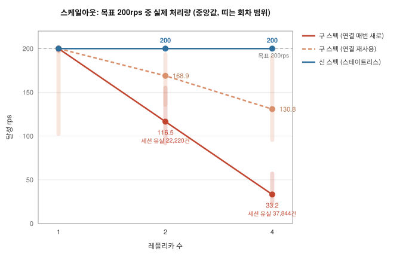
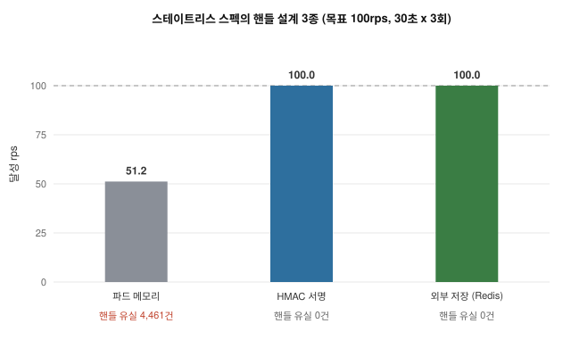

# MCP 서버를 스테이트리스 스펙으로 옮기면 무엇이 달라질까

[English](README.md)

MCP(Model Context Protocol)의 2026-07-28 스테이트리스(stateless) 개정은
프로토콜이 나온 뒤 가장 큰 변경이다. 프로토콜 수준의 세션과 `Mcp-Session-Id`
헤더가 사라졌고 요청마다 처리에 필요한 정보를 모두 담아 보내게 됐으며 세션에
담겨 있던 상태는 이제 핸들(handle, 서버가 발급해 도구 인자로 주고받는 상태
식별자)로 명시해서 오간다. 무엇이 바뀌었는지에 대한 해설은 이미 많다. 그런데
찾을 수 없던 것이 있다. 이 변경이 쿠버네티스 위에서 로드 밸런서 뒤에서,
레플리카가 늘고 파드가 교체되는 환경에서 실제로 얼마나 차이를 만드는지 측정한
자료다.

그래서 직접 쟀다. 같은 워크로드를 두 번 돌렸다. 한 번은 구 스펙(2025-11-25)
세션 기반 서버로, 한 번은 신 스펙으로 포팅한 서버로, 같은 클러스터에서 같은
부하 생성기로, 릴리스 주간에 나온 안정 버전 SDK로 측정했다. 본측정 뒤에는
일주일을 보강 측정에 써서 셀마다 관측을 13회에서 22회까지 늘렸다. 이 저장소에
하네스와 포팅한 서버, 수치가 전부 있다.

본문에 나오는 용어를 먼저 정리하고 넘어가는 게 좋겠다. rps는 초당 요청 수이고
목표(offered)는 부하 생성기가 보내려는 양, 달성(achieved)은 실제로 성공한
양이다. 세션 유실은 서버가 요청의 세션을 알지 못해 거절한 요청이다(구
스펙에서 HTTP 400이나 404). 핸들 유실은 신 스펙에서 핸들이 가리키는 상태를
받은 파드가 갖고 있지 않아 도구 수준 오류가 난 요청이다.

## 요약

- 구 스펙에서는 레플리카를 늘릴수록 처리량이 오히려 줄어든다. 실제로 목표
  200rps에서 레플리카를 1에서 4로 올리자 달성 처리량 중앙값이 200에서
  33.2rps로 내려갔고 요청 78,000건 중 세션 유실이 37,844건 생겼다. 게다가
  같은 조건을 다시 재면 22.4에서 57.0rps까지 회차마다 값이 달라진다.
- 신 스펙은 두 연결 방식과 모든 레플리카 수에서 69회 관측 전부 200.0rps에
  유실 0이었다. 관측 범위가 199.7에서 200.0이다.
- 실행 중에 파드 하나를 강제로 종료하는 측정에서 구 스펙은 6회에 세션
  1,922개를 잃었고(회차별 59~1,072) 신 스펙은 같은 종료를 6회 겪고도
  아무것도 잃지 않았다.
- 전송 계층을 옮겼다고 해서 애플리케이션까지 함께 옮겨 가는 것은 아니다. 신
  스펙으로 포팅하고도 핸들 상태를 파드 메모리에 두면 구 스펙의 문제가 그대로
  돌아온다. 스케일아웃에서 목표의 절반만 달성했고 파드 교체 5회에서는 핸들
  유실이 13,942건 나왔다. 반면 상태를 핸들 값에 서명해 담는
  HMAC(Hash-based Message Authentication Code, 해시 기반 메시지 인증 코드)
  방식과 외부 저장(Redis)은 스케일아웃과 파드 교체 양쪽에서 유실이 0이었다.
- 아직 옮길 수 없다면 구 스펙을 버티게 하는 대안 두 가지가 실제로 통한다.
  서비스의 스티키 세션(sessionAffinity: ClientIP)을 켜면 유실이 0이 되지만
  트래픽이 클라이언트 IP 단위로 파드 하나에 몰리고 게이트웨이(agentgateway
  v1.4.1)를 두면 스케일아웃과 파드 교체를 모두 흡수하는 대신 세션 상태를
  지키는 부담이 게이트웨이 자체로 옮겨간다.
- 파일럿에서 막혔던 지점이 풀렸다. agentgateway v1.4.0-alpha.1은
  `params._meta`를 훼손해서 신 스펙 통과가 불가능했는데 v1.4.1은 온전히
  통과시킨다.

## 옮겨야 할까, 무엇을 조심해야 할까

| 상황 | 측정 결과에서 알 수 있는 것 |
|---|---|
| 스케일아웃, 오토스케일, 잦은 배포를 쓴다 | 옮기는 쪽이 맞다. 구 스펙은 레플리카 변화와 파드 교체마다 세션을 잃었고 처리량도 회차마다 달라졌다. 신 스펙은 측정한 모든 조건에서 목표 처리량을 그대로 유지했다 |
| 지금 포팅하는 중이다 | 성패는 핸들 설계에서 갈린다. 상태를 파드 메모리에 두면 안 된다. 핸들 값에 서명해 담거나(HMAC) 외부 저장(Redis)에 둔다. 둘 다 스케일아웃과 파드 교체 양쪽에서 유실 0이었고 파드 메모리는 양쪽 다 잃었다 |
| 아직 옮길 수 없다 | 스티키 세션과 게이트웨이 세션 라우팅이 둘 다 통한다. 다만 대가가 다르다. 스티키 세션은 부하 분산을 잃고 게이트웨이는 세션 상태를 지키는 부담이 게이트웨이 계층으로 옮겨간다 |
| 클라이언트를 운영한다 | 요청 단위로 할 일은 없다. 신 스펙의 요청 형식은 헤더와 `_meta`가 전부이고 릴리스 주간의 SDK가 새 필수 필드(`resultType`, `serverInfo`)를 알아서 채운다 |

## 무엇을 측정했나

우선 서버는 두 대를 준비했고 두 서버 사이에서 다르게 둔 변수는 스펙 버전
하나다.

- **A (구 스펙, 2025-11-25)**: 공식 `server-everything` 2026.7.4. streamable
  HTTP, 세션은 메모리 Map에 있다. 지금 운영 중인 세션 기반 서버 대부분이
  여기에 해당하고 마이그레이션은 이 지점에서 시작한다.
- **B (신 스펙, 2026-07-28)**: 같은 워크로드 부분집합(echo, get-sum, 카운터)을
  Python SDK `mcp` 2.0.0 안정 버전으로 포팅했다. 스펙이 핸들 지속성을 앱
  재량으로 남겼기 때문에 B는 세 가지로 구현했다. 파드 메모리(단순 포팅),
  상태를 핸들 값에 서명해 담는 HMAC 방식, Redis 외부 저장이다.

측정은 3개이고 조건 조합 하나를 셀이라고 부른다. 클라이언트에서 서버까지
가는 길은 (a) LoadBalancer Service 직접, (b) Gateway API 구현체 경유,
(c) agentgateway 경유 세 가지를 두고 이 중 (a)와 (c)를 쟀다.

- **M1 스케일아웃**: 경로 (a)에서 레플리카 1 -> 2 -> 4, 목표 200rps로 30초.
  kube-proxy가 연결 단위로 분배하므로 연결 방식 두 가지(호출마다 새 연결,
  연결 재사용)를 다 쟀다.
- **M2 핸들 설계**: B의 세 구현을 목표 100rps로.
- **M3 파드 교체**: 60초 실행의 20초 시점에 파드 하나를 강제로 종료한다.
- **경로 (c) 게이트웨이**: 같은 워크로드를 agentgateway v1.4.1 경유로. 구
  스펙은 `sessionRouting: Stateful`, 신 스펙은 `Stateless`.

본측정(2026-08-06) 뒤 일주일은 보강 측정에 썼다. M1의 모든 셀을 13회로
늘렸고(연결 재사용 레플리카 4는 22회), 파드 교체는 6회로 늘렸다. 덧붙여
스티키 세션, kube-proxy nftables 모드, 클라이언트 동시성 4~32, 30분 연속
실행, 핸들 설계별 파드 교체, Redis 자체 장애까지 같은 하네스로 확인했다.

## 환경

- Kubernetes 1.36.2(kubeadm), 노드 3개(컨트롤플레인 1 + 워커 2, 노드당 2 CPU와
  4GB), VirtualBox arm64, Calico, MetalLB, kube-proxy는 기본값인 iptables 모드.
- 부하 생성기는 파드가 아니라 호스트에서 돌린다. 측정 도구가 측정 대상과 같은
  자원을 나눠 쓰지 않게 하기 위해서다. 또한 이 생성기는 두 스펙의 요청 형식을
  모두 만들어 낼 수 있다. 구 스펙의 핸드셰이크와 세션, 재초기화 흐름, 그리고 신
  스펙의 헤더와 `_meta` 흐름이다. MCP 전용 부하 도구가 없어서 직접 만들었고
  이것도 산출물의 일부다.
- 실행마다 버전을 결과 디렉토리에 기록한다. 7월 파일럿 수치(RC와 베타 SDK로
  측정)는 내부 보존이고 여기 실린 수치는 전부 확정 스펙과 안정 버전 SDK로 잰
  것이다.

## 결과



| 셀 | 달성 rps 중앙값 (범위) | p50 ms | 세션 유실 | 핸들 유실 |
|---|---|---|---|---|
| A 구 스펙, 연결 매번 새로, 레플리카 1 | 199.9 (196.8~200.0) | 7.4 | 0 | 0 |
| A 구 스펙, 연결 매번 새로, 레플리카 2 | 116.5 (91.9~155.1) | 6.7 | 22,220 | 0 |
| A 구 스펙, 연결 매번 새로, 레플리카 4 | 33.2 (22.4~57.0) | 5.9 | 37,844 | 0 |
| A 구 스펙, 연결 재사용, 레플리카 1 | 200.0 (102.5~200.0) | 4.9 | 16 | 0 |
| A 구 스펙, 연결 재사용, 레플리카 2 | 168.9 (135.7~193.4) | 3.7 | 11,478 | 0 |
| A 구 스펙, 연결 재사용, 레플리카 4 | 130.8 (95.6~190.6) | 2.8 | 40,773 | 0 |
| **B 신 스펙, 두 방식 x 레플리카 1/2/4** | **200.0 (199.7~200.0)** | 6.2 | **0** | 0 |
| B 핸들 파드 메모리, 100rps | 51.2 | 6.7 | 0 | **4,461** |
| B 핸들 HMAC 서명, 100rps | 100.0 | 7.5 | 0 | 0 |
| B 핸들 Redis, 100rps | 100.0 | 7.9 | 0 | 0 |
| A 실행 중 파드 강제 종료, 100rps | 97.7 | 4.2 | **1,922** | 0 |
| B 실행 중 파드 강제 종료, 100rps | 100.0 | 6.9 | **0** | 0 |
| A 게이트웨이 경유(Stateful), 레플리카 4 | 200.0 | 6.2 | 0 | 0 |
| B 게이트웨이 경유(Stateless), 레플리카 4 | 200.0 | 6.5 | 0 | 0 |

처리량은 반복의 중앙값이고 괄호는 관측 범위, 유실은 반복의 합이다. 관측
횟수는 셀마다 다르다. M1 셀은 13회(연결 재사용 레플리카 4만 22회)로 셀당
78,000건을 보냈고 핸들 3종은 3회에 9,000건, 파드 강제 종료는 6회에
36,000건, 게이트웨이는 3회다. 파드 강제 종료는 매회 실제로 실행된 것을
확인했다.

레플리카가 2개 이상인 구 스펙 셀은 회차 사이 편차가 크다. 어느 파드가 세션을
들고 있고 연결이 어느 파드로 가는지에 따라 결과가 달라지기 때문이다. 그에
반해 레플리카 1은 196.8~200.0으로 안정적이고 신 스펙은 69회 관측 전부
200.0rps다. 편차가 측정 잡음이 아니라 구 스펙의 성질이라는 뜻이다.



## 수치를 읽을 때 주의할 점

- **처리량 절대값이 결론이 아니다.** 소형 가상화 클러스터이고 200rps는
  일부러 포화 아래로 잡은 값이다. 목표를 올려 재 보니 신 스펙은 300rps까지
  그대로 따라오고 400rps부터 못 따라갔으므로(달성 324.6, 그때도 유실 0)
  200rps는 이 클러스터가 감당하는 양의 3분의 2쯤이다. 다른 환경에도 적용할
  수 있는 것은 구성별 경향이다. 즉 요청을 잃는 구성과 목표 처리량을 그대로
  유지하는 구성의 구분이다.
- **연결을 많이 만드는 셀을 연달아 돌리면 쿨다운이 필요하다.** 첫 전체 실행이
  이것 때문에 무효가 됐다. 초당 200개의 새 연결을 셀마다 연이어 만들면 경로에
  conntrack TIME_WAIT 상태(타임아웃 120초)가 쌓여서 뒤 셀의 p99가 16ms에서
  1초대로 뛰고 처리량이 내려간다. 이 때문에 러너는 이제 셀 사이에 180초를
  쉰다. 첫 실행 데이터는 진단 근거로 저장소 이력에 남겨 두었다.
- **게이트웨이 뒤에서는 실패가 다른 얼굴로 온다.** 직접 경로에서 세션을
  잃으면 400이 오지만 게이트웨이 경유에서는 5xx가 온다. 400과 404만 세는
  클라이언트로 재면 게이트웨이의 실패가 유실 0으로 보이고 반대로 5xx에서
  재초기화하지 않는 클라이언트로 재면 실패한 워커가 남은 실행 내내 실패해서
  실제보다 훨씬 나쁘게 보인다. 우리 하네스가 처음에 후자였고 그 회차는 폐기한
  뒤 5xx에서도 재초기화하도록 고쳐서 다시 쟀다.
- **게이트웨이 셀의 절대 처리량을 직접 경로와 나란히 비교하면 안 된다.**
  게이트웨이 컨트롤 플레인과 프록시가 워커 CPU를 쓰기 때문에 스케일아웃
  셀은 한 번에 한 서버만 레플리카 4로 올려서 쟀다. 파드 교체 비교만 같은
  조건(레플리카 2, 100rps)으로 게이트웨이 경유와 직접 경로를 잇달아 쟀다.

## 조사 결과

### 1. 구 스펙에서는 레플리카를 늘릴수록 처리량이 줄고 회차마다 달라진다

kube-proxy는 연결 단위로 분배하고 구 스펙의 세션은 파드 하나의 메모리에
있다. 호출마다 새 연결을 여는 조건에서는 레플리카가 늘수록 요청이 자기
세션을 모르는 파드로 갈 확률이 커진다. 실제로 유실률은 산수와 맞는다.
레플리카가 N개면 새 연결이 세션 파드를 놓칠 확률이 (N-1)/N인데, 세션을 새로
만들고 몇 번째 연결에서 깨어지는지를 60회씩 재 보니 레플리카 2에서는 첫
연결에서 바로 잃는 비율이 50%(이론 50%), 4에서는 82%(이론 75%)였다.

그런데 처리량은 유실률보다 더 내려간다. 유실마다 재초기화가 붙어 워커를
묶고 그동안 보내지 못한 요청이 버려지기 때문이다. 그래서 레플리카 4의 달성
중앙값이 이론값 4분의 1(50rps)보다 낮은 33.2rps다. 연결을 재사용하는
조건에서는 정도가 덜했지만(중앙 130.8rps) 재연결할 때마다 어느 파드에 붙을지
다시 정해지므로 문제가 사라지지는 않았다.

여기에 반복해서 재 보기 전에는 잘 안 보이는 성질이 하나 더 있다. 같은 셀을
13회 재면 22.4에서 57.0rps까지, 연결 재사용은 22회에서 95.6에서 190.6rps까지
회차마다 값이 달라진다. 레플리카 1이 196.8~200.0으로 안정적이므로 측정
잡음이 아니라 세션이 어느 파드에 놓이는지에 따라 갈리는 구 스펙의 성질이다.
즉 구 스펙의 스케일아웃은 느려질 뿐 아니라 예측하기도 어렵다.

### 2. 신 스펙은 어느 조건에서도 처리량이 그대로다

구 스펙과 같은 클러스터에서 같은 부하를 주고 레플리카 1, 2, 4와 연결 방식
두 가지를 바꿔 가며 69회를 쟀는데 전부 200.0rps에 유실 0이었고 p50도
6.2ms로 일정했다. 요청이 놓칠 세션 자체가 없으니 어느 파드가 받아도 처리할
수 있다. 결국 이 개정이 설계에서 노린 것이 무엇인지가 이 한 줄로 확인된다.

같은 결과가 조건을 바꿔도 유지됐다. 클라이언트 동시성을 4에서 32까지 바꿔도,
kube-proxy를 nftables 모드로 바꿔도, 30분을 연속으로 돌려도 신 스펙의 서버
쪽 유실은 0이었다. 구 스펙의 세션 유실이 데이터플레인 구현이 아니라 연결
단위 분배라는 성질에서 온다는 것도 nftables 비교에서 함께 확인됐다.

### 3. 파드가 교체되어도 신 스펙은 요청을 잃지 않는다

60초 실행 중에 파드 하나를 강제로 종료하는 측정을 6회 했다. 구 스펙은 세션
1,922개를 잃었고 회차별로는 59개에서 1,072개까지 갈렸다. 죽은 파드가 세션을
몇 개나 들고 있었는지에 따라 달라지기 때문이다. 그에 반해 신 스펙은 같은
종료를 6회 겪고도 요청 하나 잃지 않았다. 롤아웃과 오토스케일링을 하면 파드에
이 일이 상시로 일어나므로 이 차이는 벤치마크 안에서만 나타나는 것이 아니라
실제 운영에서도 그대로 나타난다.

핸들 설계에도 같은 시험을 했다. 파드 메모리 구현은 파드가 죽으면 그 파드가
들고 있던 상태가 모두 사라지므로 5회에 핸들 유실이 13,942건 나왔다. HMAC
서명과 Redis는 0건이었다. 덧붙여 Redis 자체를 실행 중에 죽여 봤는데
91.7rps에 유실 24건으로 끝났다. 파드 재기동이 빨라 손실이 작았지만 외부
저장을 고르는 것은 지켜야 할 의존성을 하나 들이는 선택이라는 점은 수치로도
남는다.

### 4. 이관의 성패는 핸들 설계에서 갈린다

스펙은 핸들 지속성을 일부러 앱 재량으로 남겼다. 서버를 포팅하고도 핸들
상태를 파드 메모리에 두면 수치가 다시 구 스펙처럼 된다. 목표 100rps 중
51.2만 달성했고 핸들 유실이 4,461건 나왔다. 반대로 상태를 핸들 값에 서명해
담거나(HMAC) Redis로 옮기면 둘 다 100rps를 전부 달성했고 유실 0에 지연도
거의 같았다(p50 7.5 대 7.9ms). 파드 교체 시험에서도 같은 구분이 그대로
나타났다(위 3번). 전송을 스테이트리스로 바꿔도 앱의 상태는 저절로 없어지지
않는다. 따라서 앱 상태를 어디에 둘지는 서버를 만드는 쪽이 직접 정해야만
하는 일로 남는다.

### 5. 구 스펙을 버티게 하는 대안은 둘 다 통하지만 대가가 서로 다르다

옮기기 전까지 구 스펙 서버를 여러 레플리카로 돌려야 한다면 선택지가 둘 있는데
둘 다 실제로 유실을 없앴다.

하나는 쿠버네티스 서비스의 스티키 세션이다. `sessionAffinity: ClientIP`를
켜자 레플리카 4에서 200.0rps에 유실 0이 됐고(끄면 중앙 26.4rps에 유실
13,760) 파드 교체에서도 유실이 2,148건에서 88건으로 줄었다. 다만 이
측정에는 단서가 있다. 부하 생성기가 호스트 한 대라 클라이언트 IP가
하나였고 ClientIP 친화도는 IP 단위로 고정하므로 트래픽 전부가 파드 하나로
몰렸다. 세션이 전부 살아남은 것은 부하 분산을 전부 포기한 결과다. 실제
환경은 클라이언트 IP가 여러 개라 효과가 부분적일 것으로 보인다.

다른 하나는 세션을 종단하는 게이트웨이다. agentgateway v1.4.1의
`sessionRouting: Stateful`을 두자 스케일아웃(레플리카 4)에서 유실이 0이 됐고
파드 교체에서도 5회에 실패 20건으로 끝났다. 같은 조건의 직접 경로가 6회에
1,922건이었으니 자릿수가 두 개 다르다. 게이트웨이가 세션을 종단하고 살아
있는 파드로 다시 연결해 주기 때문이다. 다만 이 수치는 5xx를 받으면 다시
초기화하는 클라이언트로 잰 것이다. 게이트웨이 뒤에서는 세션을 잃은 요청이
400이 아니라 5xx로 오므로, 5xx에서 복구하지 않는 클라이언트라면 결과가 크게
나빠질 수 있다.

어느 쪽을 골라도 세션 상태를 지키는 부담 자체가 없어지는 것은 아니고 자리만
옮겨간다. 스티키 세션은 그 부담을 부하 분산과 맞바꾸고 게이트웨이는
게이트웨이 계층으로 가져간다. 게이트웨이 자체의 장애와 교체가 새 관심사가
된다는 뜻인데, 이번 측정에서 게이트웨이를 죽여 보지는 않았다. 신 스펙은 이
두 장치 없이 같은 수치를 냈다.

### 6. 스펙이 확정되면서 막혀 있던 부분도 함께 해소됐다

7월 파일럿에서는 agentgateway v1.4.0-alpha.1이 `params._meta`를 훼손해서 신
스펙 트래픽이 게이트웨이를 통과할 수 없었다. 스펙 다음 날 나온 v1.4.1은
온전히 통과시키고 SDK 두 종도 안정 버전 2.0.0이 나왔다. 덧붙여 확정판에서
하네스에 영향을 줄 수 있던 변경, 그러니까 오류 코드 번호가 다시 매겨진 것,
`resultType`이 필수가 된 것, 목록 응답에 `ttlMs`와 `cacheScope`가 추가된
것도 확인했는데 전부 SDK가 채워 주는 것들이라 베타 SDK로 포팅한 서버가 안정
버전에서 수정 없이 그대로 돌았다.

## 한계

- 소형 가상화 클러스터라 처리량과 지연의 절대값은 확장 해석하면 안 된다.
  결과는 조건 사이의 상대적인 차이다.
- 워크로드가 한 계열(작은 JSON 도구 호출)이다. 큰 페이로드, 스트리밍,
  `subscriptions/listen`은 다루지 않았다.
- 경로 (b), 클라이언트와 서버 사이에 Gateway API 구현체를 두는 구성은
  측정하지 못했다. 게이트웨이 관련 확인은 경로 (c)의 agentgateway로만 했다.
- 구 스펙 셀의 중앙값은 위치이지 보장이 아니다. 반복을 13~22회로 늘려도
  범위가 2배 안팎으로 남았으므로 절대값 해석은 주의가 필요하다.
- 스티키 세션 측정은 클라이언트 IP가 하나인 조건이다(위 조사 결과 5의 단서).
- 게이트웨이 자체의 장애와 이중화는 측정하지 않았다.

## 재현

```
test-cluster/                     Vagrant 3노드 클러스터, 기준 스냅샷(baseline)
studies/stateless-scaleout/
  b-server/                       신 스펙 포팅 서버 (핸들 설계 3종)
  images/                         이미지 빌드와 containerd 적재
  k8s/                            디플로이먼트, 서비스, 게이트웨이 경로
  harness/loadgen.py              두 스펙의 요청 형식을 만드는 부하 생성기
  harness/capture.py              이관 전후 페이로드 캡처
  harness/run_main.sh             직접 경로 캠페인 (M1/M2/M3)
  harness/run_gateway.sh          게이트웨이 경로 캠페인
  harness/verify_repro.sh         문서 순서 그대로 재구축하는 재현 검증
  harness/chart.py                실행 데이터에서 차트 생성
```

실행 순서가 중요하다. 클러스터를 올리고 기준 스냅샷(baseline)을 복원한 다음
이미지를 빌드해 적재하고 그다음 배포한다. 스냅샷 복원이 그보다 먼저 적재한
이미지를 지우기 때문이다. 그리고 이미지 빌드에는 Docker 데몬이 떠 있어야
한다. 데몬을 손으로 켜는 환경(colima 등)이라면 빌드 스크립트가 먼저 확인해서
없으면 켜 보고 그래도 안 되면 중단하도록 해 두었다. 무인 실행 한 회차를 이
전제 때문에 잃고 나서 넣은 확인이다. 마지막으로 집계 표는 이 README에 있고
셀 단위 원시 JSON은 git 밖에 있으며 요청하면 제공한다.
